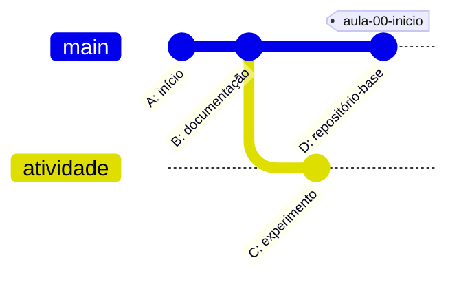
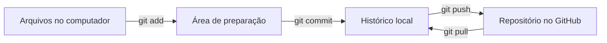
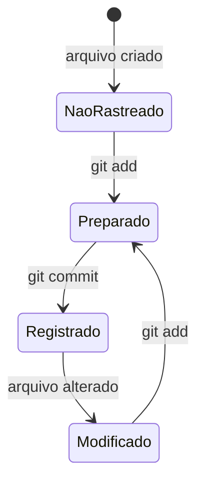

# Java – Spring Boot – Aula 00 – GitHub e início do projeto

[⬅ Voltar para o índice do curso](../../README.md)

---

## Apresentação da aula

Nesta aula criaremos o ponto de partida do projeto **Suporte OS 2026**. Ainda não haverá código Spring Boot. O objetivo é preparar o repositório que armazenará o código, os materiais e todo o histórico produzido durante o semestre.

Ao final da aula teremos:

- um repositório oficial no GitHub;
- uma cópia local ligada ao repositório remoto;
- os arquivos iniciais de documentação e configuração;
- o primeiro commit publicado;
- uma compreensão inicial de branch, commit, push e tag;
- um ponto de quebra que poderá ser recuperado durante todo o curso.

> O projeto Spring Boot será criado somente na Aula 02. Começar pelo GitHub permite registrar inclusive o momento anterior à existência da aplicação.

## Objetivos de aprendizagem

Ao concluir esta aula, o estudante deverá ser capaz de:

1. Diferenciar Git de GitHub.
2. Explicar o que são repositório local e repositório remoto.
3. Criar ou clonar um repositório.
4. Identificar o remoto chamado `origin`.
5. Interpretar o resultado básico do comando `git status`.
6. Preparar arquivos para um commit.
7. Criar e publicar um commit.
8. Entender a finalidade das tags utilizadas no curso.
9. Reconhecer arquivos que não devem ser enviados ao GitHub.

## Fundamentos acadêmicos do controle de versão

### Controle de versão como memória verificável

Um sistema de controle de versão registra **estados significativos** de um conjunto de arquivos e as relações entre esses estados. O benefício não se limita a “guardar cópias”: o histórico associa conteúdo, autoria, data e relação de precedência, permitindo investigar quando e por que uma mudança entrou no projeto.

O Git modela commits como **snapshots** do projeto. Cada commit referencia seu conteúdo e o commit anterior — ou mais de um, em uma integração — formando um grafo dirigido acíclico. Branches e tags não duplicam o projeto: são referências para commits.



| Conceito | Interpretação |
|---|---|
| Commit | snapshot identificado e ligado ao histórico |
| Branch | referência móvel para a ponta de uma linha de desenvolvimento |
| Tag | referência destinada a identificar um marco estável |
| Merge | operação que integra histórias de desenvolvimento |
| Hash | identificador derivado do conteúdo e dos metadados do objeto |

O identificador baseado em hash ajuda a detectar alteração de conteúdo e encadeia objetos do histórico. Isso oferece **integridade**, mas não transforma Git em sistema completo de backup, autorização ou guarda de segredos.

### Sistema distribuído

O Git é distribuído: após o clone, o repositório local contém arquivos de trabalho e histórico. Commits, consultas e branches podem ser criados sem conexão permanente com um servidor. O GitHub hospeda uma cópia remota e coordena colaboração, permissões e automações; ele não substitui o Git.

Comparado a um modelo centralizado, o modelo distribuído reduz a dependência operacional do servidor para operações locais, mas exige que o estudante entenda a diferença entre **histórico local** e **histórico publicado**. É por isso que `commit` e `push` não são sinônimos.

### Unidade lógica e rastreabilidade

Um bom commit representa uma unidade lógica: alterações relacionadas, pequenas o suficiente para revisão e completas o suficiente para preservar um estado coerente. Mensagens significativas aumentam a rastreabilidade entre intenção e implementação. Commits gigantes ou que misturam assuntos dificultam revisão, reversão e diagnóstico.

### Reprodutibilidade e pontos de quebra

As tags do curso funcionam como marcos didáticos. Cada uma deve apontar para um estado executável e verificável. Isso permite que professor e estudantes reconstruam o sistema a partir do mesmo ponto, comparem resultados e isolem em qual intervalo uma falha foi introduzida.

### Da teoria para a prática

| Ação | Conceito observado |
|---|---|
| `git status` | estado entre diretório de trabalho, índice e commit atual |
| `git diff` | diferença ainda não preparada |
| `git diff --staged` | diferença selecionada para o próximo commit |
| `git commit` | criação de um snapshot lógico no repositório local |
| `git push` | publicação de referências e objetos no remoto |
| `git tag` | nomeação de um marco do histórico |
| novo clone em outra pasta | teste parcial de reprodutibilidade do conteúdo publicado |

## Pré-requisitos

- Uma conta no GitHub.
- Git instalado no computador.
- Acesso a um terminal:
  - PowerShell ou Git Bash no Windows;
  - Terminal no macOS ou Linux.
- IntelliJ IDEA Ultimate instalado ou em processo de instalação para as próximas aulas.
- Conexão com a internet.

Para conferir o Git:

```bash
git --version
```

Exemplo de resposta:

```text
git version 2.x.x
```

O número exato pode ser diferente. O importante é que o comando seja reconhecido.

---

## 1. Git e GitHub não são a mesma coisa

### 1.1 Git

O **Git** é um sistema de controle de versão. Ele registra alterações realizadas nos arquivos de um projeto e permite consultar estados anteriores.

Com Git podemos:

- saber quais arquivos foram alterados;
- registrar conjuntos de alterações;
- recuperar versões anteriores;
- trabalhar em linhas de desenvolvimento separadas;
- comparar diferentes momentos do projeto;
- colaborar sem substituir diretamente o trabalho de outras pessoas.

O Git funciona no computador local. É possível criar commits mesmo temporariamente sem acesso à internet.

### 1.2 GitHub

O **GitHub** é uma plataforma que hospeda repositórios Git e acrescenta recursos de colaboração, como:

- visualização de código pelo navegador;
- issues;
- pull requests;
- revisão de código;
- gerenciamento de permissões;
- releases;
- automações com GitHub Actions.

Nesta disciplina, o GitHub será a origem oficial do projeto e o local onde os pontos de quebra das aulas serão publicados.

### 1.3 Modelo mental



Os comandos representam ações diferentes:

| Comando | Função |
|---|---|
| `git add` | Seleciona alterações para o próximo commit |
| `git commit` | Registra localmente as alterações selecionadas |
| `git push` | Envia commits locais para o repositório remoto |
| `git pull` | Busca e integra alterações do repositório remoto |

> Salvar um arquivo não cria um commit. Criar um commit também não o publica automaticamente no GitHub.

---

## 2. Organização utilizada no curso

Teremos dois papéis diferentes.

### 2.1 Repositório oficial do professor

O professor mantém a evolução oficial do projeto:

```text
github.com/jeffersonarpasserini/suporteos2026
```

Esse repositório recebe:

- código construído em aula;
- apostilas em Markdown;
- commits de encerramento;
- tags correspondentes aos pontos de quebra.

### 2.2 Cópia de trabalho do estudante

O estudante clona o repositório oficial para acompanhar a disciplina. Atividades de leitura e experimentação podem ser feitas em branches locais ou no fluxo definido pelo professor.

Na Aula 02, cada estudante também criará um repositório temático próprio, que será mantido durante o restante do curso. Portanto, existirão lado a lado:

```text
suporteos2026    <- referência do professor
projeto-tematico <- trabalho individual do estudante
```

O estudante não deve modificar o remoto do projeto de referência para apontá-lo ao projeto temático, nem criar um repositório dentro do outro.

---

## 3. Criando o repositório oficial no GitHub

Esta seção é demonstrada pelo professor. Para atividades individuais, o professor poderá pedir que cada estudante repita o procedimento usando outro nome.

### 3.1 Abrindo o formulário

1. Acesse <https://github.com/>.
2. Entre em sua conta.
3. No canto superior direito, abra o menu de criação identificado pelo símbolo **+**.
4. Escolha **New repository**.

Também é possível abrir diretamente:

<https://github.com/new>

### 3.2 Preenchendo os campos

Use os seguintes valores para o projeto oficial:

| Campo | Valor |
|---|---|
| Owner | Conta ou organização utilizada pela disciplina |
| Repository name | `suporteos2026` |
| Description | `API didática construída no curso de Spring Boot 2026` |
| Visibility | Public, salvo restrição institucional |

O nome do repositório:

- não deve conter espaços;
- deve ser curto e identificável;
- deve permanecer igual durante o semestre.

### 3.3 Criando um repositório inicialmente vazio

Para demonstrar o primeiro ciclo completo pelo terminal, deixe desmarcadas as opções de inicialização automática:

- Add a README file;
- Add `.gitignore`;
- Choose a license.

Clique em **Create repository**.

O GitHub mostrará a página **Quick setup**, com endereços HTTPS e SSH. Como nenhum arquivo foi criado, é normal o repositório aparecer vazio.

> Em outros projetos é possível iniciar o repositório com README. Nesta aula ele será criado localmente para que possamos praticar `add`, `commit` e `push`.

---

## 4. HTTPS e SSH

O GitHub oferece mais de uma forma de comunicação com o repositório.

### 4.1 HTTPS

Formato:

```text
https://github.com/USUARIO/REPOSITORIO.git
```

Exemplo do curso:

```text
https://github.com/jeffersonarpasserini/suporteos2026.git
```

O endereço HTTPS é simples para leitura e clone. Operações que escrevem no GitHub exigem autenticação apropriada. A senha comum da conta não deve ser colocada em comandos ou arquivos do projeto.

### 4.2 SSH

Formato:

```text
git@github.com:USUARIO/REPOSITORIO.git
```

Exemplo do curso:

```text
git@github.com:jeffersonarpasserini/suporteos2026.git
```

SSH utiliza um par de chaves. A chave privada permanece no computador; a chave pública é cadastrada no GitHub.

Para testar uma configuração SSH já realizada:

```bash
ssh -T git@github.com
```

Uma conexão autenticada apresenta uma mensagem contendo o nome do usuário. O GitHub informa que não fornece acesso de shell; isso é esperado.

> Nunca envie uma chave privada para o GitHub, para o professor, para colegas ou para o repositório.

### 4.3 Qual caminho usar?

Nesta disciplina:

- SSH é recomendado quando já estiver configurado;
- HTTPS pode ser usado como alternativa;
- cada estudante deve usar somente uma URL no momento do clone;
- trocar o tipo da URL não muda o conteúdo do repositório.

---

## 5. Escolhendo a pasta de projetos

Antes de clonar, escolha uma pasta de fácil localização.

Exemplos:

```text
C:\Projetos
```

```text
/Users/seu-usuario/Projetos
```

```text
/home/seu-usuario/projetos
```

No PowerShell:

```powershell
cd C:\Projetos
```

No macOS ou Linux:

```bash
cd ~/Projetos
```

Confirme a pasta atual:

```bash
pwd
```

No PowerShell também pode ser usado:

```powershell
Get-Location
```

> Não execute o clone de dentro de outra cópia do mesmo projeto. Isso criaria um repositório dentro de outro repositório.

---

## 6. Clonando o repositório vazio

### 6.1 Clone com SSH

```bash
git clone git@github.com:jeffersonarpasserini/suporteos2026.git
```

### 6.2 Clone com HTTPS

```bash
git clone https://github.com/jeffersonarpasserini/suporteos2026.git
```

Depois do clone:

```bash
cd suporteos2026
```

Como o repositório ainda não possui commits, uma mensagem semelhante pode aparecer:

```text
warning: You appear to have cloned an empty repository.
```

Essa mensagem não representa um erro.

### 6.3 Verificando o clone

```bash
git status
git remote -v
git branch --show-current
```

O comando `git remote -v` deve mostrar o remoto `origin` duas vezes: uma URL para buscar e outra para enviar alterações.

Exemplo:

```text
origin  git@github.com:jeffersonarpasserini/suporteos2026.git (fetch)
origin  git@github.com:jeffersonarpasserini/suporteos2026.git (push)
```

Se o nome inicial da branch não for `main`, normalize-o antes do primeiro commit:

```bash
git branch -M main
```

---

## 7. Identidade usada nos commits

Todo commit registra autor, data, mensagem e conteúdo.

Consulte a configuração atual:

```bash
git config --global user.name
git config --global user.email
```

Caso ainda não esteja configurada:

```bash
git config --global user.name "Seu Nome"
git config --global user.email "email-usado-no-github@exemplo.com"
```

Confira:

```bash
git config --global --list
```

Use um endereço associado à sua conta do GitHub ou o endereço de privacidade fornecido pela plataforma, conforme sua preferência.

> `user.name` não é necessariamente o nome de usuário do GitHub. É o nome que aparecerá como autor dos commits.

---

## 8. Criando os arquivos iniciais

O primeiro estado do curso terá somente:

```text
suporteos2026/
├── .editorconfig
├── .gitignore
└── README.md
```

Ainda não devem existir `pom.xml`, `src` ou classes Java. Esses elementos surgirão nas aulas correspondentes.

### 8.1 README.md

Crie `README.md` na raiz:

```markdown
# Suporte OS 2026

API didática desenvolvida na disciplina de Programação da graduação em Sistemas de Informação.

## Domínio inicial

- Grupo de produto: classificação de produtos.
- Produto: item identificado por código de barras, com saldo e valor unitário.

## Requisitos

- Java 21
- Git
- IntelliJ IDEA Ultimate
- Docker Desktop, utilizado nas aulas de PostgreSQL e containerização

## Organização do curso

O sistema será construído incrementalmente. Cada aula termina em um estado executável, registrado por um commit e, após validação, por uma tag Git no formato `aula-NN-*`.
```

O README é a porta de entrada do projeto. Ele deve explicar o propósito, os requisitos e a forma de execução.

### 8.2 .editorconfig

Crie `.editorconfig`:

```ini
root = true

[*]
charset = utf-8
end_of_line = lf
insert_final_newline = true
trim_trailing_whitespace = true

[*.java]
indent_style = space
indent_size = 4

[*.{xml,yml,yaml,properties,md}]
indent_style = space
indent_size = 2

[*.md]
trim_trailing_whitespace = false
```

Esse arquivo ajuda editores diferentes a usar regras compatíveis para codificação, quebra de linha, indentação e espaços finais.

### 8.3 .gitignore

Crie `.gitignore`:

```gitignore
# IntelliJ IDEA
.idea/
*.iml
*.iws
*.ipr

# Maven e Java
target/
*.class
*.jar
*.war
*.ear

# Logs
*.log
logs/

# Variáveis de ambiente e segredos locais
.env
.env.*
!.env.example

# Sistema operacional
.DS_Store
**/.DS_Store
Thumbs.db

# Arquivos temporários
*.tmp
*.swp
*~
```

O `.gitignore` evita que arquivos gerados, configurações locais e segredos sejam adicionados por engano.

Ele não apaga arquivos do computador. Apenas orienta o Git a ignorar arquivos ainda não rastreados que correspondam aos padrões.

---

## 9. Primeiro ciclo de versionamento

### 9.1 Conferindo arquivos não rastreados

```bash
git status
```

Os três arquivos deverão aparecer como **untracked files**. Isso significa que existem na pasta, mas ainda não participam do histórico.

### 9.2 Preparando os arquivos

```bash
git add README.md .editorconfig .gitignore
```

Confira novamente:

```bash
git status
```

Agora eles deverão aparecer em **Changes to be committed**.

### 9.3 Por que não começar com git add ponto?

O comando abaixo adiciona todas as alterações encontradas:

```bash
git add .
```

Ele é válido, mas no início do curso usaremos nomes explícitos para desenvolver o hábito de revisar o conteúdo do commit. Antes de adicionar qualquer coisa, pergunte:

- Este arquivo pertence ao projeto?
- Há uma senha ou token nele?
- É um arquivo gerado automaticamente?
- O `.gitignore` deveria ignorá-lo?

### 9.4 Revisando o que será registrado

Para arquivos já rastreados ou preparados:

```bash
git diff --staged
```

Na primeira aula também podemos usar:

```bash
git status
```

### 9.5 Criando o commit

```bash
git commit -m "Aula 00: inicia o repositório do curso"
```

Uma boa mensagem de commit deve:

- indicar a intenção da alteração;
- ser curta e específica;
- evitar mensagens vagas como `alterações`, `teste` ou `final`;
- manter o padrão definido para a disciplina.

Consulte o histórico:

```bash
git log --oneline
```

### 9.6 Publicando no GitHub

```bash
git push -u origin main
```

Elementos do comando:

| Parte | Significado |
|---|---|
| `git push` | Envia commits locais |
| `-u` | Registra a relação entre a branch local e a remota |
| `origin` | Nome do repositório remoto |
| `main` | Branch enviada |

Nos próximos envios, normalmente será suficiente:

```bash
git push
```

### 9.7 Conferindo no navegador

Atualize a página do repositório no GitHub e confira:

- os três arquivos;
- a mensagem do commit;
- a branch `main`;
- o conteúdo renderizado do README;
- a ausência de `.idea`, `.env` e `.DS_Store`.

---

## 10. Entendendo os estados de um arquivo



| Estado | Interpretação |
|---|---|
| Não rastreado | O Git ainda não acompanha o arquivo |
| Modificado | O arquivo rastreado mudou desde o último commit |
| Preparado | A versão atual foi selecionada para o próximo commit |
| Registrado | O conteúdo faz parte de um commit |

O comando mais importante para reconhecer esses estados é:

```bash
git status
```

Use-o antes e depois de cada operação enquanto estiver aprendendo.

---

## 11. Fluxo dos estudantes

Depois que o professor publicar o primeiro commit, os estudantes clonam o repositório já inicializado.

### 11.1 Clonando

```bash
git clone https://github.com/jeffersonarpasserini/suporteos2026.git
cd suporteos2026
```

Ou, com SSH:

```bash
git clone git@github.com:jeffersonarpasserini/suporteos2026.git
cd suporteos2026
```

### 11.2 Conferindo o histórico recebido

```bash
git status
git log --oneline
git remote -v
```

O clone traz os arquivos e o histórico publicado até aquele momento.

### 11.3 Criando uma branch para a atividade

```bash
git switch -c atividade/aula-00
```

Confira:

```bash
git branch --show-current
```

Altere no README apenas a linha solicitada pelo professor e execute:

```bash
git status
git add README.md
git commit -m "Atividade Aula 00: atualiza README"
```

A publicação da branch dependerá das permissões e da estratégia adotada pelo professor.

> Não coloque nome completo, matrícula, e-mail pessoal ou outro dado sensível no repositório público sem uma orientação institucional específica.

---

## 12. Commit, branch e tag

### 12.1 Commit

Um commit é um registro identificado por um hash:

```text
a34355d Aula 00: inicia o repositório do curso
```

O hash identifica aquele estado do histórico.

### 12.2 Branch

Uma branch é uma linha móvel de desenvolvimento. A branch `main` avança quando novos commits são incorporados.

```text
main: A --- B --- C
```

### 12.3 Tag

Uma tag identifica permanentemente um commit importante:

```text
main: A --- B --- C
       ↑
 aula-00-inicio
```

No curso, cada aula concluída recebe uma tag anotada. Exemplo:

```bash
git tag -a aula-00-inicio -m "Conclusão da Aula 00"
```

Confira:

```bash
git tag --list
git show aula-00-inicio
```

Publique a tag:

```bash
git push origin aula-00-inicio
```

> A tag somente deve ser criada depois de o professor validar o ponto de quebra. Uma tag publicada não deve ser movida para outro commit.

---

## 13. Segurança desde o primeiro commit

### 13.1 Nunca versionar

- senhas;
- tokens de acesso;
- chaves privadas SSH;
- arquivos `.env` reais;
- credenciais de banco;
- dados pessoais desnecessários;
- arquivos com configurações privadas da IDE.

### 13.2 .gitignore não corrige um vazamento anterior

Se uma senha já entrou em um commit, adicioná-la depois ao `.gitignore` não remove o conteúdo do histórico.

Nesse caso:

1. interrompa a publicação;
2. avise o professor ou responsável;
3. invalide imediatamente a credencial;
4. substitua-a por outra;
5. trate o histórico conforme a orientação responsável.

Não tente esconder silenciosamente um vazamento de credencial.

### 13.3 Regra prática

Antes de cada commit:

```bash
git status
git diff --staged
```

Depois, confirme que somente os arquivos esperados estão preparados.

---

## 14. Problemas frequentes

### 14.1 git não é reconhecido

Mensagem típica:

```text
git: command not found
```

ou:

```text
'git' não é reconhecido como um comando interno ou externo
```

Possíveis causas:

- Git não instalado;
- terminal aberto antes da instalação;
- diretório do Git ausente no `PATH`.

Feche e abra o terminal depois da instalação e teste `git --version`.

### 14.2 Repository not found

Confira:

- nome do usuário ou organização;
- nome do repositório;
- visibilidade e permissões;
- autenticação da conta;
- URL copiada do botão **Code** ou **Quick setup**.

### 14.3 Permission denied publickey

Essa mensagem indica que o GitHub não aceitou uma chave SSH.

Teste:

```bash
ssh -T git@github.com
```

Se SSH ainda não estiver configurado, use temporariamente a URL HTTPS ou conclua a configuração da chave seguindo a documentação oficial.

### 14.4 Author identity unknown

Configure nome e e-mail:

```bash
git config --global user.name "Seu Nome"
git config --global user.email "email-usado-no-github@exemplo.com"
```

Depois repita o commit.

### 14.5 src refspec main does not match any

Normalmente acontece ao tentar executar `push` antes de criar o primeiro commit.

Confira:

```bash
git status
git log --oneline
```

Crie o commit antes do push.

### 14.6 Push rejeitado

Não use comandos destrutivos para forçar o envio. Primeiro leia a mensagem e confira:

```bash
git status
git branch --show-current
git remote -v
```

Se outra pessoa publicou alterações, o histórico remoto precisa ser analisado antes de continuar.

### 14.7 Arquivo ignorado não aparece no status

Descubra a regra responsável:

```bash
git check-ignore -v caminho/do/arquivo
```

### 14.8 Estou na pasta errada

Confira:

```bash
pwd
git status
```

Se o terminal informar que a pasta não é um repositório Git, navegue até a pasta que contém `.git`.

---

## 15. Atividade orientada

### Parte A — leitura do repositório

Execute e explique o resultado:

```bash
git status
git remote -v
git branch --show-current
git log --oneline
```

### Parte B — branch local

1. Crie `atividade/aula-00`.
2. Acrescente ao README uma seção chamada `Aprendizados da Aula 00`.
3. Escreva duas frases:
   - diferença entre Git e GitHub;
   - diferença entre commit e push.
4. Confira o diff.
5. Crie um commit local.

### Parte C — conferência

```bash
git status
git log --oneline --decorate -5
```

O diretório de trabalho deve terminar sem alterações pendentes.

---

## 16. Perguntas de revisão

1. Qual é a diferença entre Git e GitHub?
2. Um arquivo salvo já está versionado? Explique.
3. Qual é a função de `git add`?
4. O que `git commit` registra?
5. Por que o commit ainda pode não aparecer no GitHub?
6. O que representa `origin`?
7. Por que devemos executar `git status` antes de um commit?
8. Qual é a diferença entre branch e tag?
9. Por que `.env` deve ser ignorado?
10. O que deve ser feito se uma credencial for publicada?

## Avaliação da aprendizagem

| Critério | Insuficiente | Em desenvolvimento | Adequado | Avançado |
|---|---|---|---|---|
| Modelo Git | confunde arquivo salvo, commit e push | reconhece comandos sem explicar estados | explica trabalho, índice, histórico e remoto | relaciona snapshots, grafo, branches e tags |
| Execução | depende integralmente de comandos fornecidos | executa o fluxo com correções frequentes | cria, confere e publica um commit coerente | diagnostica divergências preservando o histórico |
| Rastreabilidade | mistura assuntos e usa mensagem genérica | separa parte das mudanças | cria unidade lógica com mensagem significativa | justifica o ponto de quebra e testa sua recuperação |
| Segurança | inclui segredo ou arquivo local | reconhece riscos após orientação | aplica `.gitignore` e revisa o diff | explica por que ignorar não revoga segredo publicado |
| Evidências | afirma que concluiu sem verificação | apresenta evidência parcial | mostra status, log e remoto coerentes | reproduz o marco a partir de novo clone |

Sugestão de atividade avaliativa: 30% modelo conceitual, 40% execução do fluxo, 20% evidências e 10% segurança e clareza.

---

## 17. Checklist do estudante

- [ ] Possuo acesso à minha conta do GitHub.
- [ ] `git --version` funciona.
- [ ] Clonei o repositório correto.
- [ ] Sei identificar a pasta raiz do projeto.
- [ ] `origin` aponta para o repositório esperado.
- [ ] A branch principal é `main`.
- [ ] Consigo explicar os estados não rastreado, preparado e registrado.
- [ ] Sei criar uma branch local.
- [ ] Sei criar um commit com mensagem significativa.
- [ ] Entendo que commit e push são operações diferentes.
- [ ] Sei por que arquivos de ambiente e credenciais não devem ser versionados.

## 18. Checklist do ponto de quebra oficial

- [ ] O repositório oficial foi criado no GitHub.
- [ ] O remoto `origin` está correto.
- [ ] A branch principal é `main`.
- [ ] `README.md` descreve o projeto.
- [ ] `.editorconfig` padroniza os arquivos.
- [ ] `.gitignore` ignora IDE, build, logs, segredos e arquivos do sistema.
- [ ] Não existem senhas, tokens ou chaves privadas no commit.
- [ ] O commit de encerramento foi publicado.
- [ ] O repositório pode ser clonado em outra pasta.
- [ ] O estado clonado corresponde ao estado publicado.

Commit sugerido:

```bash
git commit -m "Aula 00: inicia o repositório do curso"
```

Tag sugerida:

```bash
git tag -a aula-00-inicio -m "Conclusão da Aula 00"
```

---

## 19. Orientações para o professor

### Sequência sugerida em sala

| Etapa | Tempo aproximado |
|---|---:|
| Git, GitHub e modelo mental | 20 minutos |
| Criação do repositório no navegador | 15 minutos |
| HTTPS, SSH e clone | 20 minutos |
| Arquivos iniciais | 25 minutos |
| `status`, `add`, `commit` e `push` | 30 minutos |
| Branch da atividade | 25 minutos |
| Correção e fechamento | 15 minutos |

Adapte os tempos à duração da aula e à familiaridade da turma com terminal.

### Pontos que merecem demonstração ao vivo

- executar `git status` em cada estado;
- mostrar um arquivo não rastreado;
- mostrar o mesmo arquivo depois de `git add`;
- alterar novamente um arquivo já preparado;
- comparar commit local e conteúdo publicado;
- abrir a tag no GitHub;
- demonstrar que `.DS_Store`, `.idea` ou `.env` são ignorados.

### Resultado esperado

Ao final, o estudante não precisa dominar todos os comandos Git. Ele precisa compreender o ciclo básico e conseguir recuperar sua posição quando algo diferente acontecer.

---

## Referências oficiais

- [Criando um novo repositório — GitHub Docs](https://docs.github.com/en/repositories/creating-and-managing-repositories/creating-a-new-repository)
- [Clonando um repositório — GitHub Docs](https://docs.github.com/en/repositories/creating-and-managing-repositories/cloning-a-repository)
- [Testando uma conexão SSH — GitHub Docs](https://docs.github.com/en/authentication/connecting-to-github-with-ssh/testing-your-ssh-connection)
- [Documentação do Git](https://git-scm.com/doc)

---

[⬅ Voltar para o índice do curso](../../README.md)
