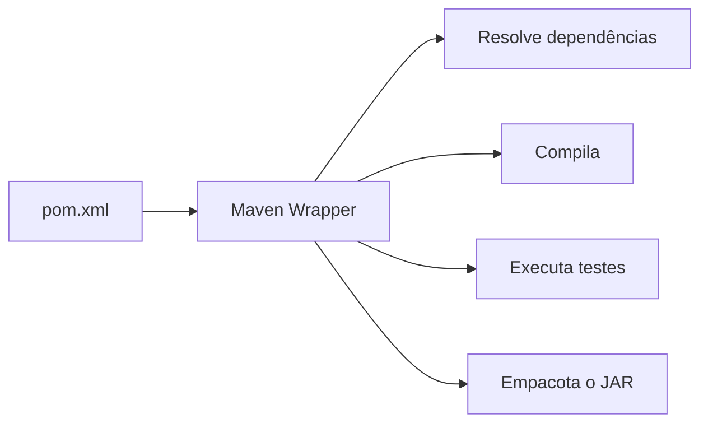
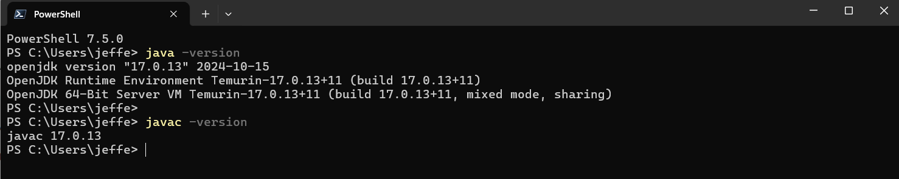
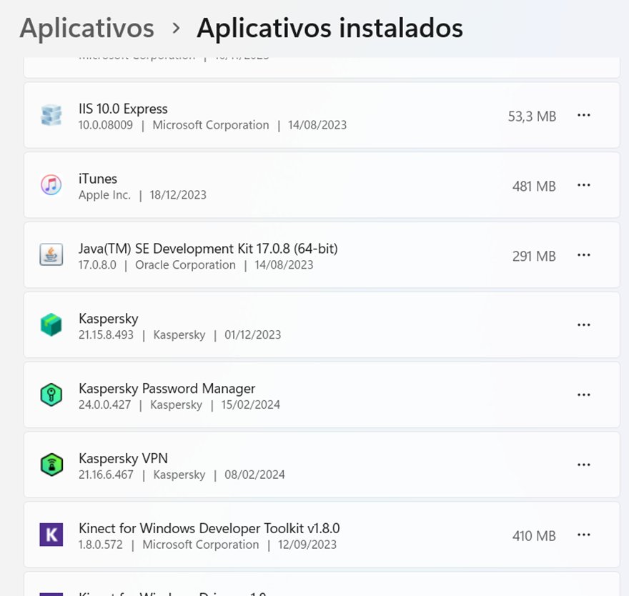
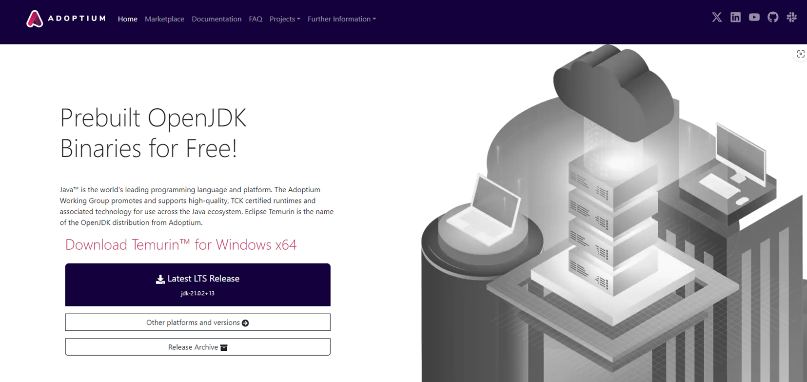

# Java – Spring Boot – Aula 01 – Configuração de Ambiente

[⬅ Voltar para o Menu](#)

---

## Introdução

A partir de agora, em nossa jornada pelo Java, vamos preparar o ambiente utilizado para estudar o framework **Spring**. Configurar um ambiente não significa apenas instalar programas: significa compreender qual responsabilidade cada ferramenta assume entre a escrita do código-fonte e a execução da aplicação.

Esta apostila preserva o roteiro original de configuração para **Java Server Pages (JSP)**, Tomcat, Payara e NetBeans. Esse conteúdo é útil para comparar diferentes modelos de desenvolvimento da plataforma Java e para disciplinas que ainda trabalham com Jakarta EE. Entretanto, o caminho obrigatório do projeto **Suporte OS 2026** está identificado separadamente e utiliza **Java 21, IntelliJ IDEA, Maven Wrapper e o servidor web incorporado ao Spring Boot**.

> [!IMPORTANT]
> As figuras de Java 17, NetBeans 24, Tomcat 9 e das antigas edições separadas do IntelliJ registram o ambiente em que o material original foi produzido. Elas não definem as versões do curso de 2026. Quando uma figura divergir dos quadros de decisão desta aula, prevalece o texto atualizado.

## Resultados de aprendizagem

Ao concluir esta aula, o estudante deverá ser capaz de:

1. distinguir JDK, JRE e JVM e relacioná-los às etapas de compilação e execução;
2. explicar as funções de IDE, ferramenta de build e servidor web;
3. verificar qual Java está sendo usado pelo terminal, pelo Maven e pelo projeto;
4. explicar por que `JAVA_HOME` e `PATH` podem produzir ambientes diferentes;
5. comparar servidor incorporado, contêiner de servlets e servidor de aplicações;
6. reconhecer o impacto da migração de `javax.*` para `jakarta.*`;
7. justificar o uso do Maven Wrapper para builds reproduzíveis;
8. instalar e validar o ambiente mínimo do projeto Spring Boot 2026;
9. diagnosticar falhas de configuração a partir de evidências, e não por tentativa aleatória.

## Pré-requisitos

- acesso de administrador ou autorização institucional para instalar software;
- terminal PowerShell no Windows, ou terminal equivalente no macOS/Linux;
- conexão com a internet para os downloads e a resolução inicial de dependências;
- repositório da disciplina preparado conforme a Aula 00;
- aproximadamente 5 GB livres para JDK, IDE, dependências e arquivos temporários.

## Decisão tecnológica do curso

Nem toda ferramenta apresentada nesta apostila é obrigatória. A tabela evita instalar componentes sem saber por quê.

| Componente | Suporte OS 2026 | Finalidade |
|---|---|---|
| Eclipse Temurin JDK 21 | Obrigatório | Compilar e executar Java 21 |
| IntelliJ IDEA com recursos Ultimate | Obrigatório para o roteiro principal | Criar, executar, depurar e inspecionar o projeto Spring |
| Maven Wrapper (`mvnw`) | Obrigatório | Fixar e obter a versão de Maven definida pelo projeto |
| Maven instalado globalmente | Opcional | Uso geral fora do projeto e comparação didática |
| Tomcat externo | Opcional, trilha JSP/Jakarta EE | Implantar manualmente aplicações empacotadas para um contêiner externo |
| Payara externo | Opcional, trilha Jakarta EE | Executar aplicações que utilizam o perfil ou a plataforma Jakarta EE |
| NetBeans | Opcional | IDE alternativa, especialmente para a trilha JSP/Jakarta EE |
| Tomcat incorporado | Gerenciado pelo Spring Boot | Atender requisições HTTP quando a aplicação é executada como JAR |

> [!NOTE]
> O IntelliJ passou a usar uma distribuição unificada. Alguns recursos permanecem gratuitos e outros exigem assinatura Ultimate ou licença educacional. Neste curso, a criação do projeto pelo assistente Spring da IDE pressupõe acesso aos recursos Ultimate; a Aula 02 também ensina o caminho independente pela página Spring Initializr.

---

## Fundamentos teóricos do ambiente Java

### Código-fonte, bytecode e máquina virtual

O arquivo `.java` é texto escrito pelo programador. O compilador `javac`, incluído no JDK, verifica regras da linguagem e produz **bytecode** em arquivos `.class`. Esse bytecode é uma representação binária destinada à Java Virtual Machine, e não diretamente a um processador específico.


Essa separação sustenta a portabilidade da plataforma: diferentes implementações de JVM podem executar o mesmo formato de classe, respeitadas a versão do bytecode e as APIs disponíveis. Portabilidade não significa ausência de compatibilidade; compilar para uma versão mais nova pode impedir a execução em uma JVM mais antiga.

### JDK, JRE e JVM

| Conceito | Responsabilidade | Evidência prática |
|---|---|---|
| **JVM** | Carregar, verificar e executar bytecode; administrar áreas de memória e execução | `java` inicia uma implementação da JVM |
| **JRE** | Ambiente necessário à execução: JVM e bibliotecas da plataforma | o programa consegue executar, mas o conceito não implica possuir compilador |
| **JDK** | Kit de desenvolvimento: ferramentas de compilação, diagnóstico e empacotamento, além do runtime | `javac`, `jar`, `javadoc` e outras ferramentas estão disponíveis |

Para desenvolver, precisamos do **JDK**. Dizer apenas “tenho Java instalado” é ambíguo: uma máquina pode reconhecer `java`, mas não `javac`, ou pode usar versões diferentes por causa do `PATH`.

### Ambiente do sistema, IDE e projeto

Há três seleções que podem divergir:

1. **Java do terminal:** o primeiro executável encontrado no `PATH`;
2. **Java usado pelo Maven:** exibido por `mvn -version` ou pelo Wrapper;
3. **SDK e nível de linguagem do projeto:** configurados na IDE e no `pom.xml`.

O diagnóstico precisa conferir os três. Reiniciar ou reinstalar sem identificar qual caminho foi resolvido pode ocultar o problema e não explicar sua causa.

No Windows, use:

```powershell
java -version
javac -version
where.exe java
where.exe javac
$env:JAVA_HOME
```

No macOS ou Linux, use:

```bash
java -version
javac -version
which java
which javac
echo "$JAVA_HOME"
```

`JAVA_HOME` indica a raiz de um JDK para ferramentas que consultam essa variável. `PATH` é a lista ordenada de diretórios usada pelo sistema para localizar comandos. Configurar uma variável não garante que a outra esteja coerente.

### IDE não é linguagem, compilador nem framework

Uma **IDE** integra editor, navegação, testes, depuração, terminal e integração com Git. Ela aumenta produtividade, mas o projeto não deve depender exclusivamente dela. A aplicação precisa poder ser compilada e testada no terminal, condição importante para integração contínua e reprodutibilidade.

### Build, dependências e reprodutibilidade

O **build** transforma código-fonte e recursos em um artefato executável ou implantável. No Maven, o `pom.xml` descreve o projeto, suas dependências, plugins e propriedades. As dependências são identificadas por coordenadas — normalmente `groupId`, `artifactId` e `version` — e resolvidas em repositórios.

O **Maven Wrapper** adiciona ao repositório scripts (`mvnw` e `mvnw.cmd`) e uma configuração da distribuição Maven. Ao usar o Wrapper, estudantes e servidores de integração executam a versão prevista pelo projeto, reduzindo a variação entre máquinas.



### Servidor web, contêiner de servlets e servidor de aplicações

Os termos são relacionados, mas não equivalentes.

| Modelo | O que oferece | Exemplo no material | Forma de uso |
|---|---|---|---|
| Servidor/contêiner web | HTTP e especificações web, como Servlet | Apache Tomcat | externo ou incorporado |
| Servidor de aplicações Jakarta EE | Conjunto mais amplo de especificações corporativas | Payara | normalmente externo |
| Servidor incorporado | Contêiner empacotado como dependência e iniciado pela aplicação | Tomcat no Spring Boot | `java -jar` ou execução pela IDE |

No projeto do curso, não implantaremos inicialmente um WAR em um Tomcat instalado à parte. A classe principal inicia o contexto Spring e o servidor incorporado. Isso reduz a configuração externa e aproxima desenvolvimento, testes e execução, sem eliminar a necessidade de compreender HTTP, portas e ciclo de vida do servidor.

### Compatibilidade `javax.*` e `jakarta.*`

O Tomcat 10 marcou a adoção das especificações Jakarta EE 9 e a mudança dos pacotes da API de `javax.*` para `jakarta.*`. Portanto, o problema não é que “Tomcat 10 não aceita servlets”; ele aceita a geração atual da API Servlet. A incompatibilidade aparece quando uma aplicação antiga compilada contra `javax.servlet.*` é implantada sem migração em um ambiente que espera `jakarta.servlet.*`.

Essa distinção ensina uma regra geral: **números de versão expressam contratos de compatibilidade**. Escolher “a versão mais nova” ou “a versão mais antiga” sem examinar o contrato da aplicação é uma decisão tecnicamente incompleta.

### Da teoria para a prática

| Ação prática | Conceito que ela verifica |
|---|---|
| executar `java -version` | runtime selecionado pelo terminal |
| executar `javac -version` | presença e versão do compilador do JDK |
| localizar executáveis com `where`/`which` | resolução do `PATH` |
| executar `mvnw -version` | Maven e JDK efetivamente usados pelo projeto |
| selecionar o SDK na IDE | modelo de linguagem e ferramentas de compilação do projeto |
| iniciar a aplicação | composição entre bytecode, framework e servidor incorporado |
| acessar uma porta HTTP | comunicação entre cliente e processo servidor |

---

---

## Aula 1 – Configuração passo a passo

### 1.1 Instalando o Java JDK

Para iniciarmos nesse mundo, devemos verificar inicialmente qual a **JRE** — software onde se encontra nossa Java Virtual Machine — está instalada em nossa máquina. Além disso, também iremos necessitar do **JDK (Java Development Kit)** do Java para que possamos desenvolver nossos softwares.

Para verificar qual versão está instalada em sua máquina, abra um prompt de comando no Windows e digite os comandos abaixo, como você pode observar na Figura 1:

```powershell
java -version
javac -version
```

- `java -version` → retorna a versão atual selecionada no terminal. **Para o Suporte OS 2026, utilizaremos Java 21.** A Figura 1 mostra Java 17 porque pertence ao registro original da apostila.
- `javac -version` → retorna a versão do compilador Java (`javac`).

> **Figura 1 — Retorno do teste dos comandos `java -version` e `javac -version`**


<details>
<summary>Descrição da Figura 1</summary>

A Figura 1 mostra uma janela do PowerShell (terminal do Windows) onde foram executados dois comandos para verificar as versões do Java instaladas:

- O comando `java -version` mostra que está instalado o **OpenJDK versão 17.0.13** (2024-10-15), especificamente o *OpenJDK Runtime Environment Temurin-17.0.13+11*.
- O comando `javac -version` mostra a versão **17.0.13** do compilador Java.

O terminal mostra que está sendo executado o PowerShell 7.5.0 e os comandos foram executados no diretório do usuário "jeffe".

</details>

Se a máquina estiver usando uma versão diferente, primeiro identifique os caminhos retornados por `where.exe java` e `where.exe javac`. Só remova uma instalação quando ela for obsoleta, conflitante e não for necessária a outro projeto. Diferentes JDKs podem coexistir; o objetivo é selecionar conscientemente o JDK 21 para este curso.

No Windows, use **Configurações → Aplicativos → Aplicativos Instalados** para consultar as distribuições existentes (Figura 2). Não remova indiscriminadamente todas as versões: laboratórios compartilhados e outros projetos podem depender delas. Se houver conflito, peça orientação ao professor ou ao responsável pelo laboratório.

> Após instalar, remover ou alterar variáveis, feche e abra novamente o terminal. Reinicie o Windows somente se o instalador solicitar ou se o ambiente ainda não refletir a alteração.

> **Figura 2 — Tela de Aplicativos Instalados no Windows**


<details>
<summary>Descrição da Figura 2</summary>

A imagem mostra a tela de "Aplicativos instalados" do Windows, que lista vários aplicativos com suas respectivas informações:

| Aplicativo | Versão | Fabricante | Instalação | Tamanho |
|---|---|---|---|---|
| IIS 10.0 Express | 10.0.08009 | Microsoft Corporation | 14/08/2023 | 53,3 MB |
| iTunes | — | Apple Inc. | 18/12/2023 | 481 MB |
| Java(TM) SE Development Kit 17.0.8 (64-bit) | 17.0.8 | Oracle Corporation | 14/08/2023 | 291 MB |
| Kaspersky | 21.15.8.493 | — | 01/12/2023 | — |
| Kaspersky Password Manager | 24.0.0.427 | — | 15/02/2024 | — |
| Kaspersky VPN | 21.16.6.467 | — | 08/02/2024 | — |
| Kinect for Windows Developer Toolkit v1.8.0 | 1.8.0.572 | Microsoft Corporation | 12/09/2023 | 410 MB |

A interface mostra um design moderno do Windows, com cada aplicativo listado em uma linha separada, incluindo seu ícone, nome, versão, desenvolvedor, data de instalação e tamanho quando disponível.

</details>

Para garantir compatibilidade com o projeto de 2026, vamos fazer o download da **versão 21 LTS do Java JDK**:

🔗 **Download Java JDK** – [Home | Adoptium](https://adoptium.net/)

> **Figura 3 — Site do Temurin JDK**


<details>
<summary>Descrição da Figura 3</summary>

A Figura 3 mostra a página inicial do site Adoptium, onde é possível fazer o download do OpenJDK (Java Development Kit). A página apresenta:

- Um cabeçalho com o logo Adoptium e menu de navegação (Home, Marketplace, Documentation, FAQ, Projects)
- Um título principal *"Prebuilt OpenJDK Binaries for Free!"*
- Uma breve descrição sobre Java e o Eclipse Temurin
- Um botão roxo de download destacado para *"Latest LTS Release"* (jdk-21.0.2+13)
- Dois botões adicionais: *"Other platforms and versions"* e *"Release Archive"*
- Uma ilustração isométrica do lado direito mostrando elementos relacionados a computação/servidores em tons de cinza

O site tem um design moderno e limpo, com esquema de cores predominantemente em roxo e branco.

</details>

Com a página aberta, localize o botão **"Other platforms and versions"** e clique nele. Você será levado a uma página de configuração do download do JDK, com algumas caixas de seleção:

| Campo | Opção a escolher |
|---|---|
| **Operating System** | Windows |
| **Architecture** | x64 |
| **Package Type** | JDK |
| **Version** | 21 – LTS |

O site oferece, entre outros formatos, **MSI** e **ZIP**. Para o laboratório Windows, prefira o MSI porque ele orienta a integração com o sistema; o ZIP é válido para instalações portáveis ou sem alteração global, desde que o caminho seja configurado corretamente.

> **Figura 4 — Configuração do download no site do Temurin JDK**

<details>
<summary>Descrição da Figura 4</summary>

A imagem mostra a página de download do Eclipse Temurin, que é uma distribuição do OpenJDK. Na página, podemos ver:

- O logotipo do Temurin da Adoptium no lado esquerdo
- 4 menus de seleção para configurar o download: Sistema Operacional (Windows), Arquitetura (x64), Tipo de Pacote (JDK) e Versão (17 – LTS)
- Um cartão mostrando a versão **17.0.10+7** do Temurin, lançada em 18 de janeiro de 2024
- Dois botões de download disponíveis: arquivo `.msi` com 168 MB e arquivo `.zip` com 190 MB

A página tem um design limpo e organizado, com um esquema de cores em tons de roxo e branco.

</details>

Vá em **Downloads** no Windows e abra o instalador. Na primeira tela é necessário apenas clicar em **Next**.

> **Figura 5 — Temurin JDK – Installer – Tela 01**

<details>
<summary>Descrição da Figura 5</summary>

A imagem mostra a primeira tela do instalador do Eclipse Temurin JDK com Hotspot 17.0.14+7 (x64):

- Logotipo da Adoptium no lado esquerdo, em tons de roxo e branco
- Texto de boas-vindas *"Welcome to the Eclipse Temurin JDK with Hotspot 17.0.14+7 (x64) Setup Wizard"*
- Mensagem explicativa informando que o Assistente de Instalação irá instalar o Eclipse Temurin JDK com Hotspot no computador
- Botões de navegação: **Back** (desativado), **Next** e **Cancel**

</details>

> **Figura 6 — Temurin JDK – Installer – Tela 02**

<details>
<summary>Descrição da Figura 6</summary>

A imagem mostra a tela de licença de usuário final (EULA) do instalador:

- Título *"End-User License Agreement"* no topo da janela
- Mensagem solicitando que o usuário leia cuidadosamente o acordo de licença
- Texto da GNU General Public License (versão 2, junho de 1991) exibido em uma caixa de rolagem
- Caixa de seleção na parte inferior para aceitar os termos da licença
- Botões de navegação: Print, Back, Next e Cancel

O logotipo roxo da Adoptium é visível no canto superior direito.

</details>

Nesta tela, marque a opção **"I accept the terms in the license Agreement"** e clique em **Next**.

> **Figura 7 — Temurin JDK – Installer – Tela 03**

<details>
<summary>Descrição da Figura 7</summary>

A Figura 7 mostra a tela de *"Installation Scope"* (Escopo de Instalação), com duas opções:

1. **Install just for you (Jeffe)** — instalar apenas para o usuário atual
2. **Install for all users of this machine** — instalar para todos os usuários desta máquina (selecionada por padrão)

A interface apresenta o logotipo do Temurin no canto superior direito e botões de navegação na parte inferior.

</details>

Em um computador pessoal com acesso administrativo, a opção **"Install for all users of this machine"** facilita o uso por todas as contas. Em laboratório ou máquina sem privilégio administrativo, a instalação apenas para o usuário atual também é válida e deve seguir a política institucional.

> **Figura 8 — Temurin JDK – Installer – Tela 04**

<details>
<summary>Descrição da Figura 8</summary>

Tela de *"Custom Setup"* (Configuração Personalizada), contendo:

- Logotipo roxo da Adoptium no canto superior direito
- Árvore de opções de instalação no lado esquerdo:
  - JDK with Hotspot
  - Modify PATH variable
  - Associate `.jar`
  - Set or override `JAVA_HOME`
  - JavaSoft (Oracle) registry keys
- Painel informativo à direita mostrando que a instalação requer **303 MB** de espaço em disco
- Na parte inferior: campo de localização com o diretório de instalação, botão **Browse** e os botões Reset, Disk Usage, Back, Next e Cancel

</details>

Nesta tela é só deixar o padrão do instalador e clicar em **Next**.

> **Figura 9 — Temurin JDK – Installer – Tela 05**

<details>
<summary>Descrição da Figura 9</summary>

Tela final de preparação para instalação. A janela tem fundo branco com o logotipo roxo da Adoptium no canto superior direito. No centro, a mensagem *"Ready to install Eclipse Temurin JDK with Hotspot 17.0.14+7 (x64)"*.

Na parte inferior, uma mensagem explicativa informa que o usuário deve clicar em **Install** para começar a instalação, **Back** para revisar ou alterar configurações, ou **Cancel** para sair do assistente.

No rodapé há três botões: **Back**, **Install** (com o ícone do Windows) e **Cancel**.

</details>

Nesta tela clique em **Install** e aguarde o final da instalação do Java JDK.

Ao final da instalação, feche a janela do instalador e confirme se a instalação ocorreu de forma adequada executando os comandos a seguir no PowerShell. Cada um deles deve responder com a versão instalada.

```powershell
java -version
javac -version
```

---

### 1.2 Instalando o Apache Tomcat

> [!NOTE]
> **Trilha opcional JSP/Jakarta EE.** O projeto Spring Boot 2026 usa o Tomcat incorporado e não exige esta instalação externa. Execute esta seção apenas se a disciplina também trabalhar com implantação manual de aplicações JSP/Servlet.

Agora precisamos fazer o download do servidor de aplicação web **Apache Tomcat**.

Para garantir compatibilidade em nosso curso, vamos fazer o download da **versão 9 do Apache Tomcat**, sendo o release atual o **9.0.102**.

🔗 **Link para download do Tomcat 9**

O link irá baixar o arquivo de instalação referente ao instalador **32-bit/64-bit Windows Service Installer** (pgp, sha512) que está na página de download do Tomcat.

Feito o download do Apache Tomcat 9, descompacte-o na sua pasta de downloads. Provavelmente o Windows irá colocar uma pasta Tomcat dentro da outra; então abra a primeira pasta e, dentro dela, vamos encontrar a pasta **`apache-tomcat-9.0.102`** → copie esta pasta e cole na raiz do seu drive `C:\`.

> [!WARNING]
> Escolha a versão do Tomcat de acordo com o namespace usado pela aplicação. Aplicações antigas baseadas em `javax.servlet.*` são compatíveis com Tomcat 9; Tomcat 10 ou superior trabalha com `jakarta.servlet.*`. Servlets continuam existindo nas versões atuais — o que exige atenção é a migração do contrato de API.

---

### 1.3 Instalando o Apache NetBeans

> [!NOTE]
> **IDE opcional e telas históricas.** O roteiro principal do Spring Boot 2026 utiliza IntelliJ IDEA. O NetBeans 24 documentado abaixo pode ser estudado como alternativa e como suporte à trilha JSP/Jakarta EE; consulte a página oficial para a versão estável atual.

Para iniciar no mundo Java, vamos instalar nossa ferramenta de desenvolvimento: o **Apache NetBeans**. O Apache NetBeans é um software desenvolvido pela comunidade open source, de onde recebe muitas contribuições que são gerenciadas pela Fundação Apache. A Apache recebeu originalmente o código-fonte do NetBeans em sua versão 8 da Oracle, quando esta decidiu descontinuar o produto em 2016.

🔗 **Link para Download do Apache NetBeans 24**

Terminado o download do instalador, vá para sua pasta de downloads e dê um clique duplo para abri-lo. Agora vamos acompanhar tela a tela a instalação e sua configuração.

#### Tela de Boas-Vindas do Apache NetBeans IDE 24

Esta é a tela de boas-vindas do instalador do Apache NetBeans IDE 24, um ambiente de desenvolvimento integrado (IDE) para programação, especialmente em Java, mas também compatível com outras linguagens como PHP e JavaScript.

**Descrição da tela**

- **Título:** "Apache NetBeans IDE Installer"
- **Mensagem de boas-vindas:** o instalador informa que irá instalar o NetBeans IDE com alguns pacotes e runtimes já incluídos
- **Pacotes instalados por padrão:**
  - **Base IDE** — o núcleo do NetBeans
  - **Java SE** — suporte para desenvolvimento na plataforma Java Standard Edition
  - **Java EE** — suporte para desenvolvimento Java Enterprise Edition
  - **HTML5/JavaScript** — suporte para desenvolvimento web
  - **PHP** — suporte para desenvolvimento em PHP
- **Botões disponíveis:**
  - **Customize…** — permite escolher quais pacotes instalar
  - **Next >** — continua para a próxima etapa
  - **Cancel** — encerra o instalador
- **Informação extra:** no canto inferior direito, o tamanho da instalação: **981,9 MB**

> **Atenção:** quem quiser instalar apenas o necessário para Java SE pode clicar em **Customize…** e desmarcar os pacotes extras. Para continuar com as opções padrão, basta pressionar **Next >**.

No nosso caso, vamos clicar no botão **"Customize…"** para conferir se as opções estão corretamente marcadas.

#### Tela "Customize Installation"

Essa tela permite personalizar quais pacotes e runtimes do NetBeans serão instalados.

- **Título da janela:** "Customize Installation"
- **Instrução:** *"Select packs and runtimes to install from the list below."*
- **Lista de componentes disponíveis:**
  - ☑ **Base IDE** → interface principal do NetBeans
  - ☑ **Java SE** → suporte para Java Standard Edition
  - ☑ **Java EE** → suporte para aplicações Java Enterprise Edition (web e corporativo)
  - ☑ **HTML5/JavaScript** → suporte para desenvolvimento web
  - ☑ **PHP** → suporte para desenvolvimento em PHP
- **Área de descrição:** à direita, exibe a descrição de cada pacote ao selecioná-lo. No momento mostra *"Select a component to see its description."*
- **Tamanho da instalação:** 981,9 MB
- **Botões:** **OK** (confirma e continua) e **Cancel** (cancela a personalização)

**Orientação:** todos os pacotes devem estar selecionados (por padrão já vêm pré-selecionados). Se algum pacote não estiver selecionado, faça isso manualmente. Pressionar **OK** continua a instalação com os pacotes escolhidos.

Voltando à tela de boas-vindas, clique em **"Next >"** para acessar a tela de *License Agreement*.

#### Tela "License Agreement"

- **Título da janela:** "Apache NetBeans IDE Installer"
- **Título da seção:** "License Agreement"
- **Instrução:** *"Please read the following license agreement carefully."*
- **Texto do acordo:** o NetBeans está sob a **Licença Apache 2.0** (versão de janeiro de 2004). Há um link para a licença oficial: <http://www.apache.org/licenses/>. Aceitar a licença significa concordar com os termos para uso, reprodução e distribuição do software.
- **Opção para aceitar:** ✅ *"I accept the terms in the license agreement"* — deve ser marcada para ativar o botão **Next >**
- **Botões:** **< Back**, **Next >** (ativado após aceitar a licença) e **Cancel**

Marque a caixa de seleção aceitando a licença e clique em **"Next >"**.

#### Tela "Apache NetBeans IDE 24 Installation"

Essa tela permite escolher o diretório de instalação do NetBeans e definir o JDK a ser utilizado pelo IDE.

- **Instrução:** *"Choose the installation folder and JDK™."*
- **Campos para configuração:**
  - **Install the Apache NetBeans IDE to:** caminho padrão `C:\Program Files\NetBeans-24` (botão **Browse…** para alterar)
  - **JDK™ for the Apache NetBeans IDE:** caminho do JDK instalado, ex.: `C:\Program Files\Eclipse Adoptium\jdk-17.0.13.11-hotspot` (botão **Browse…** para selecionar outro JDK)
- **Botões:** **< Back**, **Next >** e **Cancel**

> ⚠️ **Atenção:** nesta tela teremos o diretório padrão de instalação do Apache NetBeans — recomendo deixar o que veio pré-selecionado — e também o diretório do Java que instalamos anteriormente. Se o instalador não encontrar esse diretório automaticamente, você deve indicá-lo manualmente.

Feito isso, clique em **"Next >"** para ver a tela de resumo da instalação.

#### Tela "Summary" (Resumo da Instalação)

- **Instrução:** *"Click Install to start the installation."*
- **Base IDE Installation Folder:** `C:\Program Files\NetBeans-24`
- **Total Installation Size:** 981,9 MB
- **Botões:** **< Back**, **Install** e **Cancel**

Pressione **Install** para iniciar e aguarde o final da instalação.

#### Tela "Setup Complete"

- **Instrução:** *"Click Finish to complete the Apache NetBeans IDE setup."*
- **Mensagem de sucesso:** *"Installation completed successfully."*
- Todos os plugins já estão atualizados
- Para abrir o NetBeans, pode-se usar o Menu Iniciar ou o ícone na área de trabalho
- Para adicionar ou remover plugins, utilize o **Plugin Manager** dentro do NetBeans
- **Botão:** **Finish**

Podemos finalizar a instalação: clique em **Finish** e depois abra o Apache NetBeans. Agora devemos configurá-lo corretamente — **estas próximas etapas são muito importantes**.

#### Tela inicial do Apache NetBeans 24 (antes da configuração)

**Elementos da tela**

- **Menu superior:** File, View, Debug, Profile, Team, Tools, Window, Help
- **Barra de ferramentas:** criar novo projeto, abrir projeto existente, abrir arquivo recente
- **Área central:** logo do NetBeans e atalhos para ações comuns:
  - **New Project…** → `Ctrl + Shift + N`
  - **Open Project…** → `Ctrl + Shift + O`
  - **New File…** → `Ctrl + N`
  - **Open File…**
  - **Go to File…**
  - **Show Dashboard** → `Alt + Shift + W`
- **Campo de pesquisa** (canto superior direito): busca de arquivos e funções com `Ctrl + I`
- **Barra de janela:** botões para minimizar, maximizar e fechar

Temos nossa tela principal. Precisamos configurar a IDE para podermos utilizá-la. Como primeiro passo, acesse o menu **Tools → Options**, que abrirá a tela de configuração (**Options**) da IDE.

#### Tela "Options" — categoria General

- **Menu de categorias (parte superior):** General *(selecionada)*, Keymap, Java, HTML/JS, PHP, C/C++, Team, Appearance, Miscellaneous
- **Botões inferiores:** Export…, Import…, OK, Apply, Cancel, Help
- **Campo de pesquisa** (canto superior direito) para localizar configurações

Para cada uma das categorias temos algumas configurações e ativações a serem realizadas — **devemos passar por todas as categorias**.

##### Options → General

Não precisamos alterar nada. Segue a explicação da tela:

- **Configuração de navegador padrão:** campo *Web Browser*, onde o usuário escolhe o navegador para abrir arquivos e projetos. O valor padrão é `<Default System Browser>`. Há um botão **Edit…** para alterar.
- **Configurações de Proxy:**
  - *No Proxy*
  - *Use System Proxy Settings* **(selecionada)**
  - *Manual Proxy Settings* (desativada por padrão) — permite inserir endereço (HTTP Proxy) e porta (Port)
  - Botão **Reload** para atualizar as configurações do proxy
  - Botão **Test connection** para testar a conexão

##### Options → Keymap

Não precisamos alterar nada. Segue a explicação da tela:

- **Profile:** perfil de atalhos selecionado (**NetBeans** por padrão). Botões **Manage Profiles…** e **Show as HTML**
- **Campos de pesquisa:** *Search* (ações específicas) e *Search in Shortcuts* (atalhos existentes)
- **Tabela de atalhos:**
  - **Actions** — ações disponíveis (Debug, Run, Find Tasks, etc.)
  - **Shortcut** — atalho associado (`Ctrl + F5`, `F5`, etc.)
  - **Category** — categoria da ação (Debug, Bugtracking, Database, etc.)
  - Botões **…** ao lado de cada ação para modificar ou remover atalhos

##### Options → Java

Quando clicarmos na opção **Java**, ela será ativada no NetBeans e abrirá um submenu de opções na janela.

Quando o Java for ativado, também serão liberadas mais duas opções na parte principal da tela, entre os itens *General* e *Keymap*: **Editor** e **Fonts & Colors**.

> Nesta opção devemos ativar todas as subopções. Algumas irão pedir algum download ou ativação — então confirme.

###### Java → Ant

Nesta tela **não iremos modificar nenhuma configuração**.

- **Ant Home:** `C:\Program Files\NetBeans-24\netbeans\extide\ant` — botões **Browse…** e **Default**
- **Versão do Apache Ant:** 1.10.14, compilada em 16 de agosto de 2023
- **Opções de configuração:**
  - ✅ *Save All Modified Files Before Running Ant*
  - ✅ *Reuse Output Tabs from Finished Processes*
  - ⬜ *Always Show Output*
- **Verbosity Level:** *Normal*
- **Classpath:** caixa vazia, com botões **Add Directory…**, **Add JAR/ZIP…**, **Remove**, **Move Up** e **Move Down**
- **Propriedades personalizadas:**

  ```properties
  build.compiler.emacs=true
  ```

- **Botões inferiores:** Export…, Import…, OK, Apply, Cancel, Help

###### Java → GUI Builder

Nesta opção também **não faremos alterações**.

- **Generate Components as:**
  - ⚪ *Local Variables in `initComponents()` Method*
  - 🔘 *Fields in the Form Class* **(selecionado)**
- **Variables Modifier:** `private`
- **Listener Generation Style:** *Anonymous Inner Classes*
- **Automatic Internationalization:** *Default*
- **Layout Generation Style:** *Automatic*
- **Set Component Names:** *Default*
- **Opções de exibição e código:**
  - ✅ *Generate Fully Qualified Names of Classes*
  - ✅ *Fold Generated Code*
  - ✅ *Show Assistant*
- **Configurações visuais:**
  - *Guiding Line Color:* `[143,171,196]` (cinza-azulado)
  - *Selection Border Color:* `[255,164,0]` (laranja)
  - *Grid Size:* `10`
  - ✅ *Visualize Additional Layout Information*

> **Nota importante:** as configurações afetam apenas novos formulários GUI; formulários existentes devem ser editados diretamente.

###### Java → Gradle

Nesta opção também **não faremos alterações**.

- **Painel lateral:** Execution *(selecionado)*, Appearance, Dependencies, Maven, Experimental
- **Distribution:**
  - *Gradle User Home:* `C:\Users\jeffe\.gradle` — botões **Browse…** e **Default**
  - *Gradle Distribution:*
    - 🔘 *Prefer to use Gradle Wrapper that Comes with the Project* **(padrão)**
    - ⚪ *Custom:* campo de texto + botão **Browse…**
- **Global Execution Options:**
  - ⬜ *Offline*
  - ✅ *Configure on Demand*
  - ⬜ *Use Configuration Cache*
  - ✅ *Skip 'check' for non-test Related Executions*
  - ⬜ *Skip 'test' for non-test Related Executions*
- **Java Runtime:** JDK 17 (Default) na captura histórica — alterável em **Manage Runtimes…**; selecione JDK 21 para o curso 2026
- **Allow Gradle Execution:** *Trusted Projects Only*
- **Network Proxy:** *Ask Before Execution*

###### Java → Java Shell

Nesta opção, confirme se em **Java Platform** está selecionado o JDK previsto para o seu projeto. A captura mostra **JDK 17 (Default)**; no curso 2026, selecione **JDK 21**.

- **Java Platform:** *JDK 17 (Default)* na captura histórica — botão **Manage…** para selecionar JDK 21 e gerenciar versões
- **Opções de console:**
  - ⬜ *Auto open JavaShell console*
  - ✅ *Reuse dead consoles*
- **Saved history length:** `50`

###### Java → Maven

Nesta opção **não faremos alterações**.

- **Painel lateral:** Execution *(selecionado)*, Index, Appearance, Dependencies
- **Maven Home:** *Bundled* (Maven incluído com o NetBeans) — versão **3.9.9**
  - ✅ *Prefer Maven Wrapper that comes with project*
- **Default JDK:** JDK 17 (Default) na captura histórica — botão **Manage Java Platforms**; use JDK 21 em 2026
- **Global Execution Options:** `-no-transfer-progress` (reduz a saída de logs) — botão **Add**
- **Network Proxy:** *Ask Before Execution*
- **Opções adicionais:**
  - ⬜ *Skip Tests for any build executions not directly related to testing*
  - Botão **Edit Global Custom Goal Definitions…**
  - ✅ *Reuse Output Tabs from Finished Processes*
  - ⬜ *Print Maven output logging level*
  - ✅ *Always Show Output*
- **Output Tab identified by:**
  - 🔘 *Project Name* **(selecionado)**
  - ⚪ *Maven ArtifactId*
  - ⬜ *Also show active configuration*
  - ⬜ *Collapse folds for successfully executed mojos*

###### Java → JavaFX

Nesta opção temos que instalar um plugin que nos será solicitado, conforme a tela a seguir.

**Tela "NetBeans IDE Plugin Installer"**

- **Mensagem de boas-vindas:** *"Welcome to the NetBeans IDE Plugin Installer"* — o instalador informa que irá baixar, verificar e instalar os plugins selecionados
- **Plugin a ser instalado:** *JavaFX Implementation for Windows (amd64) [17.15]* — adiciona suporte ao JavaFX, permitindo o desenvolvimento de aplicações gráficas interativas em Java
- **Botões:** **< Back** (desativado), **Next >**, **Cancel**, **Help**

Clique em **Next** para instalar o plugin; você será direcionado para a tela de licença.

**Tela "License Agreement" (plugin)**

- **Instrução:** *"Please read all of the following license agreements carefully."* — para continuar, é preciso concordar com todos os contratos de licença associados aos plugins
- **Plugin:** *JavaFX Implementation for Windows (amd64) [17.15]*
- **Licença:** GNU General Public License (GPL) versão 2, de junho de 1991. Cópias e distribuições são permitidas, mas modificações não são autorizadas
- ✅ *"I accept the terms in all of the license agreements."*
- **Botões:** **< Back**, **Install**, **Cancel**, **Help**

> **Navegação por teclado:** use a área de rolagem abaixo do título *"The GNU General Public License (GPL)"* para ler o contrato; navegue até a caixa de seleção e pressione `Espaço` para aceitar; pressione `Tab` até **Install** e `Enter` para continuar (ou até **Cancel** para cancelar).

Concorde com o termo de licença e clique em **Install** para proceder com a instalação do plugin.

**Tela "Installation Completed Successfully"**

- *"Installation completed successfully"* / *"Click Finish to quit the NetBeans IDE installer."*
- **Plugin instalado:** *JavaFX Implementation for Windows (amd64)*
- **Botões:** **Finish** (ativo) e **Help** (desativado)

Após clicar em **Finish**, o NetBeans retornará à tela **Options**, na opção *Java* e subopção *Ant*. Encontre novamente a subopção **JavaFX**, onde a tela estará conforme descrito a seguir.

**Tela "JavaFX"**

- **JavaFX Scene Builder Integration:**
  - *Scene Builder Home:* mensagem *"Please, select a valid Scene Builder home…"* — o NetBeans não encontrou o Scene Builder instalado; o usuário precisa selecionar manualmente a pasta onde ele está instalado
- **Opções de execução:**
  - ⬜ *Save All Modified Files Before Running Scene Builder*

> Na opção JavaFX, além do plugin que instalamos, **não faremos nenhuma outra modificação**.

###### Java → Java Debugger

Nesta opção **não faremos alterações**.

- **Painel lateral:** General *(selecionado)*, Step Filters, Variable Formatters, Truffle Debugging, Visual Debugging
- **Opções de configuração:**
  - ⬜ *Stop on uncaught exceptions*
  - ⬜ *Apply code changes after save (in 'Compile on Save' mode only)*
  - *New breakpoints suspend:* **breakpoint thread**
  - *Steps resume:* **current thread only**
  - ✅ *Open Debugger Console for debugging session*
  - ✅ *Reuse Editor when displaying source code*

###### Java → Source Launcher

Nesta opção **não faremos alterações**.

- **Execution of Standalone Java Sources:**
  - *Additional VM Options:* campo para argumentos da JVM, por exemplo:

    ```text
    -Xms256m -Xmx1024m
    ```

  - ⬜ *Stop before Run*

###### Java → JS on JVM

Nesta opção, confirme se **Java Platform** aponta para o JDK do projeto. A figura preservada mostra **JDK 17 (Default)**; selecione **JDK 21** para a turma 2026.

- **Java Platform:** *JDK 17 (Default)* na figura — botão **Manage Platforms…** para selecionar JDK 21
- **Engine:** *Graal.js* (motor de JavaScript baseado na JVM) — requer Java 8 ou superior
- **Engine Options:** campo vazio para parâmetros personalizados
- **Arguments:** campo vazio para argumentos personalizados

###### Java → Profiler

Nesta opção **não faremos alterações**.

- **Painel lateral:** General *(selecionado)*, Filters, Snapshots, Engine
- **Profiler Window:**
  - ✅ *Show 'No data collected yet' hint before first profiling session*
  - ⬜ *Display profiling session status when window is active*
- **Profiling:**
  - *Profiling port:* `5140` (editável)
  - *Manage calibration data:* botão **Manage**
- **Miscellaneous:**
  - *Reset all 'Do not show again' confirmations:* botão **Reset**

Agora vamos retornar às opções principais da tela **Options** pelas quais ainda não passamos, pois a opção *Java* acabou.

##### Options → Editor

Esta opção é composta por várias subopções que **não precisamos configurar individualmente**. A tela é descrita abaixo para sua compreensão.

**Aba selecionada: "Autosave"**

- ⬜ *Save files every [10] minute(s)* — o usuário pode definir um intervalo diferente
- ⬜ *Save files when focus is lost*

**Outras abas disponíveis:** Code Templates, Hints, Language Servers, Highlighting, Inline Hints, Macros, On Save, Spellchecker, Go To, Folding, Formatting, Code Completion

##### Options → Fonts & Colors

Esta opção é composta por várias configurações, mas **não precisamos fazer nenhuma alteração**.

- **Profile:** *FlatLaf Light* — botões **Duplicate…** e **Restore**
- **Abas de personalização:** Syntax, Highlighting, Annotations, Diff, Versioning
- **Language:** *All Languages*
- **Category:** Default, Character, Comment, Entity Reference, Error, Field, Identifier…
- **Configuração de fonte e cores:**
  - *Font:* Monospaced 13
  - *Foreground:* preto
  - *Background:* branco
  - *Effects:* None
  - *Effect Color:* desativado
- **Preview:** exibe um exemplo de código Java com as cores e fontes aplicadas

##### Options → HTML/JS

Esta opção é composta por várias subopções e passará por uma breve ativação quando selecionada. **Basta passar por cada uma das subopções para que sejam ativadas** nas configurações do NetBeans. Fora isso, não faremos nenhuma alteração nas configurações padrão.

**Abas disponíveis:** Bower, CSS Preprocessors, Grunt, Gulp, Karma, Mobile Platforms, **Node.js** *(descrita abaixo)*

**Configuração do Node.js**

- *Node Path:* `C:\Program Files\nodejs\node.exe` — botões **Browse…** e **Search…**
- *Sources:* **Not downloaded** (version 22.14.0) — botões **Download…** e **Browse…**; link *Install Node.js*
- **Debugging:**
  - *Debug Protocol:* Default
  - ✅ *Stop At First Line*
  - ✅ *Apply Code Changes on Save (Live Edit)*
- **npm:**
  - *npm Path:* `C:\Program Files\nodejs\npm.cmd` — botões **Browse…** e **Search…**
  - ✅ *Ignore 'node_modules' directory from versioning*
- **Express.js:**
  - *Express Path:* campo vazio — botões **Browse…** e **Search…**; link *Install Generator*

##### Options → PHP

Esta opção é composta por várias subopções e passará por uma breve ativação quando selecionada. **Basta passar por cada uma das subopções para que sejam ativadas.** Fora isso, não faremos nenhuma alteração nas configurações padrão.

**Abas disponíveis:** General *(selecionada)*, Debugging, Annotations, Code Analysis, Jenkins, Frameworks & Tools

- **PHP Interpreter:** campo vazio (interpretador não configurado) — botões **Browse…** e **Search…**
- **Exibição do resultado do PHP:**
  - ✅ *Output Window*
  - ⬜ *Web Browser*
  - ⬜ *Editor*
- **Global Include Path:** lista vazia — botões **Add Folder…**, **Remove**, **Move Up**, **Move Down**

> **Notas do rodapé:** *"Global Include Path is used only by NetBeans."* e *"PHP interpreter must be selected."*

##### Options → C/C++

Esta opção passará por uma breve ativação quando selecionada. **Não faremos nenhuma alteração nas configurações padrão.**

- **Texto explicativo:** forneça um caminho para o servidor de linguagem `ccls` ou `clangd`; eles serão usados pelo editor para fornecer funcionalidades como autocompletar código
- *CCLS Location:* campo vazio — botão `[...]`
- *clangd Location:* campo vazio — botão `[...]`
- *Preferred Server:* **CCLS** (padrão) ou *Clangd*

##### Options → Team

Esta opção é composta por várias subopções e passará por uma breve ativação quando selecionada. **Basta passar por cada uma delas.** Fora isso, não faremos alterações.

**Abas disponíveis:** Tasks *(selecionada)*, Action Items, Versioning

- ✅ *Tasks synchronize interval in minutes:* `15`
- ✅ *Show first:* `50`
- Aplicar limite de tarefas a:
  - ⬜ *Categories*
  - ✅ *Queries*

##### Options → Appearance

Esta opção é composta por várias subopções e passará por uma breve ativação quando selecionada. **Basta passar por cada uma delas.** Fora isso, não faremos alterações.

**Abas disponíveis:** Document Tabs *(selecionada)*, Windows, Look and Feel, FlatLaf

- ⬜ *New document opens next to active document tab*
- ✅ *Close activates most recent document*
- **Ordenação de abas:**
  - 🔘 *Sort nothing* **(selecionado)**
  - ⚪ *Sort by file name*
  - ⚪ *Sort by file name with parent directory*
  - ⚪ *Sort by full file path*
- **Tab Placement:**
  - 🔘 *Top* **(selecionado)** / ⚪ *Left* / ⚪ *Bottom* / ⚪ *Right*
  - ⬜ *Multi-row tabs* (com *Maximum row count* e *One row per project* desativados)
- **Opções adicionais:**
  - ⬜ *Show parent folder name in tab title*
  - ⬜ *Show full file path*
  - ⬜ *Same background color for files from the same project*
  - ⬜ *Sort opened documents list by project*

##### Options → Miscellaneous

Esta opção é composta por várias subopções e passará por uma breve ativação quando selecionada. **Basta passar por cada uma delas.** Fora isso, não faremos alterações.

**Abas disponíveis:** Diff *(selecionada)*, Files, Groovy, Janitor, Output, Terminal

- ✅ *Ignore Leading And Trailing White Space*
- ⬜ *Ignore Changes In Inner Whitespace*
- ⬜ *Ignore Changes In Case*

Agora que chegamos à última opção da tela **Options**, clique no botão **OK** para aplicar as configurações e fechar a janela.

#### Tela inicial do Apache NetBeans IDE 24 (após a configuração)

Agora a tela principal do NetBeans possuirá várias novas opções em seu menu principal:

**Barra de menus**

| Menu | Função |
|---|---|
| **File** | Criar, abrir e gerenciar projetos e arquivos |
| **Edit** | Opções de edição de código (copiar, colar, buscar) |
| **View** | Personalizar a aparência do IDE |
| **Navigate** | Movimentação rápida entre arquivos e classes |
| **Source** | Refatoração e formatação de código |
| **Refactor** | Melhorias no código sem alterar a funcionalidade |
| **Run** | Compilar e rodar projetos |
| **Debug** | Ferramentas para depuração de código |
| **Profile** | Análise de desempenho do código |
| **Team** | Integração com ferramentas de versionamento como Git |
| **Tools** | Configurações e plugins do NetBeans |
| **Window** | Personalização do layout das janelas |
| **Help** | Documentação e suporte |

**Barra de ferramentas:** atalhos rápidos para criar novo projeto, abrir projeto existente, salvar arquivos, desfazer/refazer, depuração e execução de código, configurações globais e um indicador de memória RAM utilizada (ex.: 356,5 MB de 696 MB).

**Área central:** logotipo do NetBeans e atalhos principais — *New Project…* (`Ctrl + Shift + N`), *Open Project…* (`Ctrl + Shift + O`), *New File…* (`Ctrl + N`), *Open File…*, *Go to File…* (`Alt + Shift + O`) e *Show Dashboard* (`Alt + Shift + W`).

**Canto inferior direito:** indicador de modo de inserção de texto (INS – Insert Mode).

#### Configurando os servidores web no Apache NetBeans

Selecione o menu **Tools → Servers**. Abrirá a tela de gerenciamento de servidores.

**Tela de gerenciamento de servidores**

- **Lista de servidores (painel esquerdo):** exibe os servidores já cadastrados. No momento, nenhum servidor está listado
- **Botões de ação:** **Add Server…** e **Remove Server** (desabilitado por não haver servidores)
- **Botões de controle:** **Close** e **Help**

Esta tela permite adicionar servidores para desenvolvimento e implantação de aplicações Java EE, Spring Boot ou outras tecnologias que necessitem de um ambiente de execução.

##### Adicionando o Payara Server

Clique em **"Add Server…"**. Abrirá a tela *Add Server Instance*.

**Etapa 1 — Choose Server**

Servidores disponíveis:

- Apache Tomcat ou TomEE
- GlassFish Server
- **Payara Server** *(selecione esta opção)*
- WildFly Application Server

O campo **Name** abaixo reflete o nome do servidor selecionado. Clique em **"Next >"**. O NetBeans fará a ativação do módulo (plugin) Java EE, que nos permite desenvolver para a Web.

**Etapa 2 — Server Location**

Na tela de configuração e download do Payara Server, você deve:

1. Marcar a opção **Remote Domain** (vem pré-selecionado *Local Domain*)
2. Deixar a **Installation Location** como proposto pelo instalador
3. Marcar a opção *"I have read and accept the license agreement… (click)"*
4. Na caixa de seleção da versão do Payara a ser baixada, escolher a versão **6.2025.2**
5. Clicar no botão **Download** para baixar o servidor Payara

> ⚠️ **Atenção:** nunca escolha versões *alpha* ou *beta*.

Detalhes da tela:

- *Installation Location:* ex. `C:\Users\jeffe\Payara_Server` (botão **Browse…**)
- Opções de domínio: *Local Domain* / *Remote Domain*
- Versão disponível para download (menu suspenso) e botão **Download Now…**
- Caixa de aceitação da licença
- Mensagem de detecção de instalação existente (ex.: versão anterior 6.2024.10)
- Botões: **< Back**, **Next >**, **Finish**, **Cancel**, **Help**

Quando terminar o download, o botão **"Next >"** é liberado — clique nele.

**Etapa 3 — Domain Location**

Na próxima tela temos as configurações do servidor web Payara. **Não devemos alterar nenhum dos parâmetros**, sendo somente necessário clicar no botão **Finish**.

Campos da tela:

| Campo | Descrição | Valor padrão |
|---|---|---|
| **Domain** | Nome do domínio do Payara Server | `domain1` |
| **Host** | Endereço do host | `localhost` |
| **DAS Port** | Porta do Domain Administration Server (administração) | `4848` |
| **HTTP Port** | Porta para acessar aplicações no navegador | `8080` |
| **Target** | Alvo específico de deploy (opcional) | — |
| **User Name / Password** | Credenciais de administração | em branco (padrão) |

**Opções extras:** *Docker Volume* (integração com contêineres Docker) e *WSL* (Windows Subsystem for Linux).

> **Aviso:** *"Note the remote administration needs to be enabled before registering the remote domain."* — se estiver configurando um domínio remoto, é necessário ativar a administração remota.

Clicando em **Finish**, retornamos à tela de inserção de novos servidores, e o Payara encontra-se instalado.

**Tela de configuração do Payara Server**

- **Painel esquerdo (Servers):** o servidor *Payara Server* está selecionado
- **Painel direito — aba "Common":**
  - *Server Name:* Payara Server
  - *Server Type:* Payara Server 6.2025.2
  - *Installation Location:* `C:\Users\jeffe\Payara_Server2\glassfish`
  - *Host:* campo vazio (pode ser `localhost` ou endereço remoto)
  - *DAS Port:* `4848`
  - *HTTP Port:* `8080`
  - *Domain:* se não preenchido, será usado `domain1`
  - *User Name* e *Password:* autenticação do administrador
  - *Host Path:* caminho específico para acesso remoto
- **Opções adicionais:**
  - ⬜ *Enable Comet Support*
  - ⬜ *Enable Hot Deploy*
  - ⬜ *Enable HTTP Monitor*
  - ✅ *Enable JDBC Driver Deployment*
  - ✅ *Preserve Sessions Across Redeployment*
- **Botões inferiores:** **Add Server…**, **Remove Server**, **Close**, **Help**

##### Adicionando o Apache Tomcat

Clique novamente no botão **"Add Server"** para inserirmos nosso servidor web Tomcat, instalado anteriormente, e configurá-lo dentro da IDE NetBeans.

**Etapa 1 — Choose Server**

Na tela *Add Server Instance*, escolha na caixa **Choose Server** a opção **"Apache Tomcat or TomEE"** e depois clique em **"Next >"**.

- **Painel esquerdo:** lista de etapas, com *Choose Server* destacada
- **Painel principal:** rótulo *Server:* seguido da lista de opções (Apache Tomcat or TomEE *(selecionado)*, GlassFish Server, Payara Server, WildFly Application Server)
- **Campo Name:** preenchido automaticamente com "Apache Tomcat or TomEE"
- **Botões:** **Back** (desabilitado), **Next >**, **Finish** (desabilitado), **Cancel**, **Help**

**Ações possíveis por teclado:** use as setas ↑/↓ para navegar na lista de servidores; `Tab` para mover entre os elementos; `Enter` ou **Next >** para avançar; `Esc` ou **Cancel** para fechar sem salvar.

**Etapa 2 — Installation and Login Details**

- **Server Location:** caixa de texto para o caminho da instalação do servidor (*Catalina Home*) — botão **Browse…**
- ⬜ *Use Private Configuration Folder (Catalina Base)* — campo *Catalina Base* e botão **Browse…** desabilitados
- **Username:** caixa de texto
- **Password:** caixa de texto
- ✅ *Create user if it does not exist*
- **Mensagem de aviso:** *"Specify the Server Location (Catalina Home)."*
- **Botões:** **Back**, **Next >** (desabilitado), **Finish** (desabilitado), **Cancel**, **Help**

**Como configurar:**

1. Indique no campo **"Server Location"** o caminho correto do servidor Tomcat — o mesmo onde copiamos a instalação do Tomcat no drive `C:`. Se você baixou o último release, a pasta será **`apache-tomcat-9.0.102`**. Clique em **Browse**, navegue até o drive `C:` e escolha essa pasta.
2. Configure os campos **"Username"** e **"Password"** com uma credencial exclusiva para o laboratório. Use uma senha forte, não reutilize senha pessoal e não publique a credencial no Git. Quando utilizarmos esse servidor, o NetBeans pedirá esse usuário e senha.

Após a configuração, a tela ficará assim:

- *Server Location:* `C:\apache-tomcat-9.0.91`
- ⬜ *Use Private Configuration Folder (Catalina Base)*
- *Username:* `aluno_manager` (exemplo; escolha outro identificador)
- *Password:* `•••••`
- ✅ *Create user if it does not exist*
- Botão **Finish** habilitado

Agora resta clicar no botão **"Finish"** no rodapé da tela.

**Tela de configuração do servidor Tomcat**

- **Painel esquerdo (lista de servidores):** *Apache Tomcat ou TomEE* (selecionado) e *Payara Server*. Botões **Add Server…** e **Remove Server**
- **Painel direito — aba "Connection":**
  - *Server Name:* Apache Tomcat or TomEE
  - *Server Type:* Apache Tomcat or TomEE
  - *Catalina Home:* `C:\apache-tomcat-9.0.91`
  - *Catalina Base:* `C:\apache-tomcat-9.0.91`
  - Credenciais de um usuário com permissão `manager-script` — use um identificador exclusivo; a senha permanece oculta
  - *Server Port:* `8080` (requisições HTTP)
  - *Shutdown Port:* `8005` (desligamento do servidor)
  - ⬜ *Enable HTTP Monitor*
- **Nota:** *"Changes will take affect the next time you start the server."*
- **Botões:** **Close** e **Help**

> ✅ Assim finalizamos a configuração do ambiente para executarmos e criarmos nossos projetos em Java Web com JSP.

A partir do tópico 1.4 vamos iniciar a configuração para as aulas de desenvolvimento com **Spring Boot**, começando pela instalação do Maven.

---

### 1.4 Instalando o Maven

> [!IMPORTANT]
> Para o projeto Spring Boot 2026, a instalação global descrita nesta seção é **opcional**. O procedimento oficial é executar `mvnw.cmd` no Windows ou `./mvnw` no macOS/Linux. A instalação global foi preservada para compreender `PATH`, comparar ambientes e atender projetos que não forneçam Wrapper.

**Maven – Gerenciador de Build e Dependências para Projetos Java**

O **Maven** é uma ferramenta de automação de compilação (*build tool*) muito utilizada no ecossistema Java, especialmente em projetos que utilizam frameworks como o Spring. Seu objetivo principal é **padronizar, automatizar e facilitar** o processo de desenvolvimento, compilação, teste e empacotamento de aplicações.

#### Principais funções do Maven

**1. Gerenciamento de dependências**

- Permite declarar todas as bibliotecas necessárias no arquivo `pom.xml` (*Project Object Model*)
- Essas dependências são baixadas automaticamente de repositórios remotos, evitando que o desenvolvedor precise gerenciá-las manualmente
- Exemplo: adicionar o *Spring Boot Starter* para web com poucas linhas no `pom.xml`

**2. Padronização da estrutura de projeto**

Segue uma convenção chamada *Convention over Configuration*, definindo uma estrutura padrão:

```text
src/
  main/
    java/        → código-fonte
    resources/   → arquivos de configuração
  test/
    java/        → código de testes
```

Isso facilita a organização e o entendimento do projeto por qualquer desenvolvedor que utilize Maven.

**3. Automação do processo de build**

O Maven executa tarefas como compilar o código, rodar testes automatizados, empacotar a aplicação (JAR ou WAR) e gerar documentação — tudo isso com comandos simples:

```bash
mvn clean install
mvn spring-boot:run
```

**4. Ciclo de vida de build**

O Maven possui fases pré-definidas:

| Fase | Descrição |
|---|---|
| `validate` | Valida o projeto |
| `compile` | Compila o código-fonte |
| `test` | Executa testes automatizados |
| `package` | Empacota a aplicação |
| `verify` | Executa verificações adicionais |
| `install` | Instala no repositório local |
| `deploy` | Envia para repositório remoto |

**5. Integração com o Spring**

Ao usar Maven com Spring Boot, basta adicionar as dependências no `pom.xml` para incluir módulos como **Spring Web**, **Spring Data JPA** e **Spring Security**. O Maven cuida de baixar e manter as versões corretas de cada biblioteca, evitando conflitos.

#### Vantagens do Maven no desenvolvimento com Spring

- **Produtividade:** reduz o tempo gasto com configuração manual
- **Portabilidade:** qualquer ambiente com Java compatível pode usar o Maven Wrapper e executar a versão de Maven prevista pelo projeto
- **Gerenciamento de versões:** fácil atualização ou troca de bibliotecas
- **Integração contínua:** compatível com ferramentas como Jenkins, GitHub Actions e GitLab CI/CD

#### Download do Maven

🔗 **Link direto:** <https://dlcdn.apache.org/maven/maven-3/3.9.11/binaries/apache-maven-3.9.11-bin.zip>

🔗 **Página principal:** <https://maven.apache.org/>

> **Imagem — Site do Maven**

<details>
<summary>Descrição da imagem</summary>

A imagem mostra a página inicial oficial do Apache Maven em seu site.

Na parte superior, há o logotipo do *Apache Maven Project*: à esquerda, uma pena estilizada nas cores laranja, roxo e vermelho, seguida do texto "Apache Maven Project" em azul; à direita, o nome "Maven" em preto, com a letra "v" formada por uma pena colorida.

Abaixo do cabeçalho, há um menu horizontal com links para *Download*, *Get Sources* e a data de última publicação ("Last Published: 2025-08-13").

O título central "Welcome to Apache Maven" é seguido de um breve texto explicando que o Maven é uma ferramenta de build para projetos Java, responsável por gerenciar compilação, testes e documentação, utilizando o *Project Object Model* (POM).

O conteúdo está dividido em três seções principais:

- **Use:** links para baixar, instalar, configurar e executar o Maven, além de informações sobre plugins e extensões
- **Extend:** criação de plugins Maven e melhorias no repositório central
- **Contribute:** formas de ajudar no desenvolvimento ou na comunidade Maven

À esquerda, há um menu lateral vertical com fundo cinza claro, listando seções como *Welcome*, *License*, *What is Maven?*, *Installation*, *Downloads*, *Use*, *Run*, *Configure*, *Release Notes* e *Documentation*, com subitens sobre plugins, extensões e ferramentas.

</details>

Para encontrar o arquivo para download na página, clique no link **Download**, que lhe encaminhará para a página a seguir.

> **Imagem — Página de download do Apache Maven 3.9.11**

<details>
<summary>Descrição da imagem</summary>

A imagem mostra a página oficial de download do Apache Maven 3.9.11.

Na parte superior está o logotipo do *Apache Maven Project*, seguido do título "Downloading Apache Maven 3.9.11".

Abaixo, há uma seção de **System Requirements**:

| Requisito | Especificação |
|---|---|
| Java Development Kit (JDK) | JDK 8 ou superior |
| Memory | Sem requisito mínimo |
| Disk | ~10 MB para instalação e ao menos 500 MB para o repositório local |
| Operating System | Sem requisito mínimo (Unix e Windows) |

Na parte inferior, a seção **Files**, com uma tabela contendo os formatos disponíveis para download. O segundo item é destacado: **Binary zip archive**, com o link clicável `apache-maven-3.9.11-bin.zip`. Ao lado, há links para o checksum (`apache-maven-3.9.11-bin.zip.sha512`) e para a assinatura digital (`apache-maven-3.9.11-bin.zip.asc`).

Essa opção é indicada para usuários que desejam baixar e instalar o Maven rapidamente no formato ZIP, sem precisar compilá-lo a partir do código-fonte.

</details>

#### Verificando instalações anteriores

Antes de iniciarmos a instalação do Maven, verifique se não existe em seu computador outra versão instalada deste software. Para isso, abra o prompt de comando do Windows (`Windows + R` e digite `cmd`) e digite:

```powershell
mvn
```

> **Imagem — Retorno quando o Maven não é encontrado**

<details>
<summary>Descrição da imagem</summary>

A imagem mostra a janela do Windows PowerShell com fundo preto e texto em branco e vermelho. Na primeira linha, aparece o cabeçalho:

```text
Windows PowerShell
Copyright (C) Microsoft Corporation. Todos os direitos reservados.
```

Logo abaixo, há uma mensagem sugerindo instalar a versão mais recente do PowerShell.

No prompt `PS C:\Users\jeffe>`, o usuário digitou o comando `mvn`. O terminal respondeu em vermelho com a mensagem de erro:

```text
mvn : O termo 'mvn' não é reconhecido como nome de cmdlet, função, arquivo de script ou programa operável.
Verifique a grafia do nome ou, se um caminho tiver sido incluído, veja se o caminho está correto e tente novamente.
```

A mensagem de erro indica `CommandNotFoundException`, ou seja, o comando `mvn` não foi encontrado no sistema, sugerindo que o Maven não está instalado ou não foi adicionado ao PATH do Windows.

</details>

#### Extraindo o Maven

Agora que você confirmou que não existe outra versão do Maven no seu computador, descompacte o arquivo ZIP baixado no seu drive `C:\`.

> **Imagem — Extração e cópia da pasta do Maven para o drive C:**

<details>
<summary>Descrição da imagem</summary>

A imagem mostra duas janelas do Explorador de Arquivos do Windows abertas lado a lado.

À esquerda, está a pasta resultante da extração de um arquivo ZIP, chamada `apache-maven-3.9.6-bin`. Dentro dela há uma subpasta chamada `apache-maven-3.9.6`, que contém os arquivos do Maven.

À direita, está a janela "Este Computador" exibindo os discos e unidades do sistema:

- Disco Local (C:) com 755 GB livres de 953 GB
- Novo volume (E:) com 465 GB livres de 465 GB

Uma seta rosa aponta da pasta do Maven, na janela da esquerda, para o Disco Local (C:) na janela da direita — indicando a ação de mover ou copiar a pasta descompactada do Maven para o drive `C:`, passo comum para instalação e futura configuração da variável de ambiente PATH no Windows.

</details>

#### Criando a variável de ambiente `M2_HOME` em uma instalação global

Este é um procedimento tradicional para organizar uma instalação global. O Maven atual precisa que o executável de sua pasta `bin` esteja no `PATH`; `M2_HOME` não é requisito do Maven Wrapper e pode ser dispensado quando o caminho absoluto da pasta `bin` é adicionado diretamente ao `PATH`.

> ⚠️ **Atenção!** É importante que utilize o caminho que está no **seu** computador — o que consta das imagens é meramente ilustrativo.

**Pré-requisito:** o Maven já foi descompactado, por exemplo em `C:\apache-maven-3.9.6`.

**① Abrir "Variáveis de Ambiente…"**

1. Pressione `Windows + R`
2. Digite `sysdm.cpl` e pressione `Enter` → abre **Propriedades do Sistema**
3. Use `Tab` até o botão **"Variáveis de Ambiente…"** e pressione `Enter`

**② Criar uma nova variável de sistema**

1. Na janela *Variáveis de Ambiente*, use `Tab` até a lista **"Variáveis do sistema"**
2. Pressione `Tab` até o botão **"Novo…"** (abaixo da lista) e pressione `Enter`

**③ Preencher a variável `M2_HOME`**

No diálogo *Nova Variável de Sistema*:

- **Nome da variável:** `M2_HOME`
- **Valor da variável:** o caminho onde você extraiu o Maven, por exemplo:

  ```text
  C:\apache-maven-3.9.6
  ```

Pressione `Enter` (ou `Alt + O`) para **OK** e, em seguida, **OK** novamente para fechar as janelas.

**Como verificar**

Abra um novo Prompt/PowerShell e digite:

```powershell
# Prompt de Comando
echo %M2_HOME%

# PowerShell
$env:M2_HOME
```

Deve aparecer o caminho que você configurou.

> **Observação:** para conseguir executar `mvn` de qualquer lugar, depois crie/edite o `PATH` e adicione `%M2_HOME%\bin` (passo seguinte à criação do `M2_HOME`).

#### Adicionando o Maven ao `Path`

> ⚠️ **Atenção!** O caminho usado na imagem (`C:\apache-maven-3.9.6\bin`) é apenas ilustrativo — use o caminho real onde o Maven está instalado no seu computador.

**① Abrir a edição da variável `Path`**

1. Abra as **Variáveis de Ambiente** (`Windows + R` → `sysdm.cpl` → `Enter` → botão **"Variáveis de Ambiente…"**)
2. Na seção **Variáveis do sistema**, localize a variável **`Path`**
3. Selecione `Path` e pressione `Enter` ou clique em **"Editar…"**

**② Adicionar um novo caminho**

1. Na janela *Editar variável de ambiente*, pressione o botão **"Novo"**
2. Digite o caminho completo para a pasta `bin` do Maven, por exemplo:

   ```text
   C:\apache-maven-3.9.6\bin
   ```

**③ Salvar as alterações**

1. Pressione `Enter` ou clique em **OK** para fechar a janela de edição
2. Clique novamente em **OK** na janela de *Variáveis de Ambiente*
3. Feche todas as janelas restantes

#### Testando a instalação

Abra um **novo** Prompt de Comando ou PowerShell e digite:

```powershell
mvn -version
```

> **Imagem — Retorno do comando `mvn -version`**

<details>
<summary>Descrição da imagem</summary>

A imagem mostra a janela do Windows PowerShell com fundo preto, onde o usuário executou o comando `mvn -version`. O terminal retornou as informações confirmando que o Apache Maven está instalado e configurado corretamente:

- **Apache Maven 3.9.6** (build `bc0240f3c744dd6b6ec2920b3cd08dcc295161ae`)
- **Maven home:** `C:\apache-maven-3.9.6`
- **Java version:** 17.0.10, fornecedor Eclipse Adoptium, executando a partir de `C:\Program Files\Eclipse Adoptium\jdk-17.0.10.7-hotspot`
- **Default locale:** pt_BR, codificação de plataforma Cp1252
- **Sistema operacional:** "windows 11", versão "10.0", arquitetura "amd64", família "windows"

Essa saída indica que tanto o Java quanto o Maven estão instalados corretamente e acessíveis pelo PATH do sistema.

</details>

Se tudo estiver correto, aparecerá a versão do Maven e a versão do Java configurada.

---

### 1.5 Instalando o JetBrains IntelliJ IDEA

**IntelliJ IDEA – Ambiente de Desenvolvimento Integrado para Java e mais**

O **IntelliJ IDEA** é uma IDE (*Integrated Development Environment*) desenvolvida pela **JetBrains**, amplamente utilizada para programação em Java e em várias outras linguagens. É conhecida por sua inteligência na análise de código, recursos avançados de produtividade e integração nativa com frameworks modernos como Spring, Hibernate e JavaFX, entre outros.

#### Principais características

**1. Edição de código inteligente**

- Sugestões automáticas (*code completion*) contextuais
- Realce de sintaxe, dicas de parâmetros e detecção de erros em tempo real
- Refatorações automáticas seguras, evitando erros comuns

**2. Suporte a diversas linguagens e tecnologias**

- Embora seja focada em Java, também suporta Kotlin, Groovy, Scala, JavaScript, TypeScript, HTML, CSS e muito mais
- Integração direta com frameworks populares, como Spring Boot, facilitando configuração e execução de projetos

**3. Ferramentas integradas**

- **Controle de versão:** Git, GitHub, GitLab, Bitbucket, Mercurial, etc.
- **Gerenciadores de dependência:** integração com Maven e Gradle
- **Terminal integrado:** execução de comandos sem sair da IDE
- **Debugging avançado:** pontos de interrupção, inspeção de variáveis e execução passo a passo

**4. Ambiente personalizável**

- Suporte a temas (claro, escuro e customizados)
- Atalhos de teclado configuráveis
- Plugins para adicionar funcionalidades extras

**5. Edição e navegação eficientes**

- Pesquisa inteligente de classes, arquivos e símbolos (`Shift + Shift`)
- Navegação rápida entre métodos, implementações e usos do código
- Visualização de estrutura de classes e dependências do projeto

**6. Execução e testes**

- Execução de aplicações diretamente da IDE
- Suporte a JUnit, TestNG e outros frameworks de teste
- Monitoramento e logs em tempo real no console integrado

#### Vantagens para desenvolvimento com Spring e Maven

- Reconhecimento automático de configuração `pom.xml` (Maven) ou `build.gradle` (Gradle)
- Geração de código e configurações do Spring Boot com *starters*
- Criação e execução de endpoints REST diretamente na IDE
- *Hot Reload* com Spring DevTools integrado

#### Distribuição unificada e recursos Ultimate

As telas originais abaixo exibem downloads separados para **Community** e **Ultimate**. Nas versões atuais, o IntelliJ IDEA é distribuído por um instalador unificado: existe um núcleo gratuito e um conjunto de recursos Ultimate sujeito a assinatura, avaliação ou licença educacional.

| Modalidade de uso | Recursos relevantes para o curso |
|---|---|
| Gratuita | Java, Maven, Git, execução e edição fundamentais; o projeto pode ser baixado do Spring Initializr e aberto na IDE |
| Ultimate/licença educacional | Assistente Spring Boot dentro da IDE, suporte avançado ao Spring, HTTP, banco de dados e outras integrações |

> Para acompanhar o caminho principal da Aula 02, solicite antecipadamente a licença educacional e confirme que os recursos Ultimate estão ativos. O caminho pelo site Spring Initializr permanece documentado porque expressa a mesma configuração do projeto e não depende da IDE.

🔗 **Site:** <https://www.jetbrains.com/pt-br/>

> **Imagem — Site da JetBrains**

<details>
<summary>Descrição da imagem</summary>

A imagem mostra a página inicial do site da JetBrains com um destaque publicitário sobre o uso do GPT-5 em suas ferramentas.

Na parte superior, há um menu com fundo preto contendo o logotipo da JetBrains à esquerda e links como *IA*, *Para desenvolvimento*, *Para equipes*, *Educação*, *Soluções*, *Suporte* e *Loja*. No canto direito há ícones de conta, busca e seleção de idioma.

Abaixo do menu, uma faixa roxa com letras brancas diz: *"Experimente o GPT-5 no seu IDE – agora no AI Assistant e no Junie →"*

O conteúdo central, sobre um fundo gradiente que mistura roxo, azul, verde e preto, apresenta o texto principal em letras grandes: *"Agora o Junie e o AI Assistant usam o GPT-5"*, seguido da frase: *"Desfrute de uma qualidade do código até 2× maior e assistência mais inteligente para tarefas de desenvolvimento do mundo real."*

Abaixo, há um botão branco com letras pretas escrito **"Experimente no seu IDE"**. No canto inferior visível, inicia-se outra seção com o título "Para {desenvolvedores}" em roxo.

</details>

No menu **"Para desenvolvimento"**, acesse a opção para o **IntelliJ**.

> **Imagem — Menu "Para desenvolvimento"**

<details>
<summary>Descrição da imagem</summary>

A imagem mostra parte do site da JetBrains, especificamente o menu suspenso aberto na seção *"Para desenvolvimento"*. O menu está dividido em cinco colunas:

**IDEs da JetBrains:** Todos os IDEs, IntelliJ IDEA, CLion, PhpStorm, DataGrip, PyCharm, DataSpell, Rider, Fleet, RubyMine, GoLand, RustRover, WebStorm

**Plugins e Serviços:** Todos os plug-ins, IA em IDEs, Temas de IDE, Ferramentas de Big Data, Code With Me, RiderFlow, Scala, Toolbox App, Grazie, Junie

**.NET e Visual Studio:** Rider, ReSharper, ReSharper C++, dotCover, dotMemory, dotPeek, dotTrace, Plugins de ferramentas .NET

**Linguagens e Frameworks:** Kotlin, Ktor, Exposed, MPS, Compose Multiplatform

À esquerda do menu suspenso, há dois blocos de destaque: **DataGrip** — com o texto "Vários bancos de dados, uma só ferramenta" — e **Junie by JetBrains** — com o texto "Your smart coding agent for JetBrains IDEs".

Na parte inferior do menu há a frase: *"Não sabe qual ferramenta é melhor para você? Não importa qual tecnologia você usa, sempre há uma ferramenta JetBrains para combinar"*, com um botão preto escrito **"Encontre sua ferramenta"**.

</details>

🔗 **Página do IntelliJ IDEA:** <https://www.jetbrains.com/pt-br/idea/>

Nesta página clique no botão **"Baixar"**.

> **Imagem — Página do IntelliJ IDEA**

<details>
<summary>Descrição da imagem</summary>

A imagem mostra a página oficial do IntelliJ IDEA no site da JetBrains.

Na parte superior, há a barra de navegação preta com o logotipo da JetBrains à esquerda e menus como *IA*, *Para desenvolvimento*, *Para equipes*, *Educação*, *Soluções*, *Suporte* e *Loja*, além de ícones de conta, busca, carrinho e idioma. No canto direito, links para *Novidades*, *Funcionalidades*, *Recursos*, *Preços* e um botão azul **Baixar**.

Logo abaixo, uma faixa azul anuncia: *"Experimente o GPT-5 no seu IDE – agora no AI Assistant e no Junie →"*

O destaque principal está sobre fundo preto, com o título: *"IntelliJ IDEA – O IDE líder para desenvolvedores profissionais em Java e Kotlin"*, e abaixo um botão branco escrito **"Baixar"**.

À direita do título, há um elemento gráfico em forma de espiral com tons de roxo, rosa e azul, contendo no centro o logotipo quadrado do IntelliJ IDEA (fundo preto e letras "IJ" em branco).

Na parte inferior, um retângulo roxo escuro apresenta: *"IntelliJ IDEA goes AI — Menos rotina, mais alegria de programar. Todas as ferramentas refinadas do JetBrains AI — diretamente no seu IDE, de graça."*, com um botão arredondado escrito **"Descubra mais"**.

</details>

🔗 **Página de download:** <https://www.jetbrains.com/pt-br/idea/download/?section=windows>

Baixe o instalador atual para o seu sistema operacional. A imagem seguinte registra a página antiga, quando os downloads **Ultimate** e **Community** apareciam separados; use-a apenas para reconhecer o produto, não para inferir a organização atual das licenças.

> **Imagem — Página de download do IntelliJ IDEA**

<details>
<summary>Descrição da imagem</summary>

A imagem mostra a página de download do IntelliJ IDEA no site da JetBrains, com opções para diferentes sistemas operacionais. Na parte superior, há três abas: **Windows** (selecionada), **macOS** e **Linux**.

**Primeira seção — IntelliJ IDEA Ultimate**

À esquerda, o logotipo do IntelliJ IDEA e o título "IntelliJ IDEA Ultimate", com a descrição *"O IDE líder para desenvolvedores profissionais em Java e Kotlin"*. Abaixo, um botão azul **"Baixar .exe (Windows)"**, com indicação de avaliação gratuita por 30 dias.

À direita, uma captura de tela da interface do IntelliJ IDEA mostrando um projeto Java aberto com estrutura de pastas no painel esquerdo e o código da classe `PetController.java` no editor. Abaixo da imagem, informações de versão:

- **Versão:** 2025.2
- **Build:** 252.23892.409
- **Data:** 3 de agosto de 2025

Há também links para *Requisitos do sistema*, *Instruções de instalação*, *Outras versões* e *Softwares de terceiros*.

**Segunda seção — IntelliJ IDEA Community Edition**

Sobre fundo preto, o texto: *"Temos o compromisso de retribuir à nossa maravilhosa comunidade. É por isso que o IntelliJ IDEA Community Edition é de uso completamente gratuito"*.

Em seguida, o logotipo do IntelliJ IDEA com o título "IntelliJ IDEA Community Edition" e a descrição *"O IDE para entusiastas de Java e Kotlin"*. Há um botão cinza escuro escrito **"Baixar .exe (Windows)"** com a observação "Gratuito, com base em open source".

</details>

#### Executando o instalador

Faça o download da versão de sua preferência e execute o instalador.

**Tela 1 — Welcome to IntelliJ IDEA Setup**

No canto superior esquerdo há o logotipo do IntelliJ IDEA sobre um fundo com formas abstratas em tons de azul, roxo e rosa. No centro, o título *"Welcome to IntelliJ IDEA Setup"*.

O texto informa que o assistente guiará o usuário durante a instalação e recomenda fechar outros aplicativos antes de continuar, para facilitar a atualização de arquivos do sistema sem precisar reiniciar o computador.

**Botões:** **Next >** (destacado) e **Cancel**.

👉 Escolha a opção **Next**.

**Tela 2 — Choose Install Location**

Nesta tela escolhemos o local de instalação do software.

- **Destination Folder:** caminho padrão

  ```text
  C:\Program Files\JetBrains\IntelliJ IDEA 2025.2
  ```

  Ao lado, o botão **Browse…** permite escolher outro diretório.
- **Espaço em disco:**
  - *Space required:* 4.8 GB
  - *Space available:* 103.1 GB
- **Botões:** **< Back**, **Next >** (destacado) e **Cancel**

👉 Clique em **Next**.

**Tela 3 — Installation Options**

Nesta tela você pode deixar como padrão e clicar em **Next**, ou, por exemplo, selecionar a criação de um atalho no desktop do Windows para o IntelliJ.

As opções estão divididas em quatro categorias:

| Categoria | Opções |
|---|---|
| **Create Desktop Shortcut** | ⬜ IntelliJ IDEA (criar atalho na área de trabalho) |
| **Update PATH Variable** *(requer reinicialização)* | ⬜ Add "bin" folder to the PATH |
| **Update Context Menu** | ⬜ Add "Open Folder as Project" |
| **Create Associations** | ⬜ `.java` ⬜ `.gradle` ⬜ `.groovy` ⬜ `.kt` ⬜ `.kts` ⬜ `.pom` |

**Botões:** **< Back**, **Next >** (destacado) e **Cancel**

**Tela 4 — Choose Start Menu Folder**

Nesta tela temos a opção de escolher o nome da pasta das ferramentas no menu do Windows — o padrão é **JetBrains**. Clique em **Next**.

O texto instrui o usuário a selecionar a pasta do Menu Iniciar na qual serão criados os atalhos do programa, ou a digitar um nome para criar uma nova pasta.

No campo de lista central aparece selecionada a pasta **JetBrains**. Abaixo, outras pastas já existentes no Menu Iniciar, como: Accessibility, Accessories, Administrative Tools, Anaconda (anaconda3), Android Studio, AnyDesk, Apache NetBeans, Astah UML, Canon G6000 series Manual Interativo, Canon Utilities e docker-desktop.

Na parte inferior, há a caixa de seleção ⬜ **Do not create shortcuts**.

**Botões:** **< Back**, **Install** (destacado) e **Cancel**

**Tela 5 — Installing**

Agora o instalador irá efetuar a instalação da IDE em seu computador.

O título *"Installing"* aparece em negrito, seguido de *"Please wait while IntelliJ IDEA is being installed."*. Abaixo, uma barra de progresso mostra o arquivo sendo extraído (ex.: `app-client.jar`, progresso em 26%) e um botão **"Show details"** para exibir informações detalhadas.

Os botões **< Back** e **Next >** ficam desabilitados, restando apenas **Cancel** ativo.

**Tela 6 — Completing IntelliJ IDEA Setup**

Uma vez terminada a instalação, será exibida a tela final, onde você pode selecionar para abrir o IntelliJ assim que encerrar o instalador.

O texto principal informa que o IntelliJ IDEA foi instalado no computador e instrui o usuário a clicar em **Finish** para fechar o assistente. Abaixo, há uma caixa de seleção marcada ✅ **"Run IntelliJ IDEA"**.

**Botões:** **< Back** (desativado), **Finish** (ativo e destacado) e **Cancel** (desativado)

#### Tela inicial do IntelliJ IDEA

A tela inicial de boas-vindas do IntelliJ IDEA 2025.2 (tema escuro) será aberta.

**Menu lateral esquerdo**

- **Projects** *(selecionada)* — abrir ou criar projetos
- **Remote Development** — com subopções SSH, WSL e Dev Containers
- **Kotlin Notebooks** — trabalhar com notebooks Kotlin
- **Customize** — personalizar a IDE
- **Plugins** — com indicador de plugins disponíveis
- **Learn** — recursos de aprendizado

**Painel central**

Barra de busca *"Search projects"* para localizar projetos recentes, seguida da lista de projetos acessados anteriormente, com nome, caminho no sistema e informações da branch Git. Exemplos:

- `suporteOS2024` — `Downloads\suporteOS2024`
- `suporteOS2024` — `Downloads\av2_provas\suporteOS2024`
- `suporteOS2024` — `D:\Projetos\suporteOS2024`
- `suporteos` — `D:\Projetos\suporteos`

**Botões (canto superior direito)**

- **New Project** — criar um novo projeto
- **Open** — abrir um projeto existente
- **Clone Repository** — clonar um repositório a partir de um serviço Git

Essa tela é o ponto de partida para iniciar novos trabalhos, reabrir projetos existentes ou configurar o ambiente de desenvolvimento no IntelliJ IDEA.

---

## Verificação obrigatória do ambiente Spring Boot 2026

O ambiente só pode ser considerado pronto quando produz evidências observáveis. Execute os comandos na raiz do projeto de referência.

### Windows PowerShell

```powershell
java -version
javac -version
where.exe java
$env:JAVA_HOME
git --version
.\mvnw.cmd -version
.\mvnw.cmd test
```

### macOS ou Linux

```bash
java -version
javac -version
which java
echo "$JAVA_HOME"
git --version
./mvnw -version
./mvnw test
```

Analise a saída:

- `java` e `javac` devem indicar Java 21;
- o caminho deve pertencer ao JDK escolhido, e não a uma instalação inesperada;
- o Maven Wrapper deve informar o Java 21 usado por ele;
- os testes devem terminar sem falhas;
- uma advertência deve ser interpretada, mas não confundida automaticamente com erro;
- uma falha de download na primeira execução pode indicar rede, proxy ou certificado, e não defeito no código.

> [!TIP]
> Guarde a saída desses comandos no relatório da atividade. Em Engenharia de Software, uma afirmação como “funciona na minha máquina” só se torna útil quando acompanhada de versão, comando e resultado reproduzível.

## Diagnóstico orientado por evidências

### `java` funciona, mas `javac` não

Hipótese provável: o `PATH` aponta apenas para um runtime ou para uma instalação incompleta. Localize ambos os executáveis e confirme que o JDK está instalado.

### Terminal e IntelliJ mostram versões diferentes

O terminal resolve o `PATH`; a IDE pode usar um SDK escolhido nas configurações do projeto. Confira os dois ambientes e alinhe-os ao Java 21. Não conclua que a IDE “ignora” o Java sem verificar sua configuração.

### `UnsupportedClassVersionError`

O bytecode foi compilado para uma versão de Java mais nova que a JVM utilizada na execução. Identifique:

1. a versão configurada no `pom.xml`;
2. a versão usada para compilar;
3. a versão usada para executar.

### Porta 8080 ocupada

Uma porta identifica um ponto de comunicação de um processo no sistema operacional. Se outro processo já escuta na porta 8080, a nova aplicação não pode assumir o mesmo endereço. Descubra o processo ou configure outra porta; não encerre processos desconhecidos sem autorização.

### Dependência não é baixada

O Maven pode precisar acessar repositórios remotos. Verifique conexão, proxy institucional, certificado e a mensagem original. Apagar todo o repositório local sem diagnóstico é uma ação ampla e geralmente desnecessária.

## Atividade prática orientada

### Parte A — mapa conceitual do ambiente

Construa um diagrama que contenha pelo menos estes elementos:

- código-fonte `.java`;
- compilador `javac`;
- bytecode `.class`;
- JVM;
- IDE;
- `pom.xml`;
- Maven Wrapper;
- dependências;
- servidor incorporado;
- cliente HTTP.

Cada seta deve ser nomeada com uma relação, como “compila”, “executa”, “declara” ou “envia requisição”. Uma lista de ferramentas sem relações não caracteriza um modelo conceitual.

### Parte B — inventário reproduzível

Registre em Markdown:

| Item | Comando ou tela | Resultado encontrado | Resultado esperado | Situação |
|---|---|---|---|---|
| Java runtime | `java -version` | preencher | 21 | preencher |
| Compilador | `javac -version` | preencher | 21 | preencher |
| Caminho do Java | `where`/`which` | preencher | JDK escolhido | preencher |
| Git | `git --version` | preencher | comando reconhecido | preencher |
| Maven do projeto | Wrapper `-version` | preencher | comando reconhecido e Java 21 | preencher |
| Testes | Wrapper `test` | preencher | build sem falhas | preencher |

### Parte C — experimento de compilação

Crie uma pasta temporária fora do repositório, salve o arquivo a seguir como `Ambiente.java` e não o adicione ao projeto Spring:

```java
public class Ambiente {
    public static void main(String[] args) {
        System.out.println("JDK: " + System.getProperty("java.version"));
        System.out.println("JVM: " + System.getProperty("java.vm.name"));
        System.out.println("SO: " + System.getProperty("os.name"));
    }
}
```

Compile e execute:

```bash
javac Ambiente.java
java Ambiente
```

Explique a função dos três artefatos observados: `Ambiente.java`, `Ambiente.class` e o processo `java`. Depois apague apenas a pasta temporária criada por você.

### Parte D — comparação de arquiteturas

Produza um texto de 150 a 250 palavras respondendo:

> Qual é a diferença operacional entre implantar um WAR em um Tomcat externo e executar um JAR Spring Boot com servidor incorporado? Que configuração pertence à aplicação e que configuração pertence ao ambiente?

## Questões de revisão

1. Por que `java -version` e `javac -version` respondem a perguntas diferentes?
2. Qual é a relação entre arquivo `.class` e JVM?
3. O JDK é necessário apenas para executar uma aplicação já compilada? Justifique conceitualmente.
4. Como `PATH` participa da escolha de um executável?
5. Qual é a finalidade de `JAVA_HOME`?
6. Por que terminal, Maven e IDE podem usar JDKs diferentes?
7. O que uma IDE acrescenta ao processo de desenvolvimento?
8. Por que o projeto não deve depender exclusivamente de ações gráficas da IDE?
9. O que é um build?
10. Que informações fundamentais o `pom.xml` descreve?
11. Qual problema de reprodutibilidade o Maven Wrapper reduz?
12. O Wrapper elimina a necessidade de um JDK? Explique.
13. Qual é a diferença entre servidor incorporado e servidor instalado externamente?
14. Tomcat e Payara fornecem exatamente o mesmo conjunto de serviços? Explique.
15. O que mudou de `javax.servlet.*` para `jakarta.servlet.*`?
16. Por que a frase “Tomcat 10 não suporta servlets” está incorreta?
17. Por que `admin/admin` é inadequado mesmo em uma apostila?
18. Qual evidência demonstra que o ambiente está pronto para o projeto?
19. Como você investigaria um `UnsupportedClassVersionError`?
20. Por que registrar versões e saídas de comandos faz parte da Engenharia de Software?

## Avaliação da aprendizagem

| Critério | Insuficiente | Em desenvolvimento | Adequado | Avançado |
|---|---|---|---|---|
| Modelo Java | confunde JDK, JRE e JVM | reconhece termos sem relacioná-los | explica compilação e execução corretamente | relaciona portabilidade e compatibilidade de bytecode |
| Ferramentas | apenas lista programas | descreve funções parcialmente | distingue IDE, build e servidor | compara alternativas e seus efeitos arquiteturais |
| Configuração | depende de tentativa e erro | executa comandos sem interpretar | coleta e interpreta versões e caminhos | formula e testa hipóteses de diagnóstico |
| Reprodutibilidade | não registra o ambiente | registra dados incompletos | usa Wrapper e apresenta evidências | explica impacto em equipe e integração contínua |
| Segurança | usa credenciais triviais ou as publica | reconhece o risco após orientação | usa credencial local exclusiva e não a versiona | justifica mínimo privilégio e separação de ambientes |

Sugestão de composição da nota da atividade:

- mapa conceitual: 25%;
- inventário e evidências: 25%;
- experimento de compilação: 20%;
- comparação arquitetural: 20%;
- clareza, fontes e segurança: 10%.

## Checklist do estudante

- [ ] Consigo diferenciar JDK, JRE e JVM.
- [ ] Java 21 está selecionado no terminal.
- [ ] Sei localizar o executável resolvido pelo `PATH`.
- [ ] O SDK do projeto no IntelliJ é Java 21.
- [ ] Consigo explicar a função do `pom.xml`.
- [ ] O Maven Wrapper executa com Java 21.
- [ ] Os testes do projeto são executados pelo terminal.
- [ ] Sei por que o projeto Spring não exige Tomcat externo.
- [ ] Reconheço a diferença entre `javax.*` e `jakarta.*`.
- [ ] Não usei nem registrei credenciais triviais.
- [ ] Registrei as evidências da configuração.

## Ponto de quebra da aula

Esta aula configura a máquina e não deve adicionar binários, instaladores, preferências pessoais da IDE ou credenciais ao repositório. Se houver apenas documentação oficial da aula, o ponto de quebra sugerido é:

```bash
git status
git diff
git add docs/01aula/01aula.md
git commit -m "Aula 01: documenta e valida o ambiente Java"
git tag -a aula-01-ambiente -m "Conclusão da Aula 01"
```

Antes do commit, confirme que `.idea/`, arquivos de log, instaladores e segredos não aparecem no `git status`.

## Orientações para o professor

| Etapa | Tempo sugerido |
|---|---:|
| Modelo JDK–bytecode–JVM | 25 minutos |
| IDE, Maven e servidores | 30 minutos |
| Instalação acompanhada | 45 minutos |
| Inventário e diagnóstico em pares | 35 minutos |
| Experimento de compilação | 20 minutos |
| Discussão e fechamento | 20 minutos |

Use as seções de Tomcat externo, Payara e NetBeans como trilha comparativa ou material complementar. Para a turma de Spring Boot 2026, concentre o encontro presencial em Java 21, IntelliJ, Maven Wrapper, interpretação de mensagens e validação do ambiente.

Uma estratégia de aprendizagem ativa é distribuir falhas controladas entre grupos — por exemplo, SDK incorreto na IDE, `PATH` antigo ou porta ocupada — e pedir que cada grupo apresente a evidência, a hipótese e o teste realizado. Evite avaliar apenas a conclusão “funcionou”: avalie o raciocínio diagnóstico.

## Referências oficiais

- [Java Virtual Machine Specification — estrutura da JVM](https://docs.oracle.com/javase/specs/jvms/se21/html/jvms-2.html)
- [Eclipse Temurin — downloads do OpenJDK](https://adoptium.net/temurin/releases/)
- [Apache Maven — introdução ao ciclo de vida](https://maven.apache.org/guides/introduction/introduction-to-the-lifecycle.html)
- [Apache Maven Wrapper](https://maven.apache.org/tools/wrapper/)
- [Apache Tomcat 10 — guia de migração](https://tomcat.apache.org/migration-10)
- [Spring Boot — servidores web incorporados](https://docs.spring.io/spring-boot/how-to/webserver.html)
- [Jakarta EE Web Profile](https://jakarta.ee/specifications/webprofile/)
- [Apache NetBeans — versões disponíveis](https://netbeans.apache.org/front/main/download/)
- [IntelliJ IDEA — download e modalidades de uso](https://www.jetbrains.com/idea/download/)
- [JetBrains — licença educacional](https://www.jetbrains.com/community/education/#students)

---

[⬅ Voltar para o índice do curso](../../README.md)
