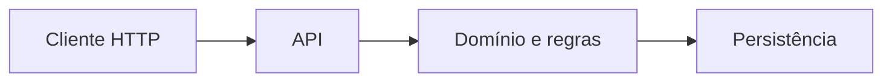
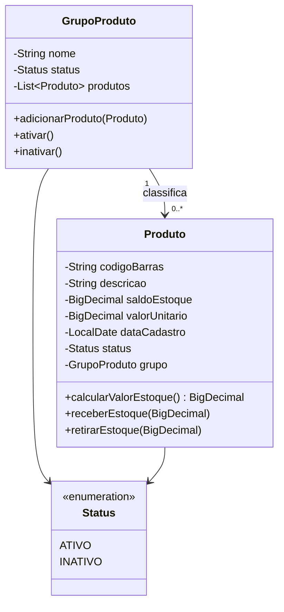
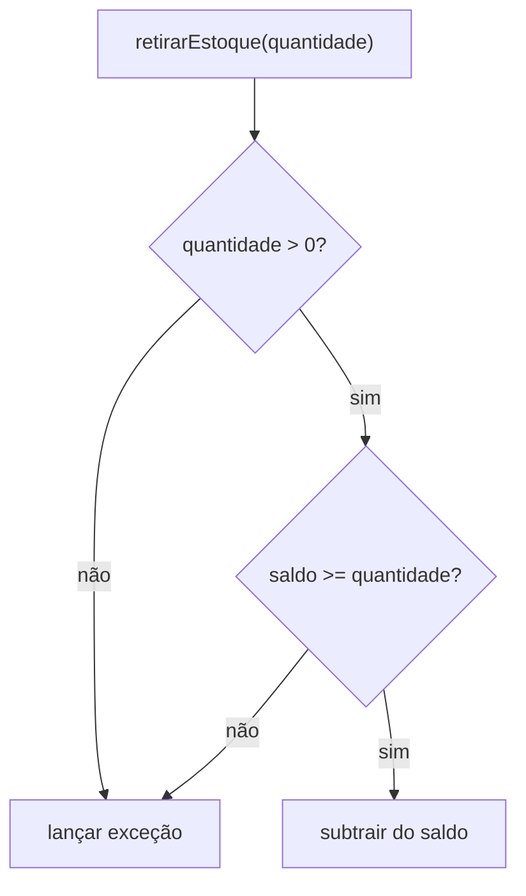

# Java – Spring Boot – Aula 03 – Modelagem de domínio com Java puro

[⬅ Voltar para o índice do curso](../../README.md)

---

## Apresentação da aula

Na Aula 02 criamos uma aplicação Spring Boot capaz de iniciar e responder a uma requisição HTTP em `/api/health`. Essa aplicação, porém, ainda não representa as regras do tema escolhido: ela prova que a infraestrutura inicial funciona, mas não sabe o que é um grupo de produtos, um produto, um saldo ou um valor de estoque.

Nesta aula transformaremos a descrição do tema em um **modelo de domínio**. O projeto de referência será capaz de representar grupos e produtos em memória, proteger regras importantes e calcular o valor de um estoque. Cada estudante realizará a mesma tradução para o tema individual aprovado na Aula 02.

O código será escrito em **Java puro**, sem banco de dados, JPA, controller, service ou repository. Essa separação é intencional: primeiro estudaremos o problema e suas regras; na Aula 04 estudaremos como um banco relacional pode persistir esses objetos.

## Problema orientador

Considere esta descrição informal:

> Um produto possui código de barras, descrição, saldo, valor unitário, data de cadastro e status. Todo produto pertence a um grupo. Um grupo pode classificar vários produtos. Não se pode retirar uma quantidade maior que o saldo disponível.

Essa descrição ainda deixa perguntas que precisam ser respondidas pelo modelo:

- quais dados são obrigatórios?
- um saldo negativo é válido?
- como representar os estados ativo e inativo?
- quem mantém a associação entre grupo e produto?
- uma lista devolvida por um objeto pode ser alterada externamente?
- como calcular valores monetários sem introduzir erros de ponto flutuante?
- como demonstrar que as regras continuam corretas depois de uma alteração?

Modelar o domínio é tornar essas decisões explícitas no código.

## Resultados de aprendizagem

Ao concluir esta aula, o estudante deverá ser capaz de:

1. explicar o que é um modelo de domínio e qual problema ele resolve;
2. distinguir classe, objeto, estado, comportamento, entidade e valor;
3. identificar e implementar invariantes de negócio;
4. aplicar encapsulamento para proteger o estado dos objetos;
5. representar estados finitos com `enum`;
6. justificar o uso de `BigDecimal` para quantidades e valores monetários;
7. modelar uma associação `1:N` entre objetos;
8. implementar comportamentos que preservem a consistência do modelo;
9. escrever testes unitários seguindo a organização Arrange–Act–Assert;
10. transferir a estrutura conceitual do Suporte OS para o tema individual.

## Pré-requisitos

- Aula 02 concluída;
- tag `aula-02-projeto-spring-boot` disponível;
- Java 21 selecionado no projeto;
- Maven Wrapper funcionando;
- tema individual aprovado e documentado;
- compreensão inicial de classe, atributo, método, construtor e modificadores de acesso.

Confirme o ponto inicial:

### Windows

```powershell
git status
git describe --tags --exact-match
.\mvnw.cmd test
```

### macOS ou Linux

```bash
git status
git describe --tags --exact-match
./mvnw test
```

Antes de iniciar a aula, o projeto deve estar sem alterações pendentes e os testes da Aula 02 devem passar.

---

## 1. O que é domínio

O **domínio** é a área de conhecimento e atividade para a qual o software está sendo construído. No projeto de referência, o domínio é um controle simplificado de produtos em estoque. Em outro projeto, o domínio poderia ser biblioteca, oficina, clínica, eventos ou locação.

O domínio não é o banco de dados nem a interface HTTP. Essas tecnologias permitem armazenar ou comunicar informações sobre o domínio, mas não definem sozinhas o significado das regras.



O diagrama apresenta três fronteiras:

- a API recebe e devolve representações;
- o domínio expressa conceitos e regras do problema;
- a persistência conserva o estado para uso futuro.

Nesta aula trabalharemos apenas no bloco central.

## 2. Modelo de domínio

Um **modelo** é uma representação seletiva da realidade. Ele não copia tudo que existe no mundo: seleciona características relevantes para o problema que o sistema precisa resolver.

Um produto real possui peso da embalagem, fabricante, cor, posição física, composição química e muitas outras características. O projeto do curso começa apenas com os dados necessários ao seu objetivo didático:

| Conceito | Representação inicial |
|---|---|
| identificação do produto | código de barras |
| nome comercial | descrição |
| quantidade disponível | saldo em estoque |
| valor de uma unidade | valor unitário |
| momento de entrada no cadastro | data de cadastro |
| disponibilidade lógica | status |
| classificação | grupo de produto |

Uma escolha de modelagem deve ser avaliada em relação ao problema. Um atributo não é correto apenas porque existe no mundo; ele precisa possuir significado e uso no sistema.

## 3. Classe, objeto, estado e comportamento

Uma **classe** define a estrutura e os comportamentos disponíveis para determinado tipo de objeto. Um **objeto** é uma ocorrência concreta criada durante a execução.

```java
GrupoProduto papelaria = new GrupoProduto("Papelaria");
GrupoProduto limpeza = new GrupoProduto("Limpeza");
```

`GrupoProduto` é a classe. `papelaria` e `limpeza` referenciam objetos diferentes.

O **estado** corresponde aos valores mantidos pelo objeto em certo instante. O **comportamento** corresponde às operações que o objeto oferece.

Exemplo:

```text
Estado: saldoEstoque = 3.000
Comportamento: receberEstoque(2.500)
Novo estado: saldoEstoque = 5.500
```

Um modelo que contém somente campos e métodos genéricos de leitura e escrita tende a deslocar as regras para outras partes do sistema. Nesta aula, operações como `receberEstoque`, `retirarEstoque`, `ativar` e `inativar` expressam a linguagem do problema.

## 4. Entidade, identidade e objeto de valor

Uma **entidade** é acompanhada por sua identidade ao longo do tempo, mesmo quando alguns atributos mudam. A descrição ou o saldo de um produto pode mudar e ele ainda representa o mesmo produto.

Nesta etapa, o código de barras funciona como uma **chave natural de negócio** para impedir duplicidade dentro do grupo. Ainda não criaremos um `id` numérico, porque o identificador de persistência será discutido junto ao JPA.

Um **objeto de valor** é caracterizado principalmente por seu valor, e não por uma identidade própria. `BigDecimal` e `LocalDate` são usados como valores dentro do modelo. Em sistemas maiores, conceitos como `Dinheiro` ou `CodigoBarras` também poderiam receber classes próprias. Essa abstração não será criada agora para manter o primeiro modelo acessível.

> **Simplificação declarada:** o curso começa usando tipos da biblioteca Java para valores. A necessidade de objetos de valor próprios deve ser reavaliada quando regras específicas desses conceitos crescerem.

## 5. Encapsulamento e invariantes

**Encapsular** significa controlar como o estado de um objeto pode ser observado e modificado. Marcar atributos como `private` impede que qualquer classe os altere diretamente.

Uma **invariante** é uma condição que deve permanecer verdadeira em todos os estados válidos do objeto.

Invariantes desta aula:

- código de barras não pode ser nulo ou vazio;
- descrição não pode ser nula ou vazia;
- saldo e valor unitário não podem ser negativos;
- data de cadastro é obrigatória;
- movimentações precisam ter quantidade maior que zero;
- retirada não pode ultrapassar o saldo;
- produto pertence a no máximo um grupo;
- um grupo não aceita dois produtos diferentes com o mesmo código;
- código, nome do grupo e data de cadastro não mudam após a criação.

Se os atributos fossem públicos ou possuíssem setters indiscriminados, essas regras poderiam ser contornadas:

```java
// Exemplo do que não queremos permitir
produto.saldoEstoque = new BigDecimal("-100");
```

No modelo implementado, o objeto só muda por operações que verificam as condições necessárias.

## 6. Construtores e criação válida

O construtor define o estado inicial do objeto. Nesta aula, preferimos impedir a criação de objetos incompletos em vez de criar primeiro um objeto vazio e preencher seus campos em várias etapas.

```java
Produto produto = new Produto(
        "7890000000001",
        "Caderno",
        new BigDecimal("3.000"),
        new BigDecimal("12.90"),
        LocalDate.of(2026, 8, 20));
```

Se um argumento obrigatório for inválido, o construtor lança uma exceção e o objeto não é disponibilizado ao código chamador.

Na Aula 04, o JPA exigirá um construtor sem argumentos com visibilidade adequada. Essa necessidade pertence ao mecanismo de persistência e será adicionada conscientemente, sem remover o construtor que representa a criação válida pelo domínio.

## 7. Associação e cardinalidade

O projeto possui a relação:

```text
Um GrupoProduto classifica zero ou vários Produtos.
Um Produto pertence a zero ou um GrupoProduto durante a montagem em memória.
Antes de persistir ou cadastrar, o grupo será obrigatório.
```



A associação é navegável nos dois sentidos: o grupo conhece seus produtos e o produto conhece seu grupo. Isso exige um método responsável por atualizar os dois lados. Se cada lado fosse alterado separadamente, seria possível produzir um estado contraditório.

## 8. `enum` e conjunto finito de estados

Quando um atributo aceita um conjunto finito e conhecido de valores, um `enum` oferece mais segurança que texto ou número solto.

Compare:

```java
String status = "Atvio"; // erro de digitação aceito
int status = 8;          // significado desconhecido
Status status = Status.ATIVO;
```

O compilador impede atribuições que não pertencem ao tipo `Status`.

Não adicionaremos códigos `0` e `1` ao enum nesta aula. Esses códigos seriam uma decisão de representação externa ou de persistência, e ainda não existe requisito que os justifique.

## 9. Precisão decimal e `BigDecimal`

Tipos `float` e `double` usam representação binária de ponto flutuante. Muitos valores decimais simples não possuem representação binária exata. Isso pode produzir resultados surpreendentes quando o domínio exige precisão decimal.

```java
double resultado = 0.1 + 0.2;
System.out.println(resultado); // pode exibir 0.30000000000000004
```

`BigDecimal` representa números decimais com precisão arbitrária e escala explícita. Por isso será usado tanto para o valor monetário quanto para o saldo, permitindo quantidades fracionárias.

Criação recomendada:

```java
new BigDecimal("12.90")
```

Evite:

```java
new BigDecimal(12.90)
```

O segundo construtor recebe o valor binário já aproximado do `double`.

No cálculo do estoque, definimos duas casas decimais e uma política de arredondamento:

```java
return saldoEstoque
        .multiply(valorUnitario)
        .setScale(2, RoundingMode.HALF_UP);
```

A política de arredondamento é uma decisão de domínio. `HALF_UP` é adotado didaticamente neste projeto; sistemas financeiros reais precisam seguir regras contábeis, contratuais e legais específicas.

### `equals` e `compareTo` em `BigDecimal`

```java
new BigDecimal("38.7").equals(new BigDecimal("38.70")); // false
new BigDecimal("38.7").compareTo(new BigDecimal("38.70")); // 0
```

`equals` considera valor e escala; `compareTo` faz comparação numérica. Os testes desta aula usam `compareTo` quando a intenção é comparar o valor numérico.

## 10. Datas com `LocalDate`

`LocalDate` representa uma data sem horário e sem fuso horário. É apropriado para a data de cadastro definida como dia civil no escopo atual.

```java
LocalDate.of(2026, 8, 20)
```

Não usamos `LocalDateTime` porque a hora ainda não é uma informação necessária. Também evitamos `LocalDate.now()` dentro do construtor para que a data seja explícita e os testes sejam determinísticos.

Se o requisito futuro precisar registrar um instante global exato, tipos como `Instant` deverão ser avaliados. Escolher um tipo temporal depende da semântica do dado.

## 11. Teste unitário como especificação executável

Um **teste unitário** verifica uma pequena unidade de comportamento isoladamente. Os testes desta aula não iniciam o Spring, não abrem porta e não acessam banco. Criam objetos diretamente e observam seus resultados.

Usaremos a organização Arrange–Act–Assert:

```java
// Arrange: preparar o cenário
Produto produto = novoProduto("3.000", "12.90");

// Act: executar o comportamento
BigDecimal valorEstoque = produto.calcularValorEstoque();

// Assert: verificar a consequência observável
assertEquals(0, new BigDecimal("38.70").compareTo(valorEstoque));
```

Um teste bem nomeado comunica a regra:

```java
void naoDeveRetirarQuantidadeMaiorQueOSaldo()
```

O teste não demonstra matematicamente que o programa está livre de todos os defeitos. Ele fornece evidência de que determinados comportamentos permanecem verdadeiros nos cenários especificados.

## 12. Mapeamento entre teoria e prática

| Ação prática | Conceito observado |
|---|---|
| criar o pacote `domain` | fronteira conceitual do modelo |
| criar `Status` | conjunto finito e segurança de tipos |
| tornar campos `private` | encapsulamento |
| validar no construtor | invariantes de criação |
| criar `receberEstoque` | comportamento de domínio |
| criar `retirarEstoque` | transição de estado protegida |
| usar `BigDecimal` | precisão decimal e regra de arredondamento |
| usar `LocalDate` explícita | semântica temporal e teste determinístico |
| retornar `List.copyOf` | proteção da coleção interna |
| testar exceções | especificação dos estados rejeitados |
| não usar Spring ou JPA | separação entre domínio e infraestrutura |

---

## 13. Estrutura que será construída

```text
src/
├── main/java/com/curso/suporteos/
│   ├── Suporteos2026Application.java
│   ├── api/
│   │   └── HealthController.java
│   └── domain/
│       ├── GrupoProduto.java
│       ├── Produto.java
│       └── Status.java
└── test/java/com/curso/suporteos/
    ├── Suporteos2026ApplicationTests.java
    └── domain/
        ├── GrupoProdutoTest.java
        └── ProdutoTest.java
```

O endpoint de saúde permanece funcionando. O novo pacote `domain` não será conectado à API nesta aula.

## 14. Criando o pacote de domínio no IntelliJ

1. Abra `src/main/java/com/curso/suporteos`.
2. Clique com o botão direito no pacote.
3. Escolha **New → Package**.
4. Informe:

   ```text
   com.curso.suporteos.domain
   ```

5. Dentro desse pacote, crie `Status`, `GrupoProduto` e `Produto`.

O nome `domain` comunica que essas classes representam conceitos do problema. Pacotes não devem ser organizados apenas por conveniência visual; eles também expressam responsabilidades e dependências.

## 15. Implementando `Status`

Arquivo: `src/main/java/com/curso/suporteos/domain/Status.java`

```java
package com.curso.suporteos.domain;

public enum Status {
    ATIVO,
    INATIVO
}
```

### Explicação

- `enum` declara um tipo com instâncias previamente conhecidas;
- `ATIVO` e `INATIVO` são os únicos valores aceitos;
- não existem setters;
- não existe código de banco;
- o mesmo tipo será usado inicialmente em grupo e produto.

Essa reutilização é adequada enquanto os dois conceitos possuírem exatamente os mesmos estados e significado. Se no futuro seus ciclos de vida divergirem, deverão receber enums distintos.

## 16. Implementando `GrupoProduto`

Arquivo: `src/main/java/com/curso/suporteos/domain/GrupoProduto.java`

```java
package com.curso.suporteos.domain;

import java.util.ArrayList;
import java.util.List;
import java.util.Objects;

public class GrupoProduto {

    private final String nome;
    private Status status;
    private final List<Produto> produtos = new ArrayList<>();

    public GrupoProduto(String nome) {
        this.nome = validarTextoObrigatorio(nome, "Nome do grupo é obrigatório");
        this.status = Status.ATIVO;
    }

    public void adicionarProduto(Produto produto) {
        Objects.requireNonNull(produto, "Produto é obrigatório");

        boolean codigoJaUtilizado = produtos.stream()
                .anyMatch(item -> item != produto
                        && item.getCodigoBarras().equals(produto.getCodigoBarras()));

        if (codigoJaUtilizado) {
            throw new IllegalArgumentException("Código de barras já utilizado no grupo");
        }

        produto.associarAo(this);

        if (!produtos.contains(produto)) {
            produtos.add(produto);
        }
    }

    public void ativar() {
        this.status = Status.ATIVO;
    }

    public void inativar() {
        this.status = Status.INATIVO;
    }

    public String getNome() {
        return nome;
    }

    public Status getStatus() {
        return status;
    }

    public List<Produto> getProdutos() {
        return List.copyOf(produtos);
    }

    private static String validarTextoObrigatorio(String texto, String mensagem) {
        if (texto == null || texto.isBlank()) {
            throw new IllegalArgumentException(mensagem);
        }
        return texto.trim();
    }
}
```

### 16.1 Nome imutável

```java
private final String nome;
```

`final` indica que a referência recebe valor uma vez. O nome passa pela validação e pelo `trim()`, que remove espaços externos.

### 16.2 Coleção controlada

```java
private final List<Produto> produtos = new ArrayList<>();
```

A lista é criada internamente. O código externo não recebe essa instância:

```java
public List<Produto> getProdutos() {
    return List.copyOf(produtos);
}
```

`List.copyOf` devolve uma cópia não modificável. Assim, esta operação será rejeitada:

```java
grupo.getProdutos().add(produto);
```

Produtos precisam entrar pelo método `adicionarProduto`, que protege as regras da associação.

### 16.3 Unicidade dentro do grupo

O `stream()` procura outro objeto com o mesmo código:

```java
boolean codigoJaUtilizado = produtos.stream()
        .anyMatch(item -> item != produto
                && item.getCodigoBarras().equals(produto.getCodigoBarras()));
```

`item != produto` compara referências e permite chamar novamente o método para a mesma instância sem duplicá-la. Dois objetos diferentes com o mesmo código são rejeitados.

Na Aula 04, a unicidade também precisará existir no banco. A validação em memória melhora a mensagem e protege o objeto, mas não substitui uma restrição de unicidade persistente em cenários concorrentes.

## 17. Implementando `Produto`

Arquivo: `src/main/java/com/curso/suporteos/domain/Produto.java`

```java
package com.curso.suporteos.domain;

import java.math.BigDecimal;
import java.math.RoundingMode;
import java.time.LocalDate;
import java.util.Objects;

public class Produto {

    private final String codigoBarras;
    private String descricao;
    private BigDecimal saldoEstoque;
    private BigDecimal valorUnitario;
    private final LocalDate dataCadastro;
    private Status status;
    private GrupoProduto grupo;

    public Produto(
            String codigoBarras,
            String descricao,
            BigDecimal saldoEstoque,
            BigDecimal valorUnitario,
            LocalDate dataCadastro) {
        this.codigoBarras = validarTextoObrigatorio(
                codigoBarras,
                "Código de barras é obrigatório");
        this.descricao = validarTextoObrigatorio(
                descricao,
                "Descrição é obrigatória");
        this.saldoEstoque = validarNaoNegativo(
                saldoEstoque,
                "Saldo de estoque não pode ser negativo");
        this.valorUnitario = validarNaoNegativo(
                valorUnitario,
                "Valor unitário não pode ser negativo");
        this.dataCadastro = Objects.requireNonNull(
                dataCadastro,
                "Data de cadastro é obrigatória");
        this.status = Status.ATIVO;
    }

    public BigDecimal calcularValorEstoque() {
        return saldoEstoque
                .multiply(valorUnitario)
                .setScale(2, RoundingMode.HALF_UP);
    }

    public void receberEstoque(BigDecimal quantidade) {
        validarPositivo(quantidade, "Quantidade recebida deve ser maior que zero");
        this.saldoEstoque = saldoEstoque.add(quantidade);
    }

    public void retirarEstoque(BigDecimal quantidade) {
        validarPositivo(quantidade, "Quantidade retirada deve ser maior que zero");

        if (saldoEstoque.compareTo(quantidade) < 0) {
            throw new IllegalArgumentException("Saldo de estoque insuficiente");
        }

        this.saldoEstoque = saldoEstoque.subtract(quantidade);
    }

    public void alterarDescricao(String novaDescricao) {
        this.descricao = validarTextoObrigatorio(
                novaDescricao,
                "Descrição é obrigatória");
    }

    public void alterarValorUnitario(BigDecimal novoValor) {
        this.valorUnitario = validarNaoNegativo(
                novoValor,
                "Valor unitário não pode ser negativo");
    }

    public void ativar() {
        this.status = Status.ATIVO;
    }

    public void inativar() {
        this.status = Status.INATIVO;
    }

    void associarAo(GrupoProduto grupo) {
        Objects.requireNonNull(grupo, "Grupo de produto é obrigatório");

        if (this.grupo != null && this.grupo != grupo) {
            throw new IllegalStateException("Produto já pertence a outro grupo");
        }

        this.grupo = grupo;
    }

    public String getCodigoBarras() {
        return codigoBarras;
    }

    public String getDescricao() {
        return descricao;
    }

    public BigDecimal getSaldoEstoque() {
        return saldoEstoque;
    }

    public BigDecimal getValorUnitario() {
        return valorUnitario;
    }

    public LocalDate getDataCadastro() {
        return dataCadastro;
    }

    public Status getStatus() {
        return status;
    }

    public GrupoProduto getGrupo() {
        return grupo;
    }

    private static String validarTextoObrigatorio(String texto, String mensagem) {
        if (texto == null || texto.isBlank()) {
            throw new IllegalArgumentException(mensagem);
        }
        return texto.trim();
    }

    private static BigDecimal validarNaoNegativo(BigDecimal valor, String mensagem) {
        Objects.requireNonNull(valor, mensagem);
        if (valor.signum() < 0) {
            throw new IllegalArgumentException(mensagem);
        }
        return valor;
    }

    private static void validarPositivo(BigDecimal valor, String mensagem) {
        Objects.requireNonNull(valor, mensagem);
        if (valor.signum() <= 0) {
            throw new IllegalArgumentException(mensagem);
        }
    }
}
```

### 17.1 Estado mutável e estado imutável

Código e data de cadastro são definidos como `final` porque não mudam no escopo atual. Descrição, saldo, valor, status e grupo podem mudar somente por métodos controlados.

### 17.2 Validação de sinal

```java
valor.signum()
```

O resultado é:

| Resultado | Significado |
|---:|---|
| `-1` | valor negativo |
| `0` | valor igual a zero |
| `1` | valor positivo |

Saldo inicial e valor unitário aceitam zero. Uma movimentação precisa ser estritamente positiva.

### 17.3 Retirada como operação atômica do objeto

O método verifica todas as condições antes de alterar o campo. Se a retirada for inválida, o saldo permanece inalterado.



### 17.4 Visibilidade de pacote

```java
void associarAo(GrupoProduto grupo)
```

O método não possui `public`, `protected` ou `private`; portanto, é acessível apenas no mesmo pacote. O código externo deve iniciar a associação pelo grupo:

```java
grupo.adicionarProduto(produto);
```

Isso concentra em um ponto a atualização dos dois lados da relação.

## 18. Decisão sobre `equals` e `hashCode`

Não implementaremos `equals` e `hashCode` nesta aula. Objetos `Produto` diferentes permanecem diferentes por identidade de referência, enquanto a regra de unicidade do código é verificada explicitamente pelo grupo.

Não devemos usar descrição, saldo, valor ou status em igualdade porque são mutáveis. Também não existe ainda um identificador JPA gerado. Na Aula 04, compararemos estratégias de igualdade para entidades persistentes antes de escolher uma implementação.

Essa decisão evita ensinar uma solução aparentemente simples que muda o comportamento de coleções quando um atributo mutável é alterado.

## 19. Criando os testes de `Produto`

Crie o pacote de teste:

```text
src/test/java/com/curso/suporteos/domain
```

Arquivo: `src/test/java/com/curso/suporteos/domain/ProdutoTest.java`

```java
package com.curso.suporteos.domain;

import org.junit.jupiter.api.Test;

import java.math.BigDecimal;
import java.time.LocalDate;

import static org.junit.jupiter.api.Assertions.assertEquals;
import static org.junit.jupiter.api.Assertions.assertThrows;

class ProdutoTest {

    @Test
    void deveCriarProdutoAtivoComDadosValidos() {
        Produto produto = novoProduto("3.000", "12.90");

        assertEquals("7890000000001", produto.getCodigoBarras());
        assertEquals("Caderno", produto.getDescricao());
        assertEquals(Status.ATIVO, produto.getStatus());
        assertEquals(LocalDate.of(2026, 8, 20), produto.getDataCadastro());
    }

    @Test
    void deveCalcularValorDoEstoque() {
        Produto produto = novoProduto("3.000", "12.90");

        BigDecimal valorEstoque = produto.calcularValorEstoque();

        assertEquals(0, new BigDecimal("38.70").compareTo(valorEstoque));
    }

    @Test
    void deveReceberERetirarEstoque() {
        Produto produto = novoProduto("3.000", "12.90");

        produto.receberEstoque(new BigDecimal("2.500"));
        produto.retirarEstoque(new BigDecimal("1.000"));

        assertEquals(0, new BigDecimal("4.500").compareTo(produto.getSaldoEstoque()));
    }

    @Test
    void naoDeveRetirarQuantidadeMaiorQueOSaldo() {
        Produto produto = novoProduto("3.000", "12.90");

        IllegalArgumentException excecao = assertThrows(
                IllegalArgumentException.class,
                () -> produto.retirarEstoque(new BigDecimal("3.001")));

        assertEquals("Saldo de estoque insuficiente", excecao.getMessage());
    }

    @Test
    void naoDeveCriarProdutoComCodigoEmBranco() {
        assertThrows(
                IllegalArgumentException.class,
                () -> new Produto(
                        "  ",
                        "Caderno",
                        BigDecimal.ZERO,
                        new BigDecimal("12.90"),
                        LocalDate.of(2026, 8, 20)));
    }

    @Test
    void naoDeveCriarProdutoComSaldoNegativo() {
        assertThrows(
                IllegalArgumentException.class,
                () -> novoProduto("-0.001", "12.90"));
    }

    @Test
    void deveAlterarOStatusPorComportamentoExplicito() {
        Produto produto = novoProduto("3.000", "12.90");

        produto.inativar();
        assertEquals(Status.INATIVO, produto.getStatus());

        produto.ativar();
        assertEquals(Status.ATIVO, produto.getStatus());
    }

    private Produto novoProduto(String saldo, String valorUnitario) {
        return new Produto(
                "7890000000001",
                "Caderno",
                new BigDecimal(saldo),
                new BigDecimal(valorUnitario),
                LocalDate.of(2026, 8, 20));
    }
}
```

### O que esses testes especificam

- o estado inicial é ativo;
- o cálculo monetário retorna o valor esperado;
- entrada e saída alteram o saldo corretamente;
- saldo insuficiente é rejeitado;
- código vazio é rejeitado;
- saldo negativo é rejeitado;
- o status muda apenas por operações explícitas.

O método auxiliar `novoProduto` reduz repetição de dados que não são relevantes para cada cenário. Ele não contém uma asserção e não é um teste.

## 20. Criando os testes de `GrupoProduto`

Arquivo: `src/test/java/com/curso/suporteos/domain/GrupoProdutoTest.java`

```java
package com.curso.suporteos.domain;

import org.junit.jupiter.api.Test;

import java.math.BigDecimal;
import java.time.LocalDate;

import static org.junit.jupiter.api.Assertions.assertEquals;
import static org.junit.jupiter.api.Assertions.assertSame;
import static org.junit.jupiter.api.Assertions.assertThrows;

class GrupoProdutoTest {

    @Test
    void deveAdicionarProdutoEManejarOsDoisLadosDaAssociacao() {
        GrupoProduto grupo = new GrupoProduto("Papelaria");
        Produto produto = novoProduto("7890000000001");

        grupo.adicionarProduto(produto);

        assertEquals(1, grupo.getProdutos().size());
        assertSame(produto, grupo.getProdutos().getFirst());
        assertSame(grupo, produto.getGrupo());
    }

    @Test
    void naoDeveAdicionarProdutoNulo() {
        GrupoProduto grupo = new GrupoProduto("Papelaria");

        assertThrows(NullPointerException.class, () -> grupo.adicionarProduto(null));
    }

    @Test
    void naoDeveAdicionarDoisProdutosComOMesmoCodigo() {
        GrupoProduto grupo = new GrupoProduto("Papelaria");
        grupo.adicionarProduto(novoProduto("7890000000001"));

        IllegalArgumentException excecao = assertThrows(
                IllegalArgumentException.class,
                () -> grupo.adicionarProduto(novoProduto("7890000000001")));

        assertEquals("Código de barras já utilizado no grupo", excecao.getMessage());
    }

    @Test
    void naoDevePermitirQueProdutoPertençaADoisGrupos() {
        GrupoProduto papelaria = new GrupoProduto("Papelaria");
        GrupoProduto materialEscolar = new GrupoProduto("Material escolar");
        Produto produto = novoProduto("7890000000001");
        papelaria.adicionarProduto(produto);

        IllegalStateException excecao = assertThrows(
                IllegalStateException.class,
                () -> materialEscolar.adicionarProduto(produto));

        assertEquals("Produto já pertence a outro grupo", excecao.getMessage());
    }

    @Test
    void naoDeveExporUmaListaInternaModificavel() {
        GrupoProduto grupo = new GrupoProduto("Papelaria");
        Produto produto = novoProduto("7890000000001");
        grupo.adicionarProduto(produto);

        assertThrows(
                UnsupportedOperationException.class,
                () -> grupo.getProdutos().add(novoProduto("7890000000002")));
    }

    private Produto novoProduto(String codigoBarras) {
        return new Produto(
                codigoBarras,
                "Caderno",
                new BigDecimal("3.000"),
                new BigDecimal("12.90"),
                LocalDate.of(2026, 8, 20));
    }
}
```

### `assertSame` e identidade

`assertSame` verifica se duas referências apontam para o mesmo objeto. O teste não quer apenas outro grupo com dados equivalentes: quer confirmar que o produto referencia exatamente o grupo que recebeu a associação.

### Teste de encapsulamento da coleção

O teste que espera `UnsupportedOperationException` demonstra que o chamador não pode inserir objetos diretamente na coleção devolvida. A regra de associação não pode ser contornada pelo getter.

## 21. Executando os testes

### Windows

```powershell
.\mvnw.cmd test
```

### macOS ou Linux

```bash
./mvnw test
```

Resultado esperado neste ponto:

```text
Tests run: 13, Failures: 0, Errors: 0, Skipped: 0
BUILD SUCCESS
```

Os 13 testes são compostos por:

- 1 teste de contexto criado na Aula 02;
- 7 testes de `Produto`;
- 5 testes de `GrupoProduto`.

## 22. Executando somente os testes de domínio

### Windows

```powershell
.\mvnw.cmd -Dtest="ProdutoTest,GrupoProdutoTest" test
```

### macOS ou Linux

```bash
./mvnw -Dtest="ProdutoTest,GrupoProdutoTest" test
```

Esses testes não devem exibir a inicialização do Spring Boot. Essa é uma evidência prática de que o domínio não depende do framework.

## 23. Testes pela interface do IntelliJ

1. Abra uma classe de teste.
2. Clique no triângulo verde ao lado da classe para executar todos os métodos.
3. Clique no triângulo ao lado de um método para executar apenas aquele cenário.
4. Observe a árvore de resultados.
5. Compare com a execução pelo Maven Wrapper.

A execução pela IDE é conveniente para desenvolvimento. A execução pelo Wrapper é a referência reproduzível para o ponto de quebra e para futura integração contínua.

## 24. Verificação manual no JShell — atividade opcional

Após compilar o projeto, é possível experimentar os objetos em um ambiente interativo. Como a configuração do classpath pode variar entre sistemas, esta atividade é opcional e não substitui os testes automatizados.

O objetivo do experimento é observar que os objetos existem e aplicam regras sem iniciar servidor ou acessar banco.

## 25. Aplicando ao tema do estudante

Antes de escrever código, preencha a tabela:

| Elemento do Suporte OS | Elemento do meu tema | Regra correspondente |
|---|---|---|
| `GrupoProduto` | preencher | classifica a entidade principal |
| `Produto` | preencher | entidade principal |
| `codigoBarras` | preencher | identificação única de negócio |
| `descricao` | preencher | descrição compreensível |
| `saldoEstoque` | preencher | medida quantitativa |
| `valorUnitario` | preencher | valor monetário |
| `dataCadastro` | preencher | data relevante |
| `Status` | preencher | estados válidos |
| `calcularValorEstoque` | preencher | cálculo que combina medida e valor |

Exemplo para biblioteca:

| Suporte OS | Biblioteca |
|---|---|
| `GrupoProduto` | `CategoriaLivro` |
| `Produto` | `Livro` |
| código de barras | ISBN |
| saldo em estoque | quantidade disponível |
| valor unitário | valor de reposição |
| valor de estoque | valor total do acervo disponível |

O estudante não deve apenas substituir palavras. Precisa justificar:

- por que o código escolhido identifica a entidade;
- qual unidade representa a medida;
- qual é a semântica do valor monetário;
- qual cálculo faz sentido;
- quais transições de status são válidas;
- qual regra impede um estado inconsistente.

## 26. Atividade orientada

### Parte A — leitura do modelo

Em duplas, identifique no código:

1. três invariantes;
2. dois estados mutáveis;
3. dois estados imutáveis;
4. uma decisão de visibilidade;
5. uma regra protegida por teste.

Para cada item, informe arquivo, método e justificativa.

### Parte B — experimento controlado

Crie temporariamente um teste que tente:

1. retirar quantidade zero;
2. retirar quantidade negativa;
3. alterar diretamente a lista do grupo;
4. associar o mesmo produto a dois grupos.

Registre a exceção observada e explique qual invariante foi protegida. Depois mantenha apenas testes que acrescentem cobertura relevante ao tema.

### Parte C — implementação temática

No repositório individual:

1. crie o enum de status;
2. crie a entidade de classificação;
3. crie a entidade principal;
4. implemente ao menos uma regra de cálculo;
5. implemente uma operação que altera a medida;
6. proteja a associação;
7. crie testes válidos e inválidos.

### Entregáveis

- diagrama ou tabela de correspondência;
- três classes de domínio;
- pelo menos oito testes unitários;
- explicação de três invariantes;
- saída do Maven Wrapper;
- commit publicado no repositório individual.

## 27. Questões de revisão

1. O que é domínio em Engenharia de Software?
2. Por que um modelo não precisa representar todos os detalhes do mundo real?
3. Qual é a diferença entre classe e objeto?
4. Qual é a diferença entre estado e comportamento?
5. Por que `Produto` pode ser tratado como entidade?
6. O que é uma invariante?
7. Como o encapsulamento protege invariantes?
8. Por que não fornecemos um setter genérico para o saldo?
9. Qual é a vantagem de `receberEstoque` em relação a `setSaldoEstoque`?
10. Por que `Status` é um `enum` e não uma `String`?
11. Por que o enum ainda não possui código numérico?
12. Qual é a cardinalidade entre grupo e produto?
13. Por que a associação precisa atualizar os dois lados?
14. O que aconteceria se o getter devolvesse diretamente a lista interna?
15. Por que `BigDecimal` é preferido para valor monetário?
16. Por que construímos `BigDecimal` a partir de `String`?
17. Qual é a diferença entre `equals` e `compareTo` em `BigDecimal`?
18. Por que a política de arredondamento precisa ser explícita?
19. Por que usamos `LocalDate` em vez de `LocalDateTime`?
20. Por que uma data explícita torna o teste mais determinístico?
21. O que `assertThrows` especifica?
22. Qual é a diferença entre `assertSame` e `assertEquals`?
23. O que significa Arrange–Act–Assert?
24. Por que testes unitários não provam ausência total de defeitos?
25. Por que o domínio não possui anotações Spring nesta aula?
26. Que adaptação o JPA provavelmente exigirá no construtor?
27. Por que não implementamos `equals` com saldo, descrição e preço?
28. A validação em memória elimina a necessidade de restrição no banco? Justifique.
29. Como uma exceção preserva o estado do produto quando o saldo é insuficiente?
30. Cite uma invariante específica do seu projeto temático.

## 28. Problemas frequentes e diagnóstico

### 28.1 `Cannot resolve symbol BigDecimal`

Confira o import:

```java
import java.math.BigDecimal;
```

`BigDecimal` pertence a `java.math`, não a `java.lang`.

### 28.2 `Cannot resolve symbol LocalDate`

Use:

```java
import java.time.LocalDate;
```

### 28.3 Resultado decimal inesperado

Confirme se o valor foi criado com `String`:

```java
new BigDecimal("12.90")
```

Depois confira a escala e a política de arredondamento no ponto do cálculo.

### 28.4 Teste compara `38.7` e `38.70` como diferentes

`BigDecimal.equals` considera a escala. Quando a intenção for igualdade numérica, compare com `compareTo` ou use uma asserção que realize comparação numérica.

### 28.5 Produto aparece no grupo, mas grupo não aparece no produto

Um dos lados da associação não foi atualizado. A entrada oficial deve ser:

```java
grupo.adicionarProduto(produto);
```

O teste deve observar os dois lados.

### 28.6 `UnsupportedOperationException` ao adicionar pelo getter

Esse comportamento é intencional. A lista exposta não é modificável. Use o método de negócio do grupo.

### 28.7 Teste unitário inicia o Spring

Verifique se a classe de domínio foi anotada com `@SpringBootTest` ou se o teste herdou configuração desnecessária. Testes de domínio precisam apenas de JUnit.

### 28.8 `Tests run: 0`

Confira:

- arquivo em `src/test/java`;
- classe reconhecida pelo Maven;
- método anotado com `@Test` de `org.junit.jupiter.api.Test`;
- nome da classe compatível com a convenção de testes.

### 28.9 `NullPointerException` durante validação

Leia a mensagem e localize qual argumento era obrigatório. Não substitua valores nulos por textos vazios apenas para fazer o teste passar; corrija a criação do cenário ou a regra, conforme o requisito.

## 29. Segurança e qualidade

Esta aula não trata autenticação, mas introduz propriedades que afetam segurança e integridade:

- estado privado reduz alterações não controladas;
- validação impede dados estruturalmente inválidos;
- coleção protegida evita contornar regras;
- exceções não incluem segredos ou dados sensíveis;
- testes tornam regressões observáveis;
- ausência de dependência desnecessária reduz acoplamento.

Validação de domínio não substitui validação da entrada HTTP. Quando a API receber dados externos, ela deverá rejeitar representações malformadas antes de chamar o domínio, e o domínio continuará sendo a última barreira para suas invariantes.

## 30. Avaliação da aprendizagem

| Critério | Insuficiente | Em desenvolvimento | Adequado | Avançado |
|---|---|---|---|---|
| Modelo conceitual | classes não representam o tema | correspondência parcial e pouco justificada | entidades, valores e relação são coerentes | explicita limites e alternativas do modelo |
| Encapsulamento | campos públicos ou setters contornam regras | algumas regras estão protegidas | invariantes são protegidas por construtores e métodos | demonstra consequências e consistência entre operações |
| Tipos | usa textos, números ou datas sem semântica | tipos corretos com uso inconsistente | enum, `BigDecimal` e `LocalDate` são usados corretamente | justifica precisão, escala e semântica temporal |
| Relacionamento | associação inconsistente | apenas um lado é mantido | dois lados permanecem coerentes | protege duplicidade, pertencimento e coleção |
| Testes | ausentes ou não executam | cobrem apenas casos válidos | cobrem comportamento e rejeições relevantes | testes comunicam regras e isolam causas de falha |
| Transferência | apenas renomeia o exemplo | adapta com justificativa incompleta | traduz estrutura e regras para o tema | identifica regras próprias sem romper o contrato do curso |
| Evidências | não apresenta execução | apresenta saída parcial | Wrapper termina com todos os testes verdes | interpreta falha controlada e demonstra correção |

Sugestão de composição da nota:

- fundamentação e correspondência do tema: 20%;
- modelo e encapsulamento: 25%;
- comportamentos e relacionamento: 20%;
- testes unitários: 25%;
- evidências, legibilidade e Git: 10%.

## 31. Checklist do estudante

### Fundamentação

- [ ] Consigo explicar o domínio do meu projeto.
- [ ] Consigo diferenciar entidade e valor.
- [ ] Identifiquei as invariantes do tema.
- [ ] Sei justificar cada tipo escolhido.

### Implementação

- [ ] Criei um pacote de domínio.
- [ ] O domínio não importa Spring nem JPA.
- [ ] Campos estão encapsulados.
- [ ] O construtor rejeita estado inicial inválido.
- [ ] O enum não possui setter nem código sem justificativa.
- [ ] Valores decimais são criados a partir de `String`.
- [ ] Movimentações rejeitam zero e valores negativos.
- [ ] Retirada não permite saldo insuficiente.
- [ ] A associação mantém os dois lados.
- [ ] A coleção interna não pode ser alterada pelo getter.

### Testes e Git

- [ ] Existem testes para caminhos válidos.
- [ ] Existem testes para entradas inválidas.
- [ ] Testes de domínio não iniciam o Spring.
- [ ] Todos os testes passam pelo Maven Wrapper.
- [ ] `git diff --check` não apresenta erros.
- [ ] Não existem arquivos da IDE ou de build no commit.
- [ ] O tema individual está documentado.

## 32. Ponto de quebra da Aula 03

### Windows

```powershell
.\mvnw.cmd test
git status
git diff --check
```

### macOS ou Linux

```bash
./mvnw test
git status
git diff --check
```

O projeto deve:

1. compilar com Java 21;
2. executar os 13 testes sem falhas;
3. manter `/api/health` disponível;
4. possuir domínio sem Spring ou JPA;
5. proteger as invariantes descritas;
6. não conter credenciais ou artefatos de build;
7. possuir documentação correspondente ao código.

Commit sugerido:

```bash
git add README.md docs/03aula src/main/java/com/curso/suporteos/domain src/test/java/com/curso/suporteos/domain
git commit -m "Aula 03: implementa o modelo de domínio"
```

Tag sugerida:

```bash
git tag -a aula-03-dominio -m "Conclusão da Aula 03"
git push origin main
git push origin aula-03-dominio
```

Não crie a tag enquanto os testes estiverem falhando. Uma tag publicada representa um estado recuperável da disciplina.

## 33. Orientações para o professor

### Sequência sugerida

| Etapa | Tempo aproximado |
|---|---:|
| Problema e linguagem do domínio | 20 minutos |
| Classe, objeto, entidade, valor e invariante | 35 minutos |
| Diagrama e decisões do modelo | 25 minutos |
| Implementação de `Status` e `GrupoProduto` | 35 minutos |
| `BigDecimal`, datas e implementação de `Produto` | 45 minutos |
| Testes unitários e falhas controladas | 40 minutos |
| Tradução para os temas | 35 minutos |
| Revisão e ponto de quebra | 20 minutos |

O conteúdo pode ocupar dois encontros. No primeiro, concentre-se em modelagem e código do projeto de referência. No segundo, execute testes, diagnóstico e transferência para os temas individuais.

### Perguntas para discussão

- todo campo de uma tabela precisa existir antes no domínio?
- um produto pode existir temporariamente sem grupo durante sua criação?
- código de barras é identidade universal ou apenas uma regra deste sistema?
- saldo deve aceitar frações em todos os temas?
- data de cadastro precisa de horário?
- qual camada deve produzir mensagens adequadas ao usuário da API?

### Falhas controladas

Para exercitar diagnóstico, o professor pode demonstrar uma falha por vez:

1. devolver a lista interna diretamente;
2. retirar sem verificar o saldo;
3. usar `double` no cálculo;
4. criar `BigDecimal` a partir de `double`;
5. atualizar apenas um lado da associação;
6. colocar `@SpringBootTest` em um teste unitário.

Os estudantes devem apresentar:

```text
Evidência observada → hipótese → teste da hipótese → correção → nova evidência
```

### Limites desta aula

Não introduza ainda:

- `@Entity`, `@Id` ou `@OneToMany`;
- repositories;
- banco H2 ou PostgreSQL;
- Liquibase;
- DTOs;
- endpoints CRUD;
- serialização do relacionamento.

Esses assuntos dependem do modelo criado aqui e terão fundamentação própria.

## 34. Próxima aula

A Aula 04 estudará a passagem entre objetos e tabelas:

- persistência e ciclo de vida;
- impedância objeto-relacional;
- entidades JPA;
- identificador persistente;
- construtor exigido pelo provedor;
- mapeamento de `BigDecimal`, data e enum;
- relacionamento `1:N` e chave estrangeira;
- diferença entre regra no objeto e restrição no banco.

Como o curso adotará Liquibase, a criação do esquema deverá ser coordenada com o primeiro modelo persistente. O objetivo é evitar que geração automática de tabelas seja apresentada como estratégia definitiva de versionamento.

## Referências

### Documentação oficial

- [Java Language Specification — classes](https://docs.oracle.com/javase/specs/jls/se21/html/jls-8.html)
- [Java 21 — `BigDecimal`](https://docs.oracle.com/en/java/javase/21/docs/api/java.base/java/math/BigDecimal.html)
- [Java 21 — `RoundingMode`](https://docs.oracle.com/en/java/javase/21/docs/api/java.base/java/math/RoundingMode.html)
- [Java 21 — `LocalDate`](https://docs.oracle.com/en/java/javase/21/docs/api/java.base/java/time/LocalDate.html)
- [Java 21 — `List.copyOf`](https://docs.oracle.com/en/java/javase/21/docs/api/java.base/java/util/List.html#copyOf(java.util.Collection))
- [JUnit User Guide](https://docs.junit.org/current/user-guide/)

### Referências bibliográficas

- EVANS, Eric. *Domain-Driven Design: Tackling Complexity in the Heart of Software*. Addison-Wesley, 2003.
- FOWLER, Martin. *Patterns of Enterprise Application Architecture*. Addison-Wesley, 2002.
- BLOCH, Joshua. *Effective Java*. 3. ed. Addison-Wesley, 2018.

---

[⬅ Voltar para o índice do curso](../../README.md)
