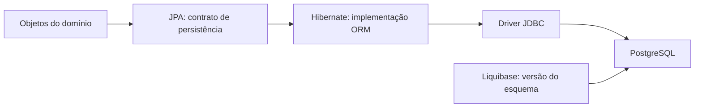
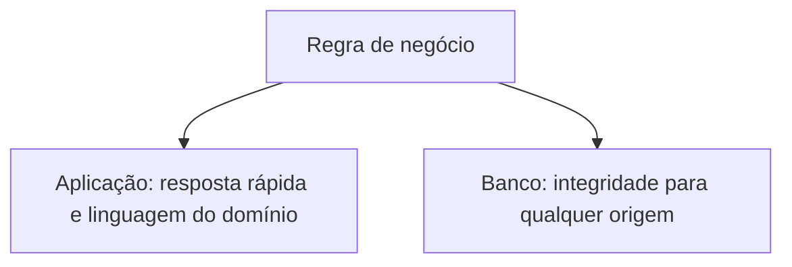

# Java – Spring Boot – Aula 04 – Persistência com JPA, PostgreSQL, perfis e Liquibase

[⬅ Voltar para o índice do curso](../../README.md)

---

## Apresentação da aula

Na Aula 03 construímos `GrupoProduto` e `Produto` como objetos Java que existem apenas na memória. Quando a aplicação termina, esses objetos desaparecem. Nesta aula conectaremos o modelo a um PostgreSQL e criaremos o esquema de forma versionada com Liquibase.

O banco não será criado pelo Hibernate. O **Liquibase será a fonte de verdade da estrutura**, enquanto o Hibernate apenas verificará se as entidades Java correspondem ao esquema. Essa separação torna as mudanças reproduzíveis, auditáveis e adequadas ao trabalho em equipe.

Usaremos três perfis Spring — `dev`, `test` e `prod` — mas todos utilizarão PostgreSQL. Não usaremos H2: assim, testes e desenvolvimento exercitam tipos, restrições e comportamento do mesmo SGBD adotado em produção.

Nesta aula ainda não criaremos repositories, services ou endpoints de cadastro. O objetivo é compreender e validar a fundação da persistência antes de adicionar novas camadas.

## Problema orientador

Como garantir que dois estudantes, o servidor de integração e o ambiente de produção construam exatamente a mesma estrutura de banco, na mesma ordem, sem depender de comandos executados manualmente?

Responderemos também:

- quem cria tabelas: Hibernate ou Liquibase?
- como o Liquibase sabe o que já executou?
- por que um `changeSet` aplicado não deve ser editado?
- como separar configurações sem colocar senha no Git?
- que responsabilidades pertencem ao Java e quais também devem ser protegidas pelo banco?
- como testar mapeamentos e restrições no PostgreSQL real?

## Resultados de aprendizagem

Ao concluir a aula, o estudante deverá ser capaz de:

1. diferenciar persistência, JDBC, JPA, Hibernate, Spring Data JPA e Liquibase;
2. explicar o problema do desencontro objeto-relacional;
3. configurar perfis Spring com PostgreSQL e variáveis de ambiente;
4. criar usuário e bancos de desenvolvimento e teste com menor privilégio;
5. escrever um changelog mestre e migrações YAML incrementais;
6. explicar identidade, `changeSet`, checksum, lock e idempotência;
7. mapear entidades e uma associação `1:N` com JPA;
8. justificar `ddl-auto=validate` quando Liquibase administra o esquema;
9. verificar o histórico em `databasechangelog`;
10. diagnosticar erros de conexão, YAML, checksum e divergência de esquema;
11. criar a próxima migração sem alterar o histórico já executado;
12. transferir a solução ao tema individual.

## Pré-requisitos

- Aula 03 concluída e tag `aula-03-dominio` disponível;
- Java 21 e Maven Wrapper funcionando;
- Docker Desktop em execução;
- PostgreSQL acessível em `localhost:5432`;
- tema individual mantido desde a Aula 02;
- nenhum segredo versionado.

Confirme o ponto inicial:

```bash
git status
git describe --tags --exact-match
./mvnw test
```

No Windows, use `git status`, `git describe --tags --exact-match` e `\.\mvnw.cmd test`.

---

## 1. Modelo mental da persistência

**Persistir** significa conservar o estado além do processo que o criou. O caminho desta aplicação possui responsabilidades diferentes:



| Elemento | Responsabilidade nesta aula |
|---|---|
| PostgreSQL | armazenar dados e aplicar integridade relacional |
| JDBC | protocolo Java de acesso a bancos relacionais |
| JPA | especificar como objetos Java são persistidos |
| Hibernate | implementar JPA e transformar operações em SQL |
| Spring Data JPA | preparar a infraestrutura; repositories virão depois |
| Liquibase | criar e evoluir o esquema em mudanças versionadas |

JPA não é banco e Hibernate não é JPA. JPA define contratos e anotações; Hibernate é uma implementação desses contratos.

## 2. O desencontro objeto-relacional

Objetos possuem referências, encapsulamento e comportamento. Bancos relacionais possuem tabelas, linhas, colunas, chaves e restrições. O ORM faz uma correspondência entre esses modelos:

| Modelo de objetos | Modelo relacional |
|---|---|
| classe `Produto` | tabela `produto` |
| objeto | linha |
| atributo | coluna |
| referência `produto.grupo` | chave estrangeira |
| identidade `id` | chave primária |
| `Status.ATIVO` | texto `ATIVO` |

O mapeamento reduz código repetitivo, mas não elimina a necessidade de compreender SQL, cardinalidade, constraints e transações.

## 3. Migração de banco como histórico executável

Uma migração descreve uma mudança pequena e ordenada no esquema. O estado atual é obtido pela composição do histórico:

```text
banco vazio
  + 001: criar grupo_produto
  + 002: criar produto e suas restrições
  = esquema da Aula 04
```

O Liquibase registra cada execução na tabela `databasechangelog` e coordena execuções simultâneas por `databasechangeloglock`. Um `changeSet` é identificado pela combinação de **arquivo, id e author**. Seu conteúdo origina um checksum.

Consequência: depois que um `changeSet` foi compartilhado ou executado em outro ambiente, ele é histórico. Para evoluir, crie outro `changeSet`; não reescreva o anterior.

## 4. Integridade em camadas

A regra “saldo não pode ser negativo” existe no construtor Java para produzir erro próximo ao usuário. Ela também existe como `CHECK` no PostgreSQL para proteger dados inseridos por scripts, integrações ou futuras versões da aplicação.



Não é duplicação acidental; são fronteiras de proteção complementares.

## 5. Perfis e configuração externa

Um **profile** ativa um conjunto de configurações para determinado contexto. Neste curso:

| Profile | Finalidade | Banco |
|---|---|---|
| `dev` | execução do estudante | `suporteos2026_dev` |
| `test` | testes automatizados | `suporteos2026_test` |
| `prod` | modelo para implantação | PostgreSQL informado pelo ambiente |

Todos usam PostgreSQL. Bancos diferentes evitam que testes alterem dados usados durante a demonstração.

Variáveis de ambiente separam código e configuração. A senha varia por máquina, não pertence ao repositório e não deve aparecer em `application.properties`, prints, commits ou logs.

Um arquivo `.env` é uma convenção para reunir configurações locais. O Spring Boot não procura esse nome automaticamente, mas permite importá-lo explicitamente como um arquivo de propriedades sem extensão. Nesta aula, os profiles `dev` e `test` farão essa importação; `prod` continuará recebendo segredos exclusivamente do ambiente de implantação.

## 6. Mapeamento teoria–prática

| Ação | Conceito exercitado |
|---|---|
| separar bancos `dev` e `test` | isolamento de ambientes |
| copiar `.env.example` para `.env` | configuração local sem versionar segredos |
| adicionar o starter Liquibase | migração integrada ao ciclo de inicialização |
| criar `db.changelog-master.yaml` | ordem e composição do histórico |
| usar `@Entity` e `@Id` | identidade persistente |
| usar `@ManyToOne` | chave estrangeira e lado proprietário |
| configurar `ddl-auto=validate` | responsabilidade única pelo esquema |
| testar no PostgreSQL | fidelidade tecnológica e evidência |

---

## 7. Checkpoint 1 — dependências de persistência

No Spring Initializr, estas dependências correspondem a **Spring Data JPA**, **Liquibase Migration** e **PostgreSQL Driver**. Como o projeto já existe, acrescente ao `pom.xml`:

```xml
<dependency>
    <groupId>org.springframework.boot</groupId>
    <artifactId>spring-boot-starter-data-jpa</artifactId>
</dependency>
<dependency>
    <groupId>org.springframework.boot</groupId>
    <artifactId>spring-boot-starter-liquibase</artifactId>
</dependency>
<dependency>
    <groupId>org.postgresql</groupId>
    <artifactId>postgresql</artifactId>
    <scope>runtime</scope>
</dependency>
<dependency>
    <groupId>org.springframework.boot</groupId>
    <artifactId>spring-boot-starter-data-jpa-test</artifactId>
    <scope>test</scope>
</dependency>
```

O `scope runtime` indica que o código compila contra APIs padronizadas, mas o driver é necessário durante a execução. O starter de teste fornece recursos próprios para testar persistência.

Atualize e compile:

```bash
./mvnw clean compile
```

No IntelliJ Ultimate, abra a janela Maven e use **Reload All Maven Projects** se as dependências ainda aparecerem em vermelho.

### Conferência do checkpoint

- [ ] Maven terminou com `BUILD SUCCESS`;
- [ ] dependências JPA, Liquibase e PostgreSQL aparecem no projeto;
- [ ] nenhum arquivo `.jar` foi copiado manualmente.

---

## 8. Checkpoint 2 — usuário e bancos PostgreSQL

Não use o superusuário `postgres` na aplicação. Crie um papel próprio e dois bancos. No terminal do contêiner PostgreSQL ou no Query Tool do pgAdmin, execute substituindo a senha do exemplo:

```sql
CREATE ROLE suporteos_app
    WITH LOGIN
    PASSWORD 'ESCOLHA_UMA_SENHA_LOCAL_FORTE';

CREATE DATABASE suporteos2026_dev
    WITH OWNER suporteos_app;

CREATE DATABASE suporteos2026_test
    WITH OWNER suporteos_app;
```

`CREATE DATABASE` não pode ser executado dentro de alguns blocos transacionais. Se o cliente reclamar, execute cada comando de banco separadamente.

Verifique sem mostrar a senha:

```sql
SELECT rolname FROM pg_roles WHERE rolname = 'suporteos_app';
SELECT datname FROM pg_database
WHERE datname IN ('suporteos2026_dev', 'suporteos2026_test');
```

O proprietário pode criar tabelas nesses bancos, mas não recebe automaticamente privilégios administrativos sobre todo o servidor. Isso aplica menor privilégio ao escopo da aula.

---

## 9. Checkpoint 3 — variáveis e profiles

O repositório contém `.env.example` na raiz. Esse arquivo é um **modelo versionável**: apresenta os nomes esperados, mas nunca contém senhas reais.

```dotenv
# Desenvolvimento
DB_DEV_URL=jdbc:postgresql://localhost:5432/suporteos2026_dev
DB_DEV_USERNAME=suporteos_app
DB_DEV_PASSWORD=substitua_pela_senha_local

# Testes
DB_TEST_URL=jdbc:postgresql://localhost:5432/suporteos2026_test
DB_TEST_USERNAME=suporteos_app
DB_TEST_PASSWORD=substitua_pela_senha_local

# Produção: definidos pela plataforma, não pelo repositório
DB_URL=jdbc:postgresql://servidor:5432/banco
DB_USERNAME=usuario_da_aplicacao
DB_PASSWORD=substitua_pelo_segredo_da_plataforma
```

Confirme que `.gitignore` ignora `.env` e permite `.env.example`.

### 9.1 Criar o arquivo local `.env`

Cada estudante cria sua própria cópia. Esse arquivo não deve ser enviado a colegas nem ao GitHub.

No Windows PowerShell:

```powershell
Copy-Item .env.example .env
```

No macOS ou Linux:

```bash
cp .env.example .env
```

Abra `.env` no IntelliJ e substitua somente os valores locais:

```dotenv
DB_DEV_URL=jdbc:postgresql://localhost:5432/suporteos2026_dev
DB_DEV_USERNAME=suporteos_app
DB_DEV_PASSWORD=SENHA_ESCOLHIDA_AO_CRIAR_O_USUARIO

DB_TEST_URL=jdbc:postgresql://localhost:5432/suporteos2026_test
DB_TEST_USERNAME=suporteos_app
DB_TEST_PASSWORD=SENHA_ESCOLHIDA_AO_CRIAR_O_USUARIO
```

Regras do formato usado nesta aula:

- uma atribuição `NOME=valor` por linha;
- não escreva espaços ao redor de `=`;
- linhas iniciadas por `#` são comentários;
- use exatamente os nomes definidos no exemplo;
- não acrescente `export` dentro do arquivo;
- não coloque a senha entre aspas, a menos que as aspas façam parte dela;
- evite caracteres de quebra de linha no segredo didático local.

Verifique a proteção antes de continuar:

```bash
git status --short
git check-ignore -v .env
```

O segundo comando deve mostrar a regra do `.gitignore`. O primeiro **não pode** listar `.env` como arquivo novo.

> Ocultar o arquivo do Git não o transforma em cofre. Ele continua armazenado em texto na máquina. Use uma senha exclusiva para o ambiente da disciplina e nunca reutilize credenciais pessoais ou de produção.

### `src/main/resources/application.properties`

```properties
spring.application.name=suporteos2026
spring.profiles.default=none
spring.liquibase.change-log=classpath:db/changelog/db.changelog-master.yaml
spring.jpa.hibernate.ddl-auto=validate
spring.jpa.open-in-view=false
```

`ddl-auto=validate` impede o Hibernate de criar ou alterar tabelas e faz a inicialização falhar se o mapeamento divergir do esquema. `open-in-view=false` evita manter o contexto de persistência aberto até a camada web; transações explícitas serão estudadas adiante.

### `src/main/resources/application-dev.properties`

```properties
spring.config.import=optional:file:./.env[.properties]

spring.datasource.url=${DB_DEV_URL:jdbc:postgresql://localhost:5432/suporteos2026_dev}
spring.datasource.username=${DB_DEV_USERNAME:suporteos_app}
spring.datasource.password=${DB_DEV_PASSWORD}
spring.jpa.show-sql=true
spring.jpa.properties.hibernate.format_sql=true
logging.level.liquibase=INFO
```

`optional:file:./.env[.properties]` significa:

- `optional:`: a ausência do arquivo não interrompe imediatamente a leitura da configuração;
- `file:./`: procurar no diretório de trabalho da aplicação, normalmente a raiz do projeto;
- `.env`: nome do arquivo local;
- `[.properties]`: informar ao Spring que o arquivo sem extensão deve ser interpretado no formato Java Properties.

Os valores após `:` são padrões não secretos. A senha não possui padrão: se `.env` estiver ausente e nenhuma variável de ambiente tiver sido fornecida, a aplicação falhará com uma mensagem de placeholder não resolvido.

Variáveis reais do sistema operacional têm precedência sobre o valor importado. Isso permite que CI, contêineres e servidores injetem configurações sem depender do arquivo local.

### `src/test/resources/application-test.properties`

```properties
spring.config.import=optional:file:./.env[.properties]

spring.datasource.url=${DB_TEST_URL:jdbc:postgresql://localhost:5432/suporteos2026_test}
spring.datasource.username=${DB_TEST_USERNAME:suporteos_app}
spring.datasource.password=${DB_TEST_PASSWORD}
spring.jpa.show-sql=false
logging.level.liquibase=INFO
```

O arquivo de teste fica em `src/test/resources`; por isso não é empacotado no artefato de produção. Ele importa o mesmo `.env`, mas lê as chaves `DB_TEST_*` e acessa outro banco.

### `src/main/resources/application-prod.properties`

```properties
spring.datasource.url=${DB_URL}
spring.datasource.username=${DB_USERNAME}
spring.datasource.password=${DB_PASSWORD}
spring.jpa.show-sql=false
logging.level.org.hibernate.SQL=INFO
logging.level.liquibase=INFO
```

### Configurar no IntelliJ Ultimate

1. Abra **Run > Edit Configurations**.
2. Selecione a configuração da classe `Suporteos2026Application`.
3. Em **Active profiles**, informe `dev`. Se esse campo não aparecer, use a variável `SPRING_PROFILES_ACTIVE=dev`.
4. Confirme que **Working directory** aponta para a raiz do projeto, onde está `.env`.
5. Não é necessário copiar a senha para **Program arguments** ou **VM options**.
6. Execute e confirme no log: `The following 1 profile is active: "dev"`.

O IntelliJ Ultimate também permite selecionar um arquivo `.env` diretamente no campo **Environment variables**. Essa é uma alternativa válida: a IDE transforma as entradas do arquivo em variáveis do processo. No projeto do curso, a importação explícita pelo Spring foi escolhida porque também funciona com Maven no terminal e mantém o mesmo procedimento nos três sistemas operacionais.

### Executar no terminal

macOS ou Linux:

```bash
./mvnw spring-boot:run -Dspring-boot.run.profiles=dev
```

PowerShell:

```powershell
.\mvnw.cmd spring-boot:run "-Dspring-boot.run.profiles=dev"
```

O profile ainda precisa ser escolhido conscientemente; o `.env` fornece a configuração, mas não decide o ambiente. A senha não aparece no comando nem no histórico do terminal.

### 9.2 Produção não utiliza o `.env` local

Observe que `application-prod.properties` não possui `spring.config.import`. Em produção, `DB_URL`, `DB_USERNAME` e `DB_PASSWORD` devem ser fornecidos pelo serviço de implantação, secret manager, Docker/Kubernetes ou outro mecanismo aprovado.

Essa separação evita transformar o `.env` do estudante em padrão arquitetural para armazenamento de segredos reais.

---

## 10. Checkpoint 4 — estrutura do Liquibase

Crie:

```text
src/main/resources/db/changelog/
├── db.changelog-master.yaml
└── changes/
    ├── 001-create-grupo-produto.yaml
    └── 002-create-produto.yaml
```

O prefixo numérico torna a ordem legível para humanos. A ordem efetiva é a ordem dos `include` no arquivo mestre.

### Changelog mestre

Arquivo `src/main/resources/db/changelog/db.changelog-master.yaml`:

```yaml
databaseChangeLog:
  - include:
      file: db/changelog/changes/001-create-grupo-produto.yaml
  - include:
      file: db/changelog/changes/002-create-produto.yaml
```

O mestre funciona como índice. Cada nova migração será criada em arquivo próprio e incluída ao final.

## 11. Anatomia de um `changeSet`

```yaml
- changeSet:
    id: 001-01-create-grupo-produto
    author: curso-spring-2026
    comment: Cria a tabela que classifica os produtos.
    changes:
      # uma ou mais mudanças
    rollback:
      # operação inversa quando ela for segura e conhecida
```

- `id`: identificador estável e descritivo;
- `author`: autoria lógica; não é autenticação;
- `comment`: intenção da mudança;
- `changes`: operações de avanço;
- `rollback`: como desfazer tecnicamente aquela mudança.

**Idempotência operacional:** iniciar a aplicação novamente não recria o que já foi aplicado. O Liquibase consulta seu histórico e executa somente mudanças pendentes.

## 12. Migração 001 — grupo de produtos

Arquivo `changes/001-create-grupo-produto.yaml`:

```yaml
databaseChangeLog:
  - changeSet:
      id: 001-01-create-grupo-produto
      author: curso-spring-2026
      comment: Cria a tabela que classifica os produtos.
      changes:
        - createTable:
            tableName: grupo_produto
            columns:
              - column:
                  name: id
                  type: BIGINT
                  autoIncrement: true
                  constraints:
                    primaryKey: true
                    primaryKeyName: pk_grupo_produto
                    nullable: false
              - column:
                  name: nome
                  type: VARCHAR(120)
                  constraints:
                    nullable: false
              - column:
                  name: status
                  type: VARCHAR(20)
                  constraints:
                    nullable: false
      rollback:
        - dropTable:
            tableName: grupo_produto

  - changeSet:
      id: 001-02-check-status-grupo-produto
      author: curso-spring-2026
      comment: Restringe o status aos valores definidos no enum Java.
      changes:
        - sql:
            sql: >
              ALTER TABLE grupo_produto
              ADD CONSTRAINT ck_grupo_produto_status
              CHECK (status IN ('ATIVO', 'INATIVO'))
      rollback:
        - sql:
            sql: >
              ALTER TABLE grupo_produto
              DROP CONSTRAINT ck_grupo_produto_status
```

O Liquibase Community da versão usada pelo projeto não oferece `addCheckConstraint` no núcleo carregado pela aplicação. Como o curso decidiu usar exclusivamente PostgreSQL, escrevemos apenas os `CHECK` em SQL explícito. Tabelas, unicidade e chave estrangeira continuam usando mudanças estruturadas. Se aparecer `Unknown change type 'addCheckConstraint'`, não instale uma extensão comercial apenas para contornar o exercício; use a forma acima.

## 13. Migração 002 — produto e integridade relacional

Arquivo `changes/002-create-produto.yaml`:

```yaml
databaseChangeLog:
  - changeSet:
      id: 002-01-create-produto
      author: curso-spring-2026
      changes:
        - createTable:
            tableName: produto
            columns:
              - column:
                  name: id
                  type: BIGINT
                  autoIncrement: true
                  constraints:
                    primaryKey: true
                    primaryKeyName: pk_produto
                    nullable: false
              - column:
                  name: codigo_barras
                  type: VARCHAR(50)
                  constraints:
                    nullable: false
              - column:
                  name: descricao
                  type: VARCHAR(150)
                  constraints:
                    nullable: false
              - column:
                  name: saldo_estoque
                  type: NUMERIC(18,3)
                  constraints:
                    nullable: false
              - column:
                  name: valor_unitario
                  type: NUMERIC(18,2)
                  constraints:
                    nullable: false
              - column:
                  name: data_cadastro
                  type: DATE
                  constraints:
                    nullable: false
              - column:
                  name: status
                  type: VARCHAR(20)
                  constraints:
                    nullable: false
              - column:
                  name: grupo_produto_id
                  type: BIGINT
                  constraints:
                    nullable: false
      rollback:
        - dropTable:
            tableName: produto

  - changeSet:
      id: 002-02-unique-codigo-barras
      author: curso-spring-2026
      changes:
        - addUniqueConstraint:
            tableName: produto
            columnNames: codigo_barras
            constraintName: uk_produto_codigo_barras
      rollback:
        - dropUniqueConstraint:
            tableName: produto
            constraintName: uk_produto_codigo_barras

  - changeSet:
      id: 002-03-foreign-key-grupo-produto
      author: curso-spring-2026
      changes:
        - addForeignKeyConstraint:
            baseTableName: produto
            baseColumnNames: grupo_produto_id
            referencedTableName: grupo_produto
            referencedColumnNames: id
            constraintName: fk_produto_grupo_produto
            onDelete: RESTRICT
      rollback:
        - dropForeignKeyConstraint:
            baseTableName: produto
            constraintName: fk_produto_grupo_produto

  - changeSet:
      id: 002-04-check-saldo-estoque
      author: curso-spring-2026
      changes:
        - sql:
            sql: >
              ALTER TABLE produto
              ADD CONSTRAINT ck_produto_saldo_estoque
              CHECK (saldo_estoque >= 0)
      rollback:
        - sql:
            sql: ALTER TABLE produto DROP CONSTRAINT ck_produto_saldo_estoque

  - changeSet:
      id: 002-05-check-valor-unitario
      author: curso-spring-2026
      changes:
        - sql:
            sql: >
              ALTER TABLE produto
              ADD CONSTRAINT ck_produto_valor_unitario
              CHECK (valor_unitario >= 0)
      rollback:
        - sql:
            sql: ALTER TABLE produto DROP CONSTRAINT ck_produto_valor_unitario

  - changeSet:
      id: 002-06-check-status-produto
      author: curso-spring-2026
      changes:
        - sql:
            sql: >
              ALTER TABLE produto
              ADD CONSTRAINT ck_produto_status
              CHECK (status IN ('ATIVO', 'INATIVO'))
      rollback:
        - sql:
            sql: ALTER TABLE produto DROP CONSTRAINT ck_produto_status
```

As constraints possuem nomes explícitos para facilitar diagnóstico. `RESTRICT` impede apagar um grupo que ainda é referenciado. O código de barras é único no banco inteiro; isso torna mais forte a regra em memória da Aula 03, que verificava duplicidade dentro do grupo. A decisão deve ser documentada no projeto do estudante.

> Em produção, rollback destrutivo precisa ser avaliado com cuidado. Saber escrever a operação inversa não significa que apagar tabela e dados seja uma decisão segura.

---

## 14. Checkpoint 5 — mapeamento JPA

### Identidade e construtor de `GrupoProduto`

No arquivo `GrupoProduto.java`, adicione:

```java
@Entity
@Table(name = "grupo_produto")
public class GrupoProduto {

    @Id
    @GeneratedValue(strategy = GenerationType.IDENTITY)
    private Long id;

    @Column(nullable = false, length = 120)
    private String nome;

    @Enumerated(EnumType.STRING)
    @Column(nullable = false, length = 20)
    private Status status;

    @OneToMany(mappedBy = "grupo", fetch = FetchType.LAZY)
    private List<Produto> produtos = new ArrayList<>();

    protected GrupoProduto() {
    }

    public Long getId() {
        return id;
    }
}
```

O construtor `protected` existe para o provedor JPA reconstruir objetos; o domínio continua usando o construtor público válido. `mappedBy = "grupo"` informa que `Produto.grupo` possui a chave estrangeira. Não adicionamos `cascade` nesta etapa: grupo e produto serão persistidos explicitamente, tornando o ciclo de vida visível ao estudante.

### Mapeamento de `Produto`

```java
@Entity
@Table(
        name = "produto",
        uniqueConstraints = @UniqueConstraint(
                name = "uk_produto_codigo_barras",
                columnNames = "codigo_barras"))
public class Produto {

    @Id
    @GeneratedValue(strategy = GenerationType.IDENTITY)
    private Long id;

    @Column(name = "codigo_barras", nullable = false, length = 50)
    private String codigoBarras;

    @Column(nullable = false, length = 150)
    private String descricao;

    @Column(name = "saldo_estoque", nullable = false, precision = 18, scale = 3)
    private BigDecimal saldoEstoque;

    @Column(name = "valor_unitario", nullable = false, precision = 18, scale = 2)
    private BigDecimal valorUnitario;

    @Column(name = "data_cadastro", nullable = false)
    private LocalDate dataCadastro;

    @Enumerated(EnumType.STRING)
    @Column(nullable = false, length = 20)
    private Status status;

    @ManyToOne(fetch = FetchType.LAZY, optional = false)
    @JoinColumn(
            name = "grupo_produto_id",
            nullable = false,
            foreignKey = @ForeignKey(name = "fk_produto_grupo_produto"))
    private GrupoProduto grupo;

    protected Produto() {
    }

    public Long getId() {
        return id;
    }
}
```

`EnumType.STRING` grava `ATIVO`, e não a posição numérica do enum. Assim, reordenar constantes não corrompe o significado existente. `LAZY` solicita carregamento da associação quando ela for necessária. A associação `@ManyToOne` é o lado proprietário porque contém `@JoinColumn`.

As anotações repetem características do esquema para que o Hibernate possa validá-lo. Elas não substituem as migrações.

---

## 15. Checkpoint 6 — primeira execução

Ative `dev`, forneça `DB_DEV_PASSWORD` e execute:

```bash
./mvnw spring-boot:run
```

Na primeira execução, procure no log:

```text
Running Changeset: ...001...
Running Changeset: ...002...
Liquibase: Update has been successful
Initialized JPA EntityManagerFactory
```

Na segunda execução, o esperado é:

```text
Database is up to date, no changesets to execute
```

Isso demonstra que o resultado não depende de repetir manualmente os comandos SQL.

### Consultar o histórico

No pgAdmin ou `psql` conectado a `suporteos2026_dev`:

```sql
SELECT id, author, filename, dateexecuted, orderexecuted
FROM databasechangelog
ORDER BY orderexecuted;
```

Verifique as tabelas:

```sql
SELECT table_name
FROM information_schema.tables
WHERE table_schema = 'public'
ORDER BY table_name;
```

Não altere linhas de `databasechangelog` manualmente. Elas são metadados da ferramenta.

---

## 16. Checkpoint 7 — testes no PostgreSQL

Ative o profile no teste de contexto:

```java
@SpringBootTest
@ActiveProfiles("test")
class Suporteos2026ApplicationTests {
    // teste de inicialização já existente
}
```

O teste `PersistenciaJpaTest` deve cobrir quatro evidências:

1. entidade e associação podem ser persistidas e relidas;
2. oito `changeSets` foram registrados;
3. código de barras duplicado é rejeitado pelo banco;
4. saldo negativo é rejeitado pelo banco.

Trecho central do teste de mapeamento:

```java
@SpringBootTest
@ActiveProfiles("test")
class PersistenciaJpaTest {

    @Autowired
    private EntityManager entityManager;

    @Test
    @Transactional
    void devePersistirERelerGrupoEProduto() {
        GrupoProduto grupo = new GrupoProduto("Periféricos");
        Produto produto = new Produto(
                "7891000000019",
                "Mouse sem fio",
                new BigDecimal("10.000"),
                new BigDecimal("89.90"),
                LocalDate.of(2026, 3, 10));

        grupo.adicionarProduto(produto);
        entityManager.persist(grupo);
        entityManager.persist(produto);
        entityManager.flush();

        Long produtoId = produto.getId();
        entityManager.clear();

        Produto recuperado = entityManager.find(Produto.class, produtoId);
        assertEquals("Periféricos", recuperado.getGrupo().getNome());
    }
}
```

`flush()` força a sincronização com o banco; `clear()` remove os objetos do contexto para impedir que o teste apenas releia a mesma instância em memória. `@Transactional` desfaz os dados do teste ao final, mas a estrutura criada pelo Liquibase permanece.

Como o carregamento do `.env` já foi configurado nesta aula, execute os testes sem repetir a senha no terminal:

macOS ou Linux:

```bash
./mvnw test
```

PowerShell:

```powershell
.\mvnw.cmd test
```

Em integração contínua, onde o arquivo `.env` não deve existir, `DB_TEST_PASSWORD` será configurada como segredo do ambiente de execução.

Resultado de referência da Aula 04:

```text
Tests run: 17, Failures: 0, Errors: 0, Skipped: 0
BUILD SUCCESS
```

---

## 17. Fluxo produtivo para criar a próxima migração

Quando surgir uma nova coluna — por exemplo, `fabricante` — não altere `002-create-produto.yaml`. Faça:

1. crie `003-add-fabricante-produto.yaml`;
2. use um novo `id` e descreva a intenção;
3. inclua o arquivo ao final do master;
4. execute primeiro no banco de teste;
5. confira SQL, constraints e histórico;
6. rode toda a suíte;
7. faça revisão antes de compartilhar.

Exemplo didático, não implementado nesta aula:

```yaml
databaseChangeLog:
  - changeSet:
      id: 003-01-add-fabricante-produto
      author: nome-do-estudante
      changes:
        - addColumn:
            tableName: produto
            columns:
              - column:
                  name: fabricante
                  type: VARCHAR(120)
      rollback:
        - dropColumn:
            tableName: produto
            columnName: fabricante
```

Uma coluna obrigatória em tabela que já contém dados exige estratégia: valor temporário, preenchimento e só depois `NOT NULL`, ou outra decisão de migração. Alterar produção não é igual a criar uma tabela vazia.

### Geração assistida será estudada em uma aula própria

Nesta aula escrevemos os changelogs manualmente para compreender tabela, tipo, constraint, ordem, rollback e intenção. Quando o curso implementar uma nova entidade ou adicionar campos, uma aula específica estudará a **geração assistida de changelog**.

Essa aula deverá comparar dois mecanismos:

1. `generate-changelog`, que lê a estrutura de um banco existente;
2. `diff-changelog`/`mvn liquibase:diff`, que compara uma estrutura de referência gerada a partir das classes JPA com o PostgreSQL versionado.

O fluxo esperado será:

```text
alterar ou criar classe JPA
        ↓
compilar o projeto
        ↓
gerar um changelog de rascunho
        ↓
revisar nomes, tipos, constraints, dados e rollback
        ↓
executar em banco de teste
        ↓
validar SQL, histórico e testes
        ↓
incorporar a migração revisada ao changelog mestre
```

O arquivo gerado nunca será aceito automaticamente como versão final. A ferramenta identifica diferenças estruturais, mas não conhece toda a intenção de negócio, a estratégia para dados existentes nem se um rollback é seguro.

A Aula 06 implementa esse processo. Como a comparação direta pela extensão Hibernate apresenta limitação com a versão usada no projeto, o fluxo didático gera um PostgreSQL de referência descartável a partir das entidades e compara dois bancos PostgreSQL reais. O rascunho continua sendo produzido automaticamente a partir das classes, mas por um caminho reproduzível e passível de inspeção.

## 18. Diagnóstico orientado por evidências

| Sintoma | Hipótese | Como confirmar | Correção |
|---|---|---|---|
| `password authentication failed` | senha/usuário incorreto | confira profile e nome da variável | ajuste a variável, não o Git |
| `Connection refused` | PostgreSQL parado ou porta errada | confira contêiner e porta publicada | inicie o serviço ou corrija URL |
| `database ... does not exist` | banco não criado | consulte `pg_database` | crie o banco correto |
| `Could not resolve placeholder` | variável obrigatória ausente | leia o nome no erro | defina a variável na configuração ativa |
| `Unknown change type` | operação não existe no núcleo carregado | leia o tipo e a versão | use mudança suportada ou SQL justificado |
| erro de YAML | indentação ou tabulação | observe arquivo e linha no stack trace | use espaços e valide a hierarquia |
| `Validation Failed`/checksum | `changeSet` aplicado foi editado | consulte `databasechangelog` e diff Git | restaure o histórico e crie nova migração |
| `Schema-validation: missing table` | Liquibase não criou o que a entidade espera | verifique master, profile e histórico | corrija a nova migração/mapeamento |
| changelog lock persistente | execução anterior terminou de modo anormal | confirme que não há outra instância ativa | libere com procedimento controlado |

Não use `clearCheckSums`, apague tabelas ou remova locks como primeira tentativa. Primeiro identifique a causa e preserve evidências. Em ambiente compartilhado, essas ações exigem coordenação.

## 19. Segurança e qualidade

- versionar `.env.example`, nunca `.env`;
- usar usuário da aplicação em vez do superusuário;
- manter bancos de teste e desenvolvimento separados;
- não imprimir senha em log, print ou vídeo;
- manter `ddl-auto=validate`;
- nomear constraints para facilitar manutenção;
- usar `NUMERIC`, não ponto flutuante, para dinheiro e quantidades precisas;
- proteger regras tanto no domínio quanto no banco quando houver múltiplas origens de dados;
- revisar rollback destrutivo antes de executá-lo;
- executar testes com PostgreSQL, pois não há profile H2 neste curso.

## 20. Transferência para o tema do estudante

O estudante não deve renomear mecanicamente `Produto` para outra palavra. Deve decidir:

- tabela da entidade de classificação;
- tabela da entidade principal;
- chave de negócio realmente única;
- precisão e escala coerentes para medida e valor;
- relação `1:N` e política de exclusão;
- estados permitidos;
- regras que também precisam de constraints;
- nomes dos bancos `<tema>_dev` e `<tema>_test`.

Estrutura obrigatória equivalente:

```text
entidade_classificacao 1 ─────── N entidade_principal
```

Entregue uma justificativa curta para cada `UNIQUE`, `FOREIGN KEY`, `NOT NULL` e `CHECK` criado.

## 21. Atividade orientada

Em dupla, localize cada anotação JPA e sua evidência no changelog. Monte uma tabela com:

```text
atributo Java | anotação | coluna | tipo PostgreSQL | constraint | changeSet
```

Depois provoque, um erro por vez, em banco de teste:

1. retire temporariamente a variável de senha;
2. escreva um nome de banco inexistente;
3. altere temporariamente uma coluna no mapeamento;
4. registre mensagem, hipótese e correção;
5. reverta a alteração local e execute os testes.

Não faça esses experimentos no banco de desenvolvimento compartilhado ou em produção.

## 22. Atividade autônoma

Implemente a persistência do tema individual:

- três profiles, todos PostgreSQL;
- usuário de aplicação;
- bancos separados de desenvolvimento e teste;
- changelog mestre;
- ao menos uma migração por entidade;
- PK, FK, unicidade e regras de integridade justificadas;
- mapeamento JPA consistente;
- teste que persista e releia a associação;
- teste de ao menos uma constraint;
- evidência do histórico Liquibase.

Entregáveis: repositório, diagrama, resultado dos testes e texto de até uma página justificando as decisões.

## 23. Questões de revisão

1. Por que `ddl-auto=update` conflita com o Liquibase como fonte de verdade?
2. Qual diferença existe entre JPA e Hibernate?
3. Como o Liquibase reconhece que uma mudança já foi aplicada?
4. Por que editar um `changeSet` publicado pode gerar erro de checksum?
5. Por que manter a regra de saldo no Java e no PostgreSQL?
6. Qual lado da associação possui a chave estrangeira e como `mappedBy` expressa isso?
7. Por que usamos `EnumType.STRING`?
8. Se os testes passam com H2 e falham no PostgreSQL, o que essa diferença revela? Por que o curso não adotou H2?
9. Como adicionar uma coluna obrigatória a uma tabela que já contém dados?
10. Uma aplicação falha com `Connection refused`. Que evidências devem ser coletadas antes de alterar código?

## 24. Rubrica de avaliação

| Critério | 4 — Pleno | 3 — Adequado | 2 — Parcial | 1 — Insuficiente |
|---|---|---|---|---|
| Fundamentação | diferencia todas as tecnologias e justifica decisões | explica os conceitos centrais | apresenta confusões pontuais | apenas reproduz comandos |
| Migrações | histórico incremental, legível, íntegro e reversível quando seguro | esquema correto com pequenos problemas | mudanças incompletas | depende de criação manual/Hibernate |
| Mapeamento | entidades e associação consistentes com o esquema | funciona com pequenas inconsistências | funciona parcialmente | não inicializa |
| Segurança | nenhum segredo, menor privilégio e profiles isolados | nenhum segredo versionado | configuração frágil | credencial no repositório |
| Testes | valida mapeamento, histórico e constraint no PostgreSQL | valida persistência principal | teste superficial | sem evidência executável |
| Diagnóstico | relaciona sintoma, hipótese, evidência e correção | identifica causas principais | tenta correções sem evidência | apaga estado indiscriminadamente |

## 25. Ponto de quebra e tag

Antes do commit:

```bash
git status
git diff
./mvnw test
git diff --check
git grep -n -E 'DB_(DEV_|TEST_)?PASSWORD=.+' -- ':!*.example'
```

O último comando não deve encontrar senha. Revise manualmente arquivos e histórico antes de publicar.

Quando professor e turma validarem o marco:

```bash
git add pom.xml .env.example README.md docs src
git commit -m "Aula 04: adiciona persistência com JPA e Liquibase"
git tag -a aula-04-jpa-postgresql-liquibase -m "Conclusão da Aula 04"
git push origin main
git push origin aula-04-jpa-postgresql-liquibase
```

Estado recuperável esperado:

- aplicação inicia com profile `dev` e variável de senha;
- Liquibase cria ou reconhece as tabelas;
- Hibernate valida o esquema;
- 17 testes passam no PostgreSQL;
- nenhum repository, service ou CRUD foi antecipado;
- nenhuma credencial está no Git.

## 26. Orientações para o professor

Sugestão para quatro blocos de 50 minutos:

1. persistência, ORM, migrações e profiles;
2. PostgreSQL, variáveis, mestre e migração 001;
3. migração 002, constraints e mapeamento JPA;
4. execução, inspeção, testes e diagnóstico.

Demonstrações recomendadas:

- iniciar duas vezes e comparar `Run: 8` com `Run: 0`;
- consultar `databasechangelog`;
- provocar uma divergência entre coluna e entidade;
- tentar inserir saldo negativo diretamente no banco;
- mostrar que `.env` não é carregado magicamente pelo Spring;
- demonstrar que o nome `.env` só funciona porque adicionamos um `spring.config.import` explícito;
- discutir por que `clearCheckSums` não é correção automática.

Para turmas mais rápidas, peça o desenho seguro de uma migração `003` que adicione coluna obrigatória quando já existem linhas, sem executá-la no projeto de referência.

## Referências oficiais

- [Spring Boot — Profiles](https://docs.spring.io/spring-boot/reference/features/profiles.html)
- [Spring Boot — Externalized Configuration](https://docs.spring.io/spring-boot/reference/features/external-config.html)
- [IntelliJ IDEA — Environment variables e arquivos `.env`](https://www.jetbrains.com/help/idea/program-arguments-and-environment-variables.html)
- [Spring Boot — Database Initialization e Liquibase](https://docs.spring.io/spring-boot/how-to/data-initialization.html)
- [Spring Boot — SQL Databases e JPA](https://docs.spring.io/spring-boot/reference/data/sql.html)
- [Hibernate ORM User Guide — Associations](https://docs.hibernate.org/orm/7.1/userguide/html_single/)
- [Liquibase Documentation](https://docs.liquibase.com/)
- [PostgreSQL — Constraints](https://www.postgresql.org/docs/current/ddl-constraints.html)

---

[⬅ Voltar para o índice do curso](../../README.md)
