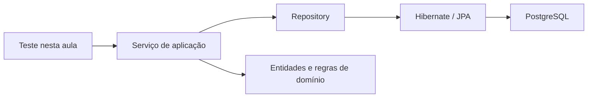

# Java – Spring Boot – Aula 05 – Spring Data JPA, repositories, serviços e transações

[⬅ Voltar para o índice](../../README.md)

---

## Apresentação

Na Aula 04 o Hibernate conseguiu persistir entidades por meio de `EntityManager`, e o Liquibase passou a administrar o esquema PostgreSQL. Ainda não existe, porém, uma camada da aplicação responsável por executar casos de uso como cadastrar um grupo, localizar um produto ou movimentar estoque.

Nesta aula criaremos repositories Spring Data JPA e serviços transacionais. Não criaremos endpoints REST: os casos de uso serão exercitados diretamente por testes para observar com clareza injeção de dependência, proxy, contexto de persistência, transação e rollback.

## Problema orientador

Como organizar o acesso aos dados e coordenar várias operações de negócio como uma única unidade atômica, sem espalhar `EntityManager`, consultas e controle transacional por toda a aplicação?

## Resultados de aprendizagem

Ao final, o estudante deverá ser capaz de:

1. explicar o padrão Repository e distingui-lo de entidade e serviço;
2. explicar como o Spring cria uma implementação para uma interface repository;
3. declarar consultas derivadas por nomes de métodos;
4. usar injeção por construtor;
5. definir uma fronteira transacional na camada de aplicação;
6. diferenciar transação de leitura e escrita;
7. explicar estados de uma entidade no contexto de persistência;
8. demonstrar dirty checking e rollback;
9. representar falhas de aplicação com exceções específicas;
10. testar repositories e serviços no PostgreSQL.

## Pré-requisitos

- tag `aula-04-jpa-postgresql-liquibase`;
- PostgreSQL e bancos `dev` e `test` disponíveis;
- `.env` local configurado;
- 17 testes da Aula 04 passando.

```bash
git status
git describe --tags --exact-match
./mvnw test
```

---

## 1. Repository, serviço e domínio



| Elemento | Responsabilidade |
|---|---|
| entidade | manter estado válido e regras do objeto |
| repository | recuperar e armazenar agregados/entidades |
| serviço | coordenar um caso de uso e sua transação |
| PostgreSQL | persistir dados e assegurar integridade |

Um repository não valida saldo nem decide a qual grupo um produto pertence. Um serviço não deve montar SQL. A entidade não deve procurar a si mesma no banco.

## 2. Spring Data JPA e proxies

Ao declarar:

```java
public interface ProdutoRepository extends JpaRepository<Produto, Long> {
}
```

não escrevemos `new ProdutoRepository()`. Durante a inicialização, o Spring Data analisa a interface e cria um objeto proxy que implementa operações como `save`, `findById`, `findAll` e `deleteById`.

`JpaRepository<Produto, Long>` informa:

- entidade administrada: `Produto`;
- tipo da chave: `Long`.

O proxy é registrado como bean e injetado por construtor nos serviços.

## 3. Consultas derivadas

O Spring Data interpreta partes do nome do método:

```java
Optional<Produto> findByCodigoBarras(String codigoBarras);
boolean existsByCodigoBarras(String codigoBarras);
List<Produto> findByGrupoId(Long grupoId);
List<Produto> findByStatus(Status status);
```

O primeiro `By` separa a operação do predicado. `GrupoId` atravessa a propriedade `grupo` e usa seu `id`. Esse recurso é adequado para consultas curtas; nomes excessivamente longos indicam que `@Query`, Specification ou outra estratégia deve ser avaliada.

## 4. Transação

Uma transação agrupa operações em uma unidade lógica:

```text
BEGIN
  consultar grupo
  verificar código
  associar produto
  inserir produto
COMMIT
```

Se uma exceção não tratada interromper o caso de uso, ocorre rollback:

```text
BEGIN → operação 1 → falha → ROLLBACK
```

O `@Transactional` deve envolver o caso de uso completo, e não somente uma chamada isolada ao repository.

```java
@Transactional(readOnly = true)
public Produto buscarPorId(Long id) {
    // consulta
}
```

`readOnly=true` comunica intenção e permite otimizações. Não é uma autorização de segurança.

## 5. Ciclo de vida e dirty checking

| Estado | Significado |
|---|---|
| transient | criado em Java, ainda não persistido |
| managed | acompanhado pelo contexto JPA |
| detached | possui identidade, mas não é acompanhado no contexto atual |
| removed | marcado para exclusão |

Uma entidade managed é comparada com seu estado inicial. Ao final da transação, o Hibernate gera `UPDATE` se detectar mudança. Isso é **dirty checking**.

```java
@Transactional
public Produto receberEstoque(Long id, BigDecimal quantidade) {
    Produto produto = repository.findById(id).orElseThrow();
    produto.receberEstoque(quantidade);
    return produto; // nenhum save adicional é necessário para o JPA
}
```

Não transforme dirty checking em permissão para alterar campos arbitrariamente: a mudança continua passando por métodos do domínio.

---

## 6. Checkpoint 1 — repositories

Crie `src/main/java/com/curso/suporteos/repository/GrupoProdutoRepository.java`:

```java
package com.curso.suporteos.repository;

import com.curso.suporteos.domain.GrupoProduto;
import org.springframework.data.jpa.repository.JpaRepository;

import java.util.Optional;

public interface GrupoProdutoRepository
        extends JpaRepository<GrupoProduto, Long> {

    boolean existsByNomeIgnoreCase(String nome);
    Optional<GrupoProduto> findByNomeIgnoreCase(String nome);
}
```

Crie `ProdutoRepository.java`:

```java
package com.curso.suporteos.repository;

import com.curso.suporteos.domain.Produto;
import com.curso.suporteos.domain.Status;
import org.springframework.data.jpa.repository.JpaRepository;

import java.util.List;
import java.util.Optional;

public interface ProdutoRepository extends JpaRepository<Produto, Long> {

    Optional<Produto> findByCodigoBarras(String codigoBarras);
    boolean existsByCodigoBarras(String codigoBarras);
    List<Produto> findByGrupoId(Long grupoId);
    List<Produto> findByStatus(Status status);
}
```

Execute os testes. O log deve informar que encontrou dois repositories.

## 7. Checkpoint 2 — exceções da aplicação

Crie `RecursoNaoEncontradoException`:

```java
public class RecursoNaoEncontradoException extends RuntimeException {
    public RecursoNaoEncontradoException(String mensagem) {
        super(mensagem);
    }
}
```

Crie `RecursoDuplicadoException` da mesma forma.

Essas exceções descrevem falhas esperadas do caso de uso. Elas não carregam HTTP nesta aula: `404` e `409` pertencem à camada de API e serão discutidos na Aula 07.

## 8. Checkpoint 3 — serviço de grupos

Arquivo `application/GrupoProdutoService.java`:

```java
@Service
public class GrupoProdutoService {

    private final GrupoProdutoRepository repository;

    public GrupoProdutoService(GrupoProdutoRepository repository) {
        this.repository = repository;
    }

    @Transactional
    public GrupoProduto cadastrar(String nome) {
        if (repository.existsByNomeIgnoreCase(nome)) {
            throw new RecursoDuplicadoException(
                    "Nome do grupo já cadastrado");
        }
        return repository.save(new GrupoProduto(nome));
    }

    @Transactional(readOnly = true)
    public GrupoProduto buscarPorId(Long id) {
        return repository.findById(id)
                .orElseThrow(() -> new RecursoNaoEncontradoException(
                        "Grupo de produto não encontrado"));
    }

    @Transactional(readOnly = true)
    public List<GrupoProduto> listar() {
        return repository.findAll();
    }
}
```

`@Service` registra a classe como bean. A dependência é explícita no construtor, o que facilita teste e impede objetos parcialmente configurados.

## 9. Checkpoint 4 — serviço de produtos

Na Aula 05, antes da introdução de fornecedor, o cadastro recebe produto e grupo:

```java
@Service
public class ProdutoService {

    private final ProdutoRepository produtoRepository;
    private final GrupoProdutoRepository grupoRepository;

    public ProdutoService(
            ProdutoRepository produtoRepository,
            GrupoProdutoRepository grupoRepository) {
        this.produtoRepository = produtoRepository;
        this.grupoRepository = grupoRepository;
    }

    @Transactional
    public Produto cadastrar(Produto produto, Long grupoId) {
        if (produtoRepository.existsByCodigoBarras(
                produto.getCodigoBarras())) {
            throw new RecursoDuplicadoException(
                    "Código de barras já cadastrado");
        }

        GrupoProduto grupo = grupoRepository.findById(grupoId)
                .orElseThrow(() -> new RecursoNaoEncontradoException(
                        "Grupo de produto não encontrado"));

        grupo.adicionarProduto(produto);
        return produtoRepository.save(produto);
    }
}
```

O método coordena consulta, regra e persistência em uma transação. O repository não substitui os comportamentos `grupo.adicionarProduto` e `produto.receberEstoque`.

## 10. Testes transacionais

Use `@SpringBootTest`, profile `test` e PostgreSQL:

```java
@SpringBootTest
@ActiveProfiles("test")
@Transactional
class ProdutoServiceTest {

    @Autowired
    private ProdutoService produtoService;

    @Autowired
    private GrupoProdutoRepository grupoRepository;

    @Test
    void deveCadastrarProdutoComGrupo() {
        GrupoProduto grupo = grupoRepository.save(
                new GrupoProduto("Periféricos"));

        Produto cadastrado = produtoService.cadastrar(
                novoProduto("TESTE-001"),
                grupo.getId());

        assertNotNull(cadastrado.getId());
        assertEquals(grupo.getId(), cadastrado.getGrupo().getId());
    }
}
```

`@Transactional` no teste desfaz os dados após cada método. Isso não substitui o `@Transactional` do serviço: cada anotação possui finalidade diferente.

### Experimento de rollback

Tente cadastrar usando um grupo inexistente e confirme que o produto não foi salvo:

```java
assertThrows(
        RecursoNaoEncontradoException.class,
        () -> produtoService.cadastrar(produto, Long.MAX_VALUE));

assertFalse(produtoRepository.existsByCodigoBarras(produto.getCodigoBarras()));
```

## 11. Erros comuns

| Sintoma | Causa provável | Correção |
|---|---|---|
| repository não encontrado | pacote fora da árvore da aplicação | mantenha abaixo de `com.curso.suporteos` |
| query falha na inicialização | nome não corresponde a atributo | confira propriedades e capitalização |
| `LazyInitializationException` | associação acessada fora da transação | planeje a consulta; não reative Open Session in View |
| alteração não gera update | entidade detached ou método sem transação | confira contexto e fronteira transacional |
| dado fica salvo após falha | exceção foi capturada/ignorada | preserve a propagação ou marque rollback conscientemente |

## 12. Atividade de transferência

No projeto individual:

1. crie repository para classificação e entidade principal;
2. crie uma consulta por chave de negócio;
3. crie uma consulta pelo relacionamento;
4. implemente cadastro transacional;
5. provoque uma falha após uma operação e demonstre rollback;
6. explique por que a regra pertence ao domínio, serviço ou banco.

## 13. Questões de revisão

1. Quem implementa uma interface `JpaRepository`?
2. Por que o serviço define a fronteira transacional?
3. Qual diferença existe entre entidade managed e detached?
4. Por que dirty checking não elimina métodos de negócio?
5. Quando um nome de consulta derivada deixa de ser adequado?
6. Por que uma exceção de aplicação não deve conhecer status HTTP nesta aula?

## 14. Avaliação

| Critério | Pleno | Parcial | Insuficiente |
|---|---|---|---|
| repositories | interfaces corretas e consultas justificadas | consultas funcionam parcialmente | acesso direto espalhado |
| transações | fronteira no caso de uso e rollback demonstrado | anotação sem explicação | operações inconsistentes |
| domínio | comportamentos preservados | algumas regras fora do lugar | modelo anêmico/setters |
| testes | PostgreSQL, sucesso e falha | somente caminho feliz | sem evidência |

## 15. Ponto de quebra

```bash
./mvnw test
git diff --check
git status
git add README.md docs src
git commit -m "Aula 05: adiciona repositories e serviços transacionais"
git tag -a aula-05-repositories-servicos-transacoes \
  -m "Conclusão da Aula 05"
```

O marco não deve conter controllers ou DTOs.

## Referências

- [Spring Data JPA — Query Methods](https://docs.spring.io/spring-data/jpa/reference/jpa/query-methods.html)
- [Spring Data JPA — Transactionality](https://docs.spring.io/spring-data/jpa/reference/jpa/transactions.html)

---

[⬅ Voltar para o índice](../../README.md)
