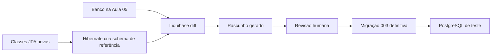
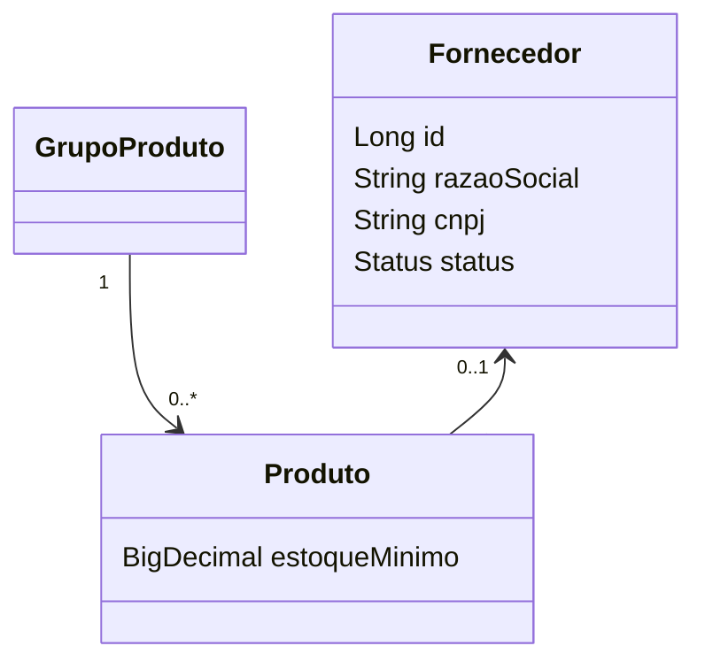

# Java – Spring Boot – Aula 06 – Evolução do modelo e geração assistida de changelogs

[⬅ Voltar para o índice](../../README.md)

---

## Apresentação

Até a Aula 05, a estrutura do banco permaneceu estável. Agora o domínio evoluirá: produtos poderão possuir fornecedor e estoque mínimo. A mudança cria uma nova entidade, uma associação e uma coluna obrigatória em uma tabela que pode conter dados.

Usaremos automação para detectar diferenças, mas não aplicaremos cegamente o arquivo produzido. O objetivo é aprender um fluxo profissional: **gerar, interpretar, revisar, testar e somente então versionar**.

## Problema orientador

Como derivar um rascunho de migração das classes JPA sem usar `ddl-auto=update` no banco real e sem perder dados existentes?

## Resultados de aprendizagem

1. diferenciar geração de esquema, diff e migração versionada;
2. explicar schema de referência e schema de destino;
3. criar uma entidade relacionada e mapear uma nova coluna;
4. gerar automaticamente um esquema PostgreSQL a partir das classes;
5. executar `liquibase:diff` entre dois bancos PostgreSQL;
6. avaliar criticamente o changelog gerado;
7. aplicar a sequência expand–migrate–contract;
8. preservar linhas existentes ao adicionar `NOT NULL`;
9. escrever rollback e constraints ausentes na geração;
10. provar que migração e entidades convergem.

## Pré-requisitos

- tag `aula-05-repositories-servicos-transacoes`;
- `.env` local;
- Docker/PostgreSQL;
- compreensão de entidade, FK, transação e Liquibase.

---

## 1. Geração automática não é migração automática



O Hibernate conhece o mapeamento atual das classes. Ele não conhece:

- dados que já existem;
- intenção histórica;
- política de nomes do curso;
- regra `CHECK` que não está totalmente expressa na anotação;
- estratégia segura de preenchimento;
- rollback apropriado.

Por isso `ddl-auto=create` será permitido somente em um banco explicitamente descartável chamado `suporteos2026_reference`.

## 2. Por que não usamos diretamente `liquibase-hibernate7`

Liquibase 5 possui a extensão `liquibase-hibernate7`. Durante a validação desta aula, porém, a comparação direta do snapshot Hibernate com PostgreSQL encontrou o erro aberto `Cannot invoke ResultSet.next() because schemas is null`.

Para oferecer um exercício reproduzível, adotamos dois PostgreSQL reais:

| Banco | Conteúdo |
|---|---|
| `suporteos2026_diff` | estrutura anterior, até a Aula 04/05 |
| `suporteos2026_reference` | estrutura nova gerada das classes pelo Hibernate |

Essa decisão mantém a leitura automática das classes, mas desacopla a comparação de uma extensão ainda sujeita a limitações.

## 3. Evolução do domínio



Fornecedor será opcional em `Produto` para preservar registros anteriores. O estoque mínimo será obrigatório, mas as linhas antigas receberão zero durante a migração.

---

## 4. Checkpoint 1 — nova entidade

Crie `domain/Fornecedor.java`:

```java
@Entity
@Table(
        name = "fornecedor",
        uniqueConstraints = @UniqueConstraint(
                name = "uk_fornecedor_cnpj",
                columnNames = "cnpj"))
public class Fornecedor {

    @Id
    @GeneratedValue(strategy = GenerationType.IDENTITY)
    private Long id;

    @Column(name = "razao_social", nullable = false, length = 150)
    private String razaoSocial;

    @Column(nullable = false, length = 14)
    private String cnpj;

    @Enumerated(EnumType.STRING)
    @Column(nullable = false, length = 20)
    private Status status;

    protected Fornecedor() {
    }

    public Fornecedor(String razaoSocial, String cnpj) {
        this.razaoSocial = validarTextoObrigatorio(razaoSocial);
        this.cnpj = validarCnpj(cnpj);
        this.status = Status.ATIVO;
    }
}
```

O exemplo valida 14 dígitos, não o algoritmo completo de CNPJ. Essa simplificação deve ser declarada; validação fiscal completa exige regra e testes próprios.

Crie `FornecedorRepository` e `FornecedorService` seguindo a estrutura da Aula 05:

```java
public interface FornecedorRepository
        extends JpaRepository<Fornecedor, Long> {
    boolean existsByCnpj(String cnpj);
}
```

## 5. Checkpoint 2 — alterar Produto

Adicione:

```java
@Column(name = "estoque_minimo", nullable = false, precision = 18, scale = 3)
private BigDecimal estoqueMinimo;

@ManyToOne(fetch = FetchType.LAZY)
@JoinColumn(
        name = "fornecedor_id",
        foreignKey = @ForeignKey(name = "fk_produto_fornecedor"))
private Fornecedor fornecedor;
```

O construtor completo passa a receber `estoqueMinimo`. Preserve temporariamente o construtor anterior delegando zero, para que a evolução não quebre todos os consumidores de uma vez:

```java
public Produto(..., BigDecimal valorUnitario, LocalDate dataCadastro) {
    this(..., valorUnitario, BigDecimal.ZERO, dataCadastro);
}
```

## 6. Checkpoint 3 — configuração de geração

No `pom.xml`, adicione o plugin Liquibase 5.0.3. As credenciais vêm do ambiente e o rascunho vai para `target/`, que não é versionado:

```xml
<plugin>
    <groupId>org.liquibase</groupId>
    <artifactId>liquibase-maven-plugin</artifactId>
    <version>${liquibase.version}</version>
    <configuration>
        <changeLogFile>${liquibase.changelog.file}</changeLogFile>
        <referenceUrl>${env.DB_REFERENCE_URL}</referenceUrl>
        <referenceUsername>${env.DB_REFERENCE_USERNAME}</referenceUsername>
        <referencePassword>${env.DB_REFERENCE_PASSWORD}</referencePassword>
        <url>${env.DB_DIFF_URL}</url>
        <username>${env.DB_DIFF_USERNAME}</username>
        <password>${env.DB_DIFF_PASSWORD}</password>
        <diffChangeLogFile>
            ${project.build.directory}/liquibase-diff/changelog-gerado.yaml
        </diffChangeLogFile>
    </configuration>
</plugin>
```

Adicione ao `.env`:

```dotenv
DB_DIFF_URL=jdbc:postgresql://localhost:5432/suporteos2026_diff
DB_DIFF_USERNAME=suporteos_app
DB_DIFF_PASSWORD=sua_senha_local

DB_REFERENCE_URL=jdbc:postgresql://localhost:5432/suporteos2026_reference
DB_REFERENCE_USERNAME=suporteos_app
DB_REFERENCE_PASSWORD=sua_senha_local
```

## 7. Carregar `.env` para o Maven Plugin

O import feito pelo Spring só existe quando a aplicação inicia. O Maven Plugin executa antes dela e precisa receber variáveis do processo.

macOS/Linux:

```bash
set -a
source .env
set +a
```

PowerShell:

```powershell
Get-Content .env |
    Where-Object { $_ -and -not $_.StartsWith("#") } |
    ForEach-Object {
        $nome, $valor = $_ -split "=", 2
        Set-Item -Path "Env:$nome" -Value $valor
    }
```

No IntelliJ Ultimate, edite a configuração Maven e selecione `.env` no campo **Environment variables**.

## 8. Checkpoint 4 — bancos descartáveis

Execute no PostgreSQL:

```sql
CREATE DATABASE suporteos2026_diff OWNER suporteos_app;
CREATE DATABASE suporteos2026_reference OWNER suporteos_app;
```

Nunca aponte `schema-reference` para `dev`, `test` ou produção: o profile usa `ddl-auto=create` e recria tabelas.

## 9. Preparar a estrutura anterior

O arquivo `src/test/resources/db/changelog/db.changelog-aula-04.yaml` inclui somente 001 e 002. Aplique-o em `diff`:

```bash
./mvnw \
  -Dliquibase.changelog.file=src/test/resources/db/changelog/db.changelog-aula-04.yaml \
  liquibase:update
```

Resultado esperado: oito `changeSets`.

## 10. Gerar o schema das classes

O profile `application-schema-reference.properties` contém:

```properties
spring.datasource.url=${DB_REFERENCE_URL}
spring.datasource.username=${DB_REFERENCE_USERNAME}
spring.datasource.password=${DB_REFERENCE_PASSWORD}
spring.main.web-application-type=none
spring.liquibase.enabled=false
spring.jpa.hibernate.ddl-auto=create
```

Execute:

```bash
./mvnw spring-boot:run -Dspring-boot.run.profiles=schema-reference
```

A aplicação não abre servidor HTTP; cria o schema e termina. Inspecione `reference` e confirme as três tabelas.

## 11. Gerar o changelog provisório

```bash
./mvnw liquibase:diff
```

Saída:

```text
target/liquibase-diff/changelog-gerado.yaml
```

Trechos realmente produzidos durante a validação:

```yaml
- dropForeignKeyConstraint:
    baseTableName: produto
    constraintName: fk_produto_grupo_produto

- addColumn:
    columns:
      - column:
          constraints:
            nullable: false
          name: estoque_minimo
          type: numeric(18, 3)
    tableName: produto
```

O primeiro é ruído perigoso: a ferramenta interpretou diferença entre `RESTRICT` e `NO ACTION`. O segundo falharia se `produto` já possuísse linhas, pois adiciona `NOT NULL` sem valor.

## 12. Revisão obrigatória do rascunho

| Resultado automático | Decisão final |
|---|---|
| IDs baseados em timestamp | IDs `003-01...003-09` |
| autor da máquina | `curso-spring-2026` |
| PK `fornecedor_pkey` | `pk_fornecedor` |
| remove/recria FK antiga | excluir do rascunho |
| coluna já nasce `NOT NULL` | expandir, preencher e restringir |
| não cria `CHECK` | adicionar checks de status/valores |
| `NO ACTION` | declarar `RESTRICT` conscientemente |
| sem rollback/comentário | escrever intenção e operação inversa |

O rascunho é evidência de análise, não um arquivo para mover diretamente ao master.

## 13. Migração final 003

Crie `003-fornecedor-e-estoque-minimo.yaml`. A sequência crítica é:

```yaml
- changeSet:
    id: 003-04-add-estoque-minimo-produto
    author: curso-spring-2026
    changes:
      - addColumn:
          tableName: produto
          columns:
            - column:
                name: estoque_minimo
                type: NUMERIC(18,3)

- changeSet:
    id: 003-05-fill-estoque-minimo-produto
    author: curso-spring-2026
    changes:
      - update:
          tableName: produto
          columns:
            - column:
                name: estoque_minimo
                valueNumeric: 0
          where: estoque_minimo IS NULL

- changeSet:
    id: 003-06-not-null-estoque-minimo-produto
    author: curso-spring-2026
    changes:
      - addNotNullConstraint:
          tableName: produto
          columnName: estoque_minimo
          columnDataType: NUMERIC(18,3)
```

Depois adicione `CHECK (estoque_minimo >= 0)`, coluna `fornecedor_id` nullable e FK `fk_produto_fornecedor`.

Inclua 003 no final do master. Nunca edite 001 ou 002.

## 14. Validar convergência

```bash
./mvnw test
```

Verifique:

- 17 `changeSets` registrados;
- dados anteriores preservados;
- `estoque_minimo` antigo igual a zero;
- CNPJ duplicado rejeitado;
- fornecedor opcional;
- Hibernate `validate` aprovado.

Depois recrie `reference` e compare com um banco já migrado. Um diff vazio ou apenas diferenças justificadas demonstra convergência.

## 15. Diagnóstico

| Sintoma | Investigação |
|---|---|
| Maven recebe URL vazia | `.env` não foi carregado no processo Maven |
| diff contém todas as tabelas | banco `diff` não recebeu a baseline |
| Hibernate apagou dados | profile de referência apontou para banco errado |
| coluna obrigatória falha | existem linhas sem backfill |
| diff remove objetos antigos | compare semântica, naming e drift antes de aceitar |
| arquivo gerado foi versionado em `target` | confirme `.gitignore`; somente migração revisada entra no Git |

## 16. Atividade de transferência

Cada estudante deverá adicionar uma entidade ou campo no tema próprio, gerar o rascunho, registrar pelo menos três problemas encontrados e entregar a migração revisada com teste de preservação de dados.

## 17. Questões

1. Por que `ddl-auto=create` só pode apontar para o banco descartável?
2. O que o diff sabe e o que ele não sabe?
3. Por que adicionar `NOT NULL` exige considerar dados existentes?
4. Por que um diff aparentemente vazio ainda precisa ser interpretado?
5. Qual diferença existe entre schema de referência e changelog oficial?

## 18. Ponto de quebra

```bash
./mvnw test
git diff --check
git add pom.xml .env.example README.md docs src
git commit -m "Aula 06: evolui o modelo com migração assistida"
git tag -a aula-06-evolucao-modelo-liquibase-diff \
  -m "Conclusão da Aula 06"
```

Não inclua `.env`, bancos, dumps ou `target/liquibase-diff`.

## Referências

- [Liquibase — Database Inspection Commands](https://docs.liquibase.com/community/reference-guide-5-0-3/database-inspection-change-tracking-and-utility-commands/what-are-database-inspection-commands)
- [Liquibase Hibernate Integration](https://github.com/liquibase/liquibase-hibernate)
- [Liquibase Maven Plugin — diff](https://github.com/liquibase/liquibase/blob/main/liquibase-maven-plugin/src/main/java/org/liquibase/maven/plugins/LiquibaseDatabaseDiff.java)

---

[⬅ Voltar para o índice](../../README.md)
