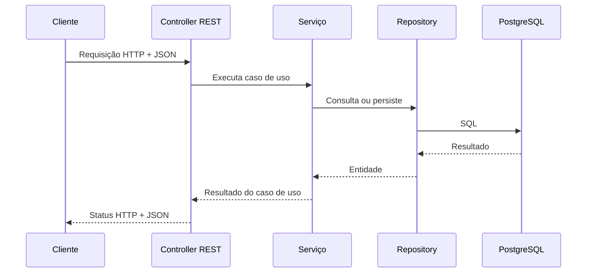

# Java – Spring Boot – Aula 07 – API REST, DTOs, mapeadores e testes com Postman

> Projeto de referência: **Suporte OS 2026**  
> Nesta etapa, cada estudante deve aplicar os mesmos conceitos ao tema escolhido na Aula 02.

## 1. Objetivos de aprendizagem

Ao final desta aula, o estudante deverá ser capaz de:

- explicar a diferença entre domínio, serviço de aplicação e camada de API;
- interpretar uma requisição e uma resposta HTTP;
- projetar recursos e rotas seguindo princípios REST;
- criar DTOs de entrada e saída sem expor entidades JPA;
- validar dados recebidos pela API;
- converter DTOs e entidades por meio de mapeadores;
- implementar controllers com códigos HTTP adequados;
- padronizar respostas de erro;
- testar endpoints automaticamente com MockMvc;
- criar uma coleção no Postman e executar um roteiro completo de testes.

## 2. Pré-requisitos

- Aulas 00 a 06 concluídas;
- PostgreSQL em execução;
- banco `suporteos2026_dev` criado;
- arquivo `.env` configurado;
- aplicação iniciando sem erros;
- Postman instalado ou acesso à versão web com o Desktop Agent.

## 3. O que é uma API?

API é a sigla de *Application Programming Interface*. Uma API define uma forma controlada de um software solicitar dados ou operações de outro software.

Neste projeto, a aplicação Spring Boot disponibiliza uma **API web**. Um cliente — navegador, aplicativo móvel, sistema externo ou Postman — envia uma requisição HTTP. A aplicação interpreta essa requisição, executa um caso de uso e devolve uma resposta HTTP.



### 3.1 HTTP em quatro partes

Uma requisição normalmente contém:

1. **método**: a intenção da operação, como `GET` ou `POST`;
2. **URL**: o endereço do recurso;
3. **cabeçalhos**: metadados, como `Content-Type: application/json`;
4. **corpo**: os dados enviados, geralmente representados em JSON.

Uma resposta contém:

1. **status HTTP**;
2. **cabeçalhos**;
3. **corpo**, quando houver.

### 3.2 Recursos e representações

Em REST, modelamos **recursos**, e não telas ou nomes de métodos Java. Um produto é um recurso; o JSON devolvido ao cliente é uma representação desse produto.

| Operação | Método e rota | Resultado esperado |
|---|---|---|
| cadastrar grupo | `POST /api/grupos-produtos` | `201 Created` |
| listar grupos | `GET /api/grupos-produtos` | `200 OK` |
| consultar grupo | `GET /api/grupos-produtos/{id}` | `200 OK` ou `404 Not Found` |
| cadastrar fornecedor | `POST /api/fornecedores` | `201 Created` |
| cadastrar produto | `POST /api/produtos` | `201 Created` |
| listar produtos | `GET /api/produtos` | `200 OK` |
| consultar produto | `GET /api/produtos/{id}` | `200 OK` ou `404 Not Found` |

Usamos substantivos no plural nas rotas. A intenção é expressa pelo método HTTP.

### 3.3 Idempotência

Uma operação é idempotente quando repeti-la produz o mesmo efeito observável no servidor. Consultar duas vezes com `GET` não deve criar nem alterar registros. Já repetir um `POST` de cadastro pode tentar criar dois recursos; portanto, `POST` não é idempotente.

Nesta aula implementaremos apenas leitura e cadastro. Atualizações com `PUT`/`PATCH` e remoções com `DELETE` serão introduzidas quando seus efeitos e regras de negócio puderem ser discutidos com cuidado.

## 4. Separação de responsabilidades

```text
api/controller  -> interpreta HTTP e escolhe o status da resposta
api/dto         -> define o contrato JSON de entrada e saída
api/mapper      -> converte DTOs e entidades
application     -> implementa os casos de uso e transações
repository      -> oferece acesso aos dados
domain          -> representa regras e conceitos do negócio
```

Essa separação reduz o acoplamento. Uma mudança no contrato HTTP não precisa modificar automaticamente o banco, e uma mudança na entidade não deve vazar dados internos para os clientes da API.

## 5. Ponto de quebra 1 – DTOs e validação de entrada

DTO significa *Data Transfer Object*: um objeto criado para transportar dados através de uma fronteira da aplicação.

### 5.1 Por que não devolver a entidade JPA diretamente?

Expor entidades pode:

- revelar campos internos sem intenção;
- acoplar o contrato público ao modelo do banco;
- provocar serialização inesperada de associações;
- dificultar versões futuras da API;
- permitir que o cliente tente controlar atributos que pertencem ao servidor.

Por isso usamos um DTO de entrada e outro de saída. Os `record` do Java são apropriados porque esses objetos representam dados e são imutáveis.

### 5.2 DTO de entrada do produto

Arquivo `ProdutoRequest.java`:

```java
public record ProdutoRequest(
        @NotBlank(message = "Código de barras é obrigatório")
        @Size(max = 50, message = "Código de barras deve possuir no máximo 50 caracteres")
        String codigoBarras,

        @NotBlank(message = "Descrição é obrigatória")
        @Size(max = 150, message = "Descrição deve possuir no máximo 150 caracteres")
        String descricao,

        @NotNull(message = "Saldo de estoque é obrigatório")
        @PositiveOrZero(message = "Saldo de estoque não pode ser negativo")
        BigDecimal saldoEstoque,

        @NotNull(message = "Valor unitário é obrigatório")
        @PositiveOrZero(message = "Valor unitário não pode ser negativo")
        BigDecimal valorUnitario,

        @NotNull(message = "Estoque mínimo é obrigatório")
        @PositiveOrZero(message = "Estoque mínimo não pode ser negativo")
        BigDecimal estoqueMinimo,

        @NotNull(message = "Grupo é obrigatório")
        @Positive(message = "Identificador do grupo deve ser positivo")
        Long grupoId,

        @Positive(message = "Identificador do fornecedor deve ser positivo")
        Long fornecedorId
) {
}
```

`fornecedorId` é opcional; os demais campos obrigatórios recebem anotações Jakarta Bean Validation. Essa validação protege a fronteira HTTP. As entidades continuam validando suas próprias invariantes porque também podem ser usadas por testes, tarefas agendadas ou outros adaptadores.

### 5.3 DTO de saída

```java
public record ProdutoResponse(
        Long id,
        String codigoBarras,
        String descricao,
        BigDecimal saldoEstoque,
        BigDecimal valorUnitario,
        BigDecimal estoqueMinimo,
        BigDecimal valorEstoque,
        LocalDate dataCadastro,
        Status status,
        Long grupoId,
        String grupoNome,
        Long fornecedorId,
        String fornecedorRazaoSocial
) {
}
```

O DTO de resposta contém identificadores e nomes úteis, mas não expõe objetos JPA completos.

### 5.4 Código correspondente no projeto

Implemente também:

- `GrupoProdutoRequest` e `GrupoProdutoResponse`;
- `FornecedorRequest` e `FornecedorResponse`;
- `ProdutoRequest` e `ProdutoResponse`.

**Verificação do ponto de quebra:** o projeto deve compilar, ainda sem controllers.

```bash
./mvnw test
```

Sugestão de tag intermediária, se o professor desejar demonstrar a evolução:

```bash
git add .
git commit -m "Aula 07.1: cria contratos DTO e validações"
git tag -a aula-07.1-dtos -m "DTOs da API"
```

## 6. Ponto de quebra 2 – Mapeadores manuais

O mapeador centraliza a transformação entre objetos. Nesta fase, o mapeamento manual é intencional: torna visível cada decisão e evita esconder conceitos atrás de uma biblioteca.

```java
@Component
public class ProdutoMapper {

    public Produto toEntity(ProdutoRequest request) {
        return new Produto(
                request.codigoBarras(),
                request.descricao(),
                request.saldoEstoque(),
                request.valorUnitario(),
                request.estoqueMinimo(),
                LocalDate.now()
        );
    }

    public ProdutoResponse toResponse(Produto produto) {
        Fornecedor fornecedor = produto.getFornecedor();

        return new ProdutoResponse(
                produto.getId(),
                produto.getCodigoBarras(),
                produto.getDescricao(),
                produto.getSaldoEstoque(),
                produto.getValorUnitario(),
                produto.getEstoqueMinimo(),
                produto.calcularValorEstoque(),
                produto.getDataCadastro(),
                produto.getStatus(),
                produto.getGrupo().getId(),
                produto.getGrupo().getNome(),
                fornecedor == null ? null : fornecedor.getId(),
                fornecedor == null ? null : fornecedor.getRazaoSocial()
        );
    }
}
```

Observe que o mapper:

- não consulta o banco;
- não inicia transações;
- não decide códigos HTTP;
- apenas transforma uma representação em outra.

O mapper cria o produto a partir dos valores simples, mas não tenta construir grupo e fornecedor usando apenas IDs. Esses IDs são resolvidos pelo `ProdutoService`, pois localizar relacionamentos é parte do caso de uso e depende de repositories.

Implemente `GrupoProdutoMapper`, `FornecedorMapper` e `ProdutoMapper` como componentes Spring.

**Verificação do ponto de quebra:** execute novamente `./mvnw test`.

## 7. Ponto de quebra 3 – Controllers REST

O controller é um adaptador de entrada. Ele conhece HTTP e delega a execução das regras ao serviço.

### 7.1 Cadastro de produto

```java
@RestController
@RequestMapping("/api/produtos")
public class ProdutoController {

    private final ProdutoService service;
    private final ProdutoMapper mapper;

    public ProdutoController(ProdutoService service, ProdutoMapper mapper) {
        this.service = service;
        this.mapper = mapper;
    }

    @PostMapping
    public ResponseEntity<ProdutoResponse> cadastrar(
            @Valid @RequestBody ProdutoRequest request) {

        Produto produto = mapper.toEntity(request);
        Produto cadastrado = service.cadastrar(
                produto,
                request.grupoId(),
                request.fornecedorId());
        URI location = URI.create("/api/produtos/" + cadastrado.getId());
        return ResponseEntity.created(location).body(mapper.toResponse(cadastrado));
    }
}
```

As anotações possuem responsabilidades diferentes:

- `@RestController`: registra a classe e serializa respostas como JSON;
- `@RequestMapping`: define a rota base;
- `@PostMapping`: associa o método ao `POST`;
- `@RequestBody`: converte o JSON recebido no DTO;
- `@Valid`: executa as validações declaradas no DTO.

O cadastro devolve `201 Created`, corpo com o recurso criado e cabeçalho `Location` com a rota de consulta.

### 7.2 Consulta e listagem

```java
@GetMapping("/{id}")
public ProdutoResponse buscarPorId(@PathVariable Long id) {
    return mapper.toResponse(service.buscarPorId(id));
}

@GetMapping
public List<ProdutoResponse> listar() {
    return service.listar().stream().map(mapper::toResponse).toList();
}
```

Crie controllers equivalentes para grupos de produto e fornecedores.

### 7.3 Códigos HTTP usados

| Código | Significado no projeto |
|---:|---|
| `200` | consulta executada com sucesso |
| `201` | recurso criado com sucesso |
| `400` | JSON inválido ou violação das validações de entrada |
| `404` | recurso solicitado ou relacionado não existe |
| `409` | conflito com um valor que deve ser único |
| `500` | erro inesperado; não deve ser usado para representar erro conhecido do cliente |

**Verificação do ponto de quebra:** inicie a aplicação e acesse `GET http://localhost:8080/api/health`.

## 8. Ponto de quebra 4 – Contrato padronizado de erros

Uma API também precisa de um contrato para falhas. Sem padronização, cada controller produziria um formato diferente.

```java
public record ApiError(
        Instant timestamp,
        int status,
        String error,
        String message,
        String path,
        Map<String, String> fields
) {
}
```

O `ApiExceptionHandler`, anotado com `@RestControllerAdvice`, trata exceções em um único lugar:

- `RecursoNaoEncontradoException` vira `404`;
- `RecursoDuplicadoException` vira `409`;
- `MethodArgumentNotValidException` vira `400` e informa os campos inválidos;
- JSON malformado vira `400`.

Exemplo de resposta de validação:

```json
{
  "timestamp": "2026-08-27T14:00:00Z",
  "status": 400,
  "error": "Bad Request",
  "message": "Um ou mais campos são inválidos",
  "path": "/api/produtos",
  "fields": {
    "descricao": "Descrição é obrigatória",
    "valorUnitario": "Valor unitário não pode ser negativo"
  }
}
```

Nunca envie ao cliente stack traces, senhas, comandos SQL ou detalhes internos da infraestrutura.

## 9. Ponto de quebra 5 – Testes automatizados da camada web

O Postman é excelente para exploração e demonstração, mas testes manuais não substituem testes automatizados. O MockMvc simula requisições HTTP dentro do teste, sem abrir uma porta de rede. Neste projeto, `@SpringBootTest` carrega a aplicação completa e usa o PostgreSQL de teste; portanto, verificamos a integração entre JSON, controller, serviço, repository, Liquibase e banco.

```java
@SpringBootTest
@AutoConfigureMockMvc
@ActiveProfiles("test")
@Transactional
class ProdutoApiTest {

    @Autowired
    private MockMvc mockMvc;

    @Autowired
    private GrupoProdutoRepository grupoRepository;

    @Autowired
    private FornecedorRepository fornecedorRepository;

    @Test
    void deveCadastrarProdutoERetornar201() throws Exception {
        GrupoProduto grupo = grupoRepository.save(new GrupoProduto("Grupo API"));
        Fornecedor fornecedor = fornecedorRepository.save(new Fornecedor(
                "Fornecedor API", "22222222000192"));

        String json = """
                {
                  "codigoBarras": "API-001",
                  "descricao": "Produto criado pela API",
                  "saldoEstoque": 10.000,
                  "valorUnitario": 49.90,
                  "estoqueMinimo": 2.000,
                  "grupoId": %d,
                  "fornecedorId": %d
                }
                """.formatted(grupo.getId(), fornecedor.getId());

        mockMvc.perform(post("/api/produtos")
                        .contentType(MediaType.APPLICATION_JSON)
                        .content(json))
                .andExpect(status().isCreated())
                .andExpect(header().exists("Location"))
                .andExpect(jsonPath("$.codigoBarras").value("API-001"));
    }
}
```

`@Transactional` desfaz os dados criados pelo teste ao final de cada método. Os testes do projeto verificam:

- cadastro válido com `201` e cabeçalho `Location`;
- entrada inválida com `400` e mensagens por campo;
- recurso inexistente com `404`.

Execute:

```bash
./mvnw test
```

## 10. Laboratório detalhado – Testando a API com Postman

O Postman atua como um **cliente HTTP**. Ele permite construir requisições, observar respostas, armazenar variáveis, agrupar cenários em coleções e escrever verificações. Ele não acessa diretamente o Java nem o banco: conversa com a aplicação pela mesma interface HTTP que seria usada por outro sistema.

### 10.1 Preparar a aplicação

1. Confirme que o PostgreSQL está em execução.
2. Confirme as credenciais do `.env`.
3. Inicie a aplicação pelo IntelliJ ou terminal:

```bash
./mvnw spring-boot:run
```

4. Aguarde a mensagem indicando que o servidor iniciou na porta `8080`.
5. Não feche esse terminal durante os testes.

Se a porta estiver ocupada, encerre a aplicação anterior. Se o erro mencionar banco ou senha, revise a Aula 04.

### 10.2 Criar a coleção

1. Abra o Postman.
2. Crie um workspace pessoal ou da disciplina.
3. Clique em **New > Collection**.
4. Nomeie a coleção como `Suporte OS 2026 - Aula 07`.
5. Na coleção, abra **Variables**.
6. Crie `baseUrl` com o valor `http://localhost:8080`.
7. Crie, inicialmente sem valor, `grupoId`, `fornecedorId` e `produtoId`.

As URLs usarão `{{baseUrl}}`. Assim, uma mudança de porta ou servidor exige alterar apenas uma variável. Não armazene senhas do banco na coleção: a API desta etapa não pede credenciais e segredos não devem ser exportados ou enviados ao Git.

### 10.3 Teste 1 – Health check

1. Adicione uma requisição à coleção.
2. Nome: `00 - Health check`.
3. Método: `GET`.
4. URL: `{{baseUrl}}/api/health`.
5. Clique em **Send**.

Verifique na área de resposta:

- status `200 OK`;
- corpo JSON;
- tempo de resposta;
- tamanho da resposta.

Na guia **Scripts > Post-response**, adicione:

```javascript
pm.test("Status deve ser 200", function () {
    pm.response.to.have.status(200);
});
```

Salve a requisição.

### 10.4 Teste 2 – Cadastrar um grupo

Crie `01 - Cadastrar grupo`:

- método: `POST`;
- URL: `{{baseUrl}}/api/grupos-produtos`;
- guia **Body > raw > JSON**.

```json
{
  "nome": "Periféricos"
}
```

Ao selecionar JSON, o Postman adiciona `Content-Type: application/json`. Envie e verifique:

- `201 Created`;
- objeto criado no corpo;
- cabeçalho `Location` terminando com o ID do grupo.

Adicione o script:

```javascript
pm.test("Grupo deve ser criado", function () {
    pm.response.to.have.status(201);
});

pm.test("Resposta deve possuir id", function () {
    const body = pm.response.json();
    pm.expect(body.id).to.be.a("number");
});

const body = pm.response.json();
pm.collectionVariables.set("grupoId", body.id);
```

O último comando captura o ID real e o guarda na variável da coleção. As próximas requisições deixam de depender de um ID digitado manualmente.

### 10.5 Teste 3 – Cadastrar um fornecedor

Crie `02 - Cadastrar fornecedor`:

- método: `POST`;
- URL: `{{baseUrl}}/api/fornecedores`;
- corpo:

```json
{
  "razaoSocial": "Distribuidora Acadêmica Ltda",
  "cnpj": "12345678000199"
}
```

Script pós-resposta:

```javascript
pm.test("Fornecedor deve ser criado", function () {
    pm.response.to.have.status(201);
});

const body = pm.response.json();
pm.collectionVariables.set("fornecedorId", body.id);
```

O CNPJ desta aula é validado apenas como uma sequência de 14 dígitos. A validação dos dígitos verificadores pode ser acrescentada posteriormente como regra de domínio.

### 10.6 Teste 4 – Cadastrar um produto relacionado

Crie `03 - Cadastrar produto`:

- método: `POST`;
- URL: `{{baseUrl}}/api/produtos`;
- corpo:

```json
{
  "codigoBarras": "AULA07-MOUSE-001",
  "descricao": "Mouse sem fio",
  "saldoEstoque": 20.000,
  "valorUnitario": 89.90,
  "estoqueMinimo": 5,
  "grupoId": {{grupoId}},
  "fornecedorId": {{fornecedorId}}
}
```

As variáveis numéricas ficam sem aspas para formar um JSON numérico válido.

Script:

```javascript
pm.test("Produto deve ser criado", function () {
    pm.response.to.have.status(201);
});

pm.test("Produto deve referenciar grupo e fornecedor", function () {
    const body = pm.response.json();
    pm.expect(body.grupoId).to.eql(
        Number(pm.collectionVariables.get("grupoId"))
    );
    pm.expect(body.fornecedorId).to.eql(
        Number(pm.collectionVariables.get("fornecedorId"))
    );
});

const body = pm.response.json();
pm.collectionVariables.set("produtoId", body.id);
```

Se o teste for repetido sobre o mesmo banco, altere `codigoBarras`, pois ele é único.

### 10.7 Teste 5 – Consultar o produto criado

Crie `04 - Buscar produto por ID`:

- método: `GET`;
- URL: `{{baseUrl}}/api/produtos/{{produtoId}}`.

Script:

```javascript
pm.test("Consulta deve retornar 200", function () {
    pm.response.to.have.status(200);
});

pm.test("Deve retornar o produto solicitado", function () {
    const body = pm.response.json();
    pm.expect(body.id).to.eql(
        Number(pm.collectionVariables.get("produtoId"))
    );
});
```

### 10.8 Teste 6 – Listar produtos

Crie `05 - Listar produtos`:

- método: `GET`;
- URL: `{{baseUrl}}/api/produtos`.

```javascript
pm.test("Listagem deve retornar 200", function () {
    pm.response.to.have.status(200);
});

pm.test("Resposta deve ser uma lista", function () {
    pm.expect(pm.response.json()).to.be.an("array");
});
```

### 10.9 Testes negativos

Testar apenas o caminho feliz produz uma falsa sensação de segurança. Adicione estes cenários:

#### Produto inválido – `400 Bad Request`

`POST {{baseUrl}}/api/produtos`

```json
{
  "codigoBarras": "",
  "descricao": "",
  "saldoEstoque": -2,
  "valorUnitario": -1,
  "estoqueMinimo": -3,
  "grupoId": 0
}
```

```javascript
pm.test("Entrada inválida deve retornar 400", function () {
    pm.response.to.have.status(400);
});

pm.test("Resposta deve identificar campos inválidos", function () {
    const body = pm.response.json();
    pm.expect(body.fields).to.be.an("object");
    pm.expect(body.fields).to.have.property("descricao");
});
```

#### Produto inexistente – `404 Not Found`

Envie `GET {{baseUrl}}/api/produtos/999999999` e confirme o status e o formato `ApiError`.

#### Código de barras repetido – `409 Conflict`

Repita o cadastro do produto usando o mesmo `codigoBarras`. A primeira criação deve retornar `201`; a tentativa duplicada deve retornar `409`.

#### JSON malformado – `400 Bad Request`

Remova propositalmente uma vírgula ou chave do JSON. O erro ocorre antes de o caso de uso ser executado, pois o corpo não pode ser convertido para o DTO.

Depois do teste, restaure o JSON válido. Erros intencionais não devem permanecer em uma coleção que será executada automaticamente sem estarem claramente nomeados.

### 10.10 Executar a coleção inteira

1. Organize as requisições na ordem `00` a `05`, seguidas dos cenários negativos.
2. Salve todas as alterações.
3. Abra a coleção e selecione **Run collection**.
4. Execute uma iteração.
5. Observe quantos testes passaram e quais falharam.

A ordem é relevante neste laboratório porque os cadastros produzem IDs utilizados pelas consultas seguintes. Em sistemas profissionais, deve-se também discutir independência, preparação e limpeza dos dados de teste.

Se executar novamente, altere os valores únicos — nome do grupo, CNPJ e código de barras — ou use um banco de testes descartável. Nunca limpe um banco compartilhado ou de produção para repetir uma aula.

### 10.11 Exportar com segurança

É possível exportar a coleção para compartilhá-la com a turma:

1. abra o menu da coleção;
2. escolha **Export**;
3. selecione o formato atual recomendado pelo Postman;
4. revise o arquivo antes de adicioná-lo ao Git.

Não exporte senhas, tokens reais, cookies de sessão ou URLs privadas. O `baseUrl` local não é segredo. Em aulas futuras, valores sensíveis deverão permanecer fora de coleções versionadas.

### 10.12 Alternativa rápida com `curl`

O mesmo protocolo pode ser testado sem interface gráfica:

```bash
curl -i http://localhost:8080/api/produtos
```

```bash
curl -i -X POST http://localhost:8080/api/grupos-produtos \
  -H 'Content-Type: application/json' \
  -d '{"nome":"Cabos e adaptadores"}'
```

Postman e `curl` são clientes diferentes da mesma API. Os resultados devem respeitar o mesmo contrato HTTP.

## 11. Diagnóstico de problemas comuns

| Sintoma | Causa provável | Verificação |
|---|---|---|
| `Connection refused` | aplicação não iniciou ou porta incorreta | consulte o console e `baseUrl` |
| `404` em todas as rotas | URL incorreta | confira `/api/...` e a porta |
| `400` no cadastro | JSON inválido ou campo obrigatório ausente | leia `message` e `fields` |
| `404` ao criar produto | ID de grupo/fornecedor não existe | confira variáveis da coleção |
| `409` ao repetir cadastro | nome, CNPJ ou código já existe | use novo valor único |
| `500` | falha não tratada | leia o log da aplicação e crie um teste que reproduza o caso |
| variável aparece como texto | variável não definida ou escopo errado | confira Variables da coleção |

## 12. Atividade prática

No tema escolhido na Aula 02:

1. crie DTOs de entrada e saída para três recursos;
2. aplique validações coerentes com o domínio;
3. crie mapeadores manuais;
4. implemente controllers de cadastro, consulta por ID e listagem;
5. padronize erros `400`, `404` e `409`;
6. escreva ao menos cinco testes MockMvc;
7. crie uma coleção Postman com caminho feliz e três erros;
8. documente por que cada status HTTP foi escolhido.

## 13. Questões para discussão

1. Por que um DTO não deve substituir as regras da entidade?
2. Qual problema pode surgir ao serializar diretamente uma associação JPA bidirecional?
3. Por que `POST /api/produtos` retorna `201`, e não apenas `200`?
4. Em que situação um erro de negócio deve ser `409` em vez de `500`?
5. Qual é a diferença entre um teste MockMvc e uma requisição manual do Postman?
6. Por que IDs produzidos por uma requisição devem ser armazenados em variáveis?
7. O que seria necessário para tornar os cenários do Collection Runner independentes?

## 14. Critérios de avaliação sugeridos

| Critério | Pontos |
|---|---:|
| contratos DTO coerentes e sem exposição de entidades | 2,0 |
| validações de entrada e invariantes de domínio | 1,5 |
| mapeadores com responsabilidade bem definida | 1,0 |
| rotas e códigos HTTP adequados | 2,0 |
| tratamento padronizado de erros | 1,0 |
| testes automatizados da camada web | 1,5 |
| coleção Postman organizada e segura | 1,0 |
| **Total** | **10,0** |

## 15. Encerramento e tag da aula

Antes de versionar:

```bash
./mvnw test
git status
```

Após revisar os arquivos:

```bash
git add .
git commit -m "Aula 07: implementa API REST com DTOs e mapeadores"
git tag -a aula-07-api-rest-dtos-mappers \
  -m "Conclusão da Aula 07"
git push origin main
git push origin aula-07-api-rest-dtos-mappers
```

Não crie a tag se os testes estiverem falhando. A tag representa um ponto reproduzível do curso.

## 16. Referências para aprofundamento

- Spring Framework — Web MVC e controllers anotados: <https://docs.spring.io/spring-framework/reference/web/webmvc/mvc-controller.html>
- Spring Framework — Bean Validation: <https://docs.spring.io/spring-framework/reference/core/validation/beanvalidation.html>
- MDN — visão geral do HTTP: <https://developer.mozilla.org/pt-BR/docs/Web/HTTP/Overview>
- Postman — criação e envio de requisições: <https://learning.postman.com/docs/use/send-requests/create-requests/request-basics>
- Postman — variáveis: <https://learning.postman.com/docs/use/send-requests/variables/variables/>
- Postman — coleções: <https://learning.postman.com/docs/use/send-requests/create-requests/intro-to-collections/>
- Postman — execução de coleções: <https://learning.postman.com/docs/tests-and-scripts/running-collections/intro-to-collection-runs/>

---

**Resultado da aula:** a aplicação passa a oferecer uma API REST com contratos explícitos, validação, conversão entre camadas, respostas de erro previsíveis e testes manuais e automatizados.
