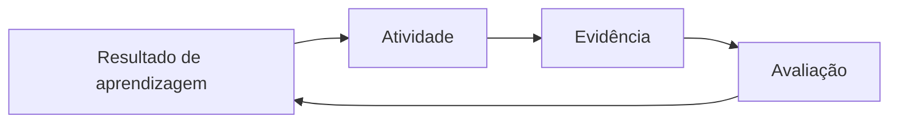

# Padrão pedagógico das aulas — Spring Boot 2026

[⬅ Voltar para o índice do curso](../README.md)

---

## Finalidade

Este documento define a estrutura mínima das apostilas da disciplina de Programação do curso de Sistemas de Informação. O objetivo é produzir material de **ensino superior** no qual implementação, decisão técnica, verificação e reflexão conceitual sejam inseparáveis.

Um roteiro operacional responde “como executar”. Uma aula de graduação também precisa responder:

- qual problema está sendo estudado;
- quais conceitos explicam a solução;
- quais alternativas existem;
- por que uma decisão é adequada ao contexto;
- quais evidências mostram que o resultado está correto;
- como o estudante transfere o conhecimento para outro domínio.

## Princípios de elaboração

### 1. Alinhamento construtivo

Resultados de aprendizagem, atividades e avaliação devem observar a mesma competência. Se o resultado usa o verbo **explicar**, uma lista de comandos não basta como avaliação. Se usa **implementar**, uma resposta puramente teórica também não basta.



### 2. Progressão cognitiva

As aulas devem avançar de reconhecimento para aplicação e análise. Verbos observáveis ajudam a planejar:

| Nível | Exemplos de verbos | Evidência possível |
|---|---|---|
| Compreender | explicar, diferenciar, exemplificar | resposta argumentada, mapa conceitual |
| Aplicar | configurar, executar, implementar | aplicação ou comando validado |
| Analisar | comparar, diagnosticar, relacionar | relatório de evidências, hipótese testada |
| Avaliar | justificar, criticar, selecionar | decisão sustentada por critérios |
| Criar | projetar, integrar, elaborar | incremento funcional no tema do estudante |

### 3. Teoria ligada a uma ação observável

Conceitos não devem aparecer como prefácio isolado. Cada seção prática deve indicar o conceito exercitado, e a revisão deve exigir que o estudante explique essa relação.

Exemplo:

| Prática | Fundamentação necessária |
|---|---|
| adicionar `@RestController` | inversão de controle, bean, camada de entrada e semântica HTTP |
| criar uma entidade JPA | identidade, persistência, mapeamento objeto-relacional e ciclo de vida |
| adicionar um changeset Liquibase | migração incremental, estado desejado, rastreabilidade e execução idempotente |
| criar variável de ambiente | separação entre configuração e código, precedência e proteção de segredos |
| criar um contêiner | imagem, camada, processo, isolamento, rede e persistência de dados |

### 4. Código como argumento técnico

Todo trecho de código relevante deve conter:

1. caminho completo do arquivo dentro do projeto;
2. contexto anterior necessário;
3. código compilável ou indicação explícita de pseudocódigo;
4. explicação das classes, anotações e decisões novas;
5. comando ou teste de verificação;
6. resultado esperado;
7. erros comuns e como investigá-los.

Não é necessário explicar novamente construções já dominadas. Nesses casos, a apostila deve remeter à aula em que o conceito foi introduzido.

### 5. Simplicidade sem imprecisão

Código didático deve reduzir complexidade acidental, mas não pode ensinar uma afirmação tecnicamente falsa. Quando uma simplificação for adotada, ela deve ser declarada:

> Nesta etapa usaremos retorno direto da entidade para observar o fluxo HTTP. Em uma etapa posterior introduziremos DTOs para separar o contrato externo do modelo de persistência.

### 6. Fontes primárias e atualidade

Conceitos normativos e comportamentos de ferramentas devem ser fundamentados prioritariamente em:

- especificações e RFCs;
- documentação oficial do projeto;
- guias oficiais do framework;
- literatura acadêmica ou técnica reconhecida, quando adequada.

Versões, interfaces de ferramentas e recomendações de segurança devem ser verificadas no semestre de oferta. Capturas antigas podem ser preservadas se forem identificadas como históricas e acompanhadas de instrução atual.

## Estrutura mínima de cada aula

Cada apostila deve conter as seções abaixo. Os nomes podem variar, mas sua finalidade precisa estar presente.

### 1. Apresentação e problema

- posição da aula na evolução do sistema;
- problema técnico ou de negócio tratado;
- relação com o projeto de referência e o tema do estudante;
- escopo e o que ainda não será abordado.

### 2. Resultados de aprendizagem

- de 5 a 10 resultados observáveis;
- verbos coerentes com a atividade e avaliação;
- inclusão de compreensão conceitual, execução e diagnóstico.

### 3. Pré-requisitos

- ponto de quebra anterior;
- software e versões;
- conceitos que o estudante deve recuperar;
- arquivos ou serviços externos necessários.

### 4. Fundamentos teóricos

- definições precisas;
- modelo mental ou diagrama quando houver três ou mais relações;
- responsabilidades e fronteiras;
- alternativas, limitações e decisões do curso;
- riscos de segurança, qualidade e manutenção.

### 5. Mapeamento teoria–prática

Uma tabela curta deve relacionar ações da aula aos conceitos observados. Isso permite ao estudante entender por que cada passo existe.

### 6. Desenvolvimento incremental

Para cada incremento:

1. estado inicial;
2. intenção da mudança;
3. arquivo e código;
4. explicação;
5. execução ou teste;
6. resultado esperado;
7. interpretação do resultado.

Quando a aula tiver muitos incrementos, crie pontos intermediários de conferência, sem necessariamente criar tags para todos eles.

### 7. Diagnóstico

- mensagens de erro prováveis;
- hipótese associada a cada mensagem;
- evidência que confirma ou rejeita a hipótese;
- correção proporcional e reversível.

Evite instruções genéricas como “reinstale tudo”, “apague o cache” ou “troque a versão” sem explicar a causa.

### 8. Segurança e qualidade

Inclua somente os tópicos pertinentes à aula, como:

- segredos e variáveis de ambiente;
- validação de entrada;
- autenticação e autorização;
- menor privilégio;
- logs sem dados sensíveis;
- dependências e origem de imagens;
- transações e integridade do banco;
- testes e análise estática.

### 9. Transferência para o tema do estudante

O estudante deve aplicar a mesma estrutura ao domínio próprio. A aula precisa dizer quais nomes e regras podem mudar e quais contratos devem permanecer compatíveis com o roteiro.

### 10. Atividade orientada e atividade autônoma

- uma atividade curta para praticar com apoio;
- uma atividade de transferência que não seja mera cópia;
- entregáveis e formato das evidências;
- restrições que preservam o escopo do curso.

### 11. Questões de revisão

Inclua questões que exijam explicar, comparar e diagnosticar. Pelo menos uma deve explorar uma decisão ou alternativa, e pelo menos uma deve apresentar um cenário de erro.

### 12. Avaliação

Use critérios explícitos. Uma rubrica de quatro níveis é preferível quando a tarefa combina conceito, código e comunicação.

Critérios recorrentes:

- domínio conceitual;
- correção funcional;
- estrutura e legibilidade;
- capacidade de diagnóstico;
- evidências e reprodutibilidade;
- segurança;
- aplicação ao tema próprio.

### 13. Checklist e ponto de quebra

Antes de criar a tag, confirme:

- projeto compila e testes passam;
- incremento pode ser demonstrado;
- documentação corresponde ao código;
- `git diff --check` não aponta problemas;
- não existem credenciais ou arquivos locais;
- commit possui uma unidade lógica;
- tag segue o padrão `aula-NN-descricao`.

### 14. Orientações para o professor

- tempo estimado por bloco;
- conceitos que exigem demonstração;
- perguntas para discussão;
- falhas controladas que podem ser usadas em diagnóstico;
- extensão opcional para turmas que avançarem mais rápido.

### 15. Referências

- links diretos para fontes primárias;
- data ou versão quando isso afetar o conteúdo;
- referências colocadas também perto de afirmações sensíveis quando necessário.

## Modelo de ponto de quebra

O ponto de quebra não é apenas uma data no calendário. Ele representa um estado recuperável do sistema.

```bash
git status
git diff
./mvnw test
git diff --check
git add arquivos-da-aula
git commit -m "Aula NN: descreve o incremento"
git tag -a aula-NN-descricao -m "Conclusão da Aula NN"
git push origin main
git push origin aula-NN-descricao
```

No Windows, substitua `./mvnw` por `.\mvnw.cmd`. O professor deve publicar a tag somente depois de validar o commit em um ambiente limpo sempre que o risco do incremento justificar.

## Checklist editorial

- [ ] O texto usa termos técnicos de forma consistente.
- [ ] Os resultados podem ser observados e avaliados.
- [ ] Há fundamentação para cada decisão prática nova.
- [ ] O código corresponde à versão atual do projeto.
- [ ] Cada código novo é explicado e verificado.
- [ ] Comandos distinguem Windows de macOS/Linux quando necessário.
- [ ] Capturas antigas estão identificadas.
- [ ] Segurança não aparece apenas como observação final.
- [ ] A atividade exige transferência para o tema do estudante.
- [ ] A rubrica avalia conceito e prática.
- [ ] O ponto de quebra é executável e recuperável.
- [ ] As referências oficiais foram verificadas.

---

[⬅ Voltar para o índice do curso](../README.md)
